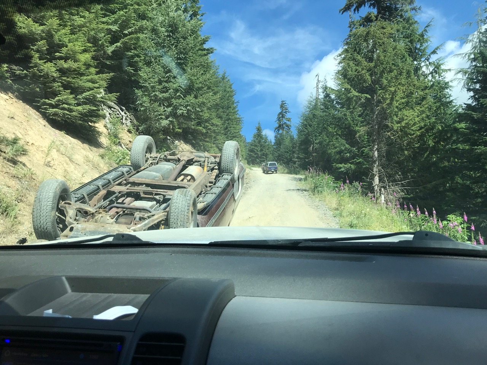

> It was the best of times, it was the worst of times, it was the age of wisdom, it was the age of foolishness, it was the epoch of belief, it was the epoch of incredulity, it was the season of light, it was the season of darkness, it was the spring of hope, it was the winter of despair.

Couldn’t find a more fitting quote than what Dickens put in A Tale of Two Cities, to describe what had gone down in the past 12 months. As the day of one year ~~WTF~~ WFH[^fn1] anniversary approaches, I felt compelled to write down something. I think I’ll ramble more than just work though.

## So It Begins

It was a Friday in early to mid-March, 2020. I specifically remember that I wasn’t feeling well that day and was sent home early to rest (not covid though, according to the good doctors at St. Paul’s). Shortly after I got home, Teams notifications went off and my friends asked me to check my inbox. There I found CEO’s email asking everyone to work from home (WFH) until further notice, starting the following Monday. In retrospect, around the same time there were probably some other announcements from provincial authorities too, emergency declaration or something - but I can’t recall exactly.

`Until further notice`, that phrase had immediately struck me with a tiny bit of panic. I called my brother and we decided to go buy some necessities. Evidently a lot of other people thought the same too. The Costco lines snaked all the way down to the parking lot; people were raiding shelves. No pastas at Safeway - in fact, the entire aisles were empty. I went panic shopping at different stores, and bought perhaps weeks' worth of groceries. Never had 600+ dollar grocery bills before, especially since I was living by myself. Oddly, the most coveted goods was.. TP! I guess personal hygiene is kinda important here then. 


## The Mask Situation 

At the beginning of the lockdown, the masks were simply nowhere to be found. We visited different pharmacies and were told either out of stock or getting on a waiting list. Out of desperation, I requested help from my folks in China. At that time, the table had turned - the pandemic was somewhat contained in China and production of masks really caught up. Four different shipments of masks were sent from different places in China by my family and friends. I was worried some of them may not arrive given the logistics difficulties. Luckily after a few weeks they all did, some of which I had to pay duties but still I was very happy that there’d be PPEs now. 

A few months later, masks here became locally available again and were definitely cheaper than the ones I procured from China - the shipping fees and duties couldn’t be amortized. But I never regretted the decision.

## The WFH 

I had WFH’ed before, but never “until further notice”.

It was little difference to begin with though. The nature of our line of work makes our jobs remote friendly. VPN was set up successfully, so were all the other needful toolings. 

At home, I have an IKEA electric standing desk, big screen**s**, all the bells and whistles, and even got a mighty Filco wireless mechanical keyboard recently. My home office, is pretty state of the art I’d say. At least on the hardware side. 


Can still work and produce same as working in the office. But I did notice the number of online meetings grew significantly - back when we were in the office, what used to be a quick 5-min conversation in the conference room now easily became a 15 to 30 long meeting. Moreover, sometimes Teams would drive my computer fans crazy, so much so that I had to turn the camera off. There were a lot classic catchphrases like “oh sorry you go first”, “I think you’re muted”, and “can everyone hear me?”, etc etc. Our PM Frank was quite the GIF guru who would constantly send witty gifs and emotions to our chat group. It was hilarious.

But I do miss badly the water cooler chitchats, the unofficial foosball tournaments, coffee runs, bubble teas and lunches with coworkers, and.. more importantly, talking to people in real life! 

A side note, I joined Microsoft in October. It’s my second job in Canada, and was an incredibly hard decision to make. The 100% virtual offboarding and onboarding was one-of-a-kind experience as well. I thank my wonderful colleagues at airG and I miss them every day. :( I still talk to them every once in a while to catch up.

As for my work at Microsoft, it’s quite different, as we all know it’s a very, very big organization with lots of services and acronyms (tsk tsk!). I’m still learning a lot of new stuff and I’m afraid I might need a corporate lawyer’s clearance to write more. All in all, I am glad to be working on some potentially impactful projects and I hope I can grow with the company and contribute more. 

## Mrs. Yue

The most impactful event to me, however, wasn’t the pandemic. It was late June, when my wife joined me from China. We had been planning on a landing date of early 2020 but then the pandemic happened. We had the choice to extend her visa indefinitely but she felt it might be better to get here sooner given the uncertainties on so many things. It was incredibly brave of her to travel in such times and I’m deeply grateful and happy that she did so. Otherwise I was one time seriously considering going back to China for a while. 

We did the two-week isolation at home despite neither of us had any symptoms. It aint half bad actually. I had the fridge fully stocked before her arrival. My managers Harman and Frank sent us a heart-warming welcome basket, full of "sweets" - it was very kind of them. There were also grocery delivery services available - I think it was T&T who delivered the seasonal spot prawns just in time. 

It was the beginning of summer, not too hot, not too cold, just about right. We enjoyed wines, books and home theatres in the evenings. Good times. 
 

As soon as the isolation was over, we did some socially-distanced and mask-wearing downtown sightseeing, such as Steam Clock (why is that even an attraction?!), Canada Place, Stanley, Sunset Beach, all by foot since we live in Kits. I remember one day we walked 17km straight! That gal sure can walk! 


As promised, I also took her to the one and only Steveston Pizza Company. It burnt a hole in my wallet but the pizza was actually pretty tasty. 


Her arrival really brought life to the house. She’s a fantastic chef: steak, ribs (lots of them), lamb, wings, dumplings, seafood, you name it.. She also enjoys experimenting the video recipes from social medias like TikTok and Weibo. Not to draw any conclusions, but I gained quite a few pounds recently - not exactly something I’m proud of and it has taken a toll on my BP and general health. :(  


At the House of Yue, we govern by democracy - everyone’s voice must be heard. When it comes to decision making, the process is straightforward: if we share the same opinion, then great, we’ll go with mine; otherwise most likely hers prevails. That said, there’re lots of conversations going on like: “no, we don’t need a drone”, “yes, the dishes have to be done pronto”, “eat your breakfast!”. :D 

Despite the occasional losses of “freedom”, I’m over the moon that she joined me. 

## After Hours

Since the commuting between office and home had never been faster, I actually had more after hours, than ever.

Unfortunately traveling or other outdoor activities weren’t always available, neither were the social gatherings in general. But we were still able to e-hang out with family, friends and coworkers - Jackbox, Among Us, and online poker[^fn2] were fun! 

We also managed to sneak out every once in a while, socially distanced of course. In addition to the walkable attractions, we also visited nearby ones like Lighthouse, Deer Lake, Cypress, and Cleveland Dam, etc.

My buddy Alex even drove a small group of us with his 4wd to hike the Mt Cheam. It was **not** an easy hike but the views totes justified! 


Oh, on the way up, we also found an upside down abandoned truck on the bumpy logging road's curb. There's a chance it might still be there today!


Aside from those, I watched lots of good movies and documentaries. Recently, as part of my New Year’s resolution, I pledged to become a reader and read more books and so I did! 

I am happy to say that I've finished three whole books already in January and February:

* *Atomic Habits*, by James Clear 
* *Olive Kitteridge*, by Elizabeth Strout. It was so good that HBO also made a namesake [miniseries](https://www.imdb.com/title/tt3012698/) starred by the renowned Frances McDormand
* *Olive Again*, the sequel of *Olive Kitteridge* by the same author 

Reading more books had forced me to cut down screen time too. I think this would be a really good habit, and I shall carry on to the next items on my to_read list.

## Other General Haywires

Since I promised not to touch on the topics of politics, I’m not gonna talk about what happened between November and January in the States. I’m pretty sure it’s hard for anyone to miss the news. But.., it.. was.. jaw-dropping! 

Recently I read there’re some places down the south rampant racism and hate crimes against Asians have been rising. This worries me. The down turn of economy and hardships aren’t tied to certain ethnic groups and racism is plain wrong. I’m glad that things are much better in Canada - as our PM once said we value diversity as one of our greatest strengths. Amen to that! 

I try to refrain from taking in too much news nowadays; seems too much of them are unpleasant or too dramatic anyways. After all, the earth is spinning still; the sun rises as usual. Life goes on. 

## What Next

I honestly don’t know what the future would unfold. One of the most pressing items for me is to shake off a ~~looooot~~ few pounds. This is a bit hard as we’re not supposed to visit gyms (I don’t know if they’re open even). But I’ll find a way to exercise. 

I do enjoy the reassuring vaccination news. 

Let’s hope for the best, but in the meantime, prepare for the worst. As people often say, it can only go up from here! 

I'll end this wordy write-up with a sentimental verse by Rainer Maria Rilke：

```
Let everything happen to you: 
beauty and terror. 
Just keep going. 
No feeling is final.
``` 


---


[^fn1]: WFH = **W**ork **F**rom **H**ome. Also, in case you didn't know, I think WTF probably means **W**elcome **T**o **F**acebook. :D 
[^fn2]: The Chinese social platform WeChat, now a super app capable of way beyond its original chatting functionalities, has these so-called mini-programs that serves as addons. That is, with zero setup, you can do a lot other things via these mini-programs, such as playing games online with your existing WeChat contacts, be it Mahjong or Poker. 
