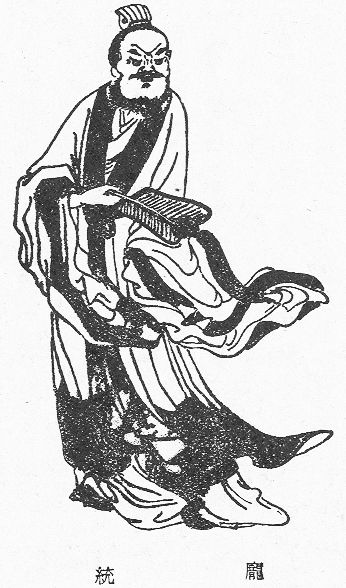
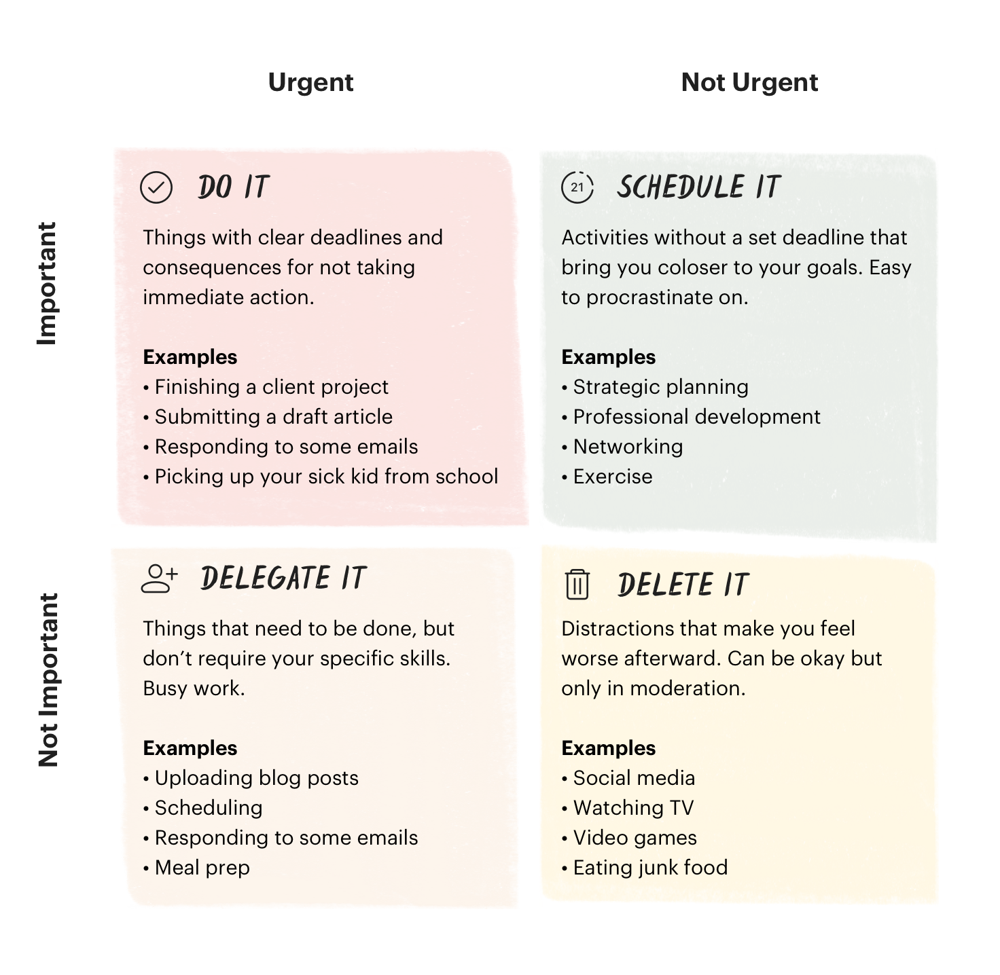

Ever since childhood, I was a bit procrastinating kid. In fact, I still fight it from time to time as a grownup - the fact that I wanted to write something about it last week but only got to it this week is a living proof.

Back in China, pupils would get months-long winter and summer breaks every year. But they were always strings attached - tons of homework that'd be due when the new semester began. Being a child who had little self-control and too much trust from parents, I almost always ended up catching up in a frenzy a couple of days before the breaks were about to end. And when I pulled it off, I'd say "this can't happen again, next break I will evenly allocate the homework workload by day and avoid this craziness". But as people say, if there's anything we learnt from history, is.. we never learn. :D Luckily, in retrospect, I did pull it off every time.

But why? Why would any one procrastinate, knowing it's such a bad thing to do? Since this is a widely studied topic, you can probably easily search and get answers like perfectionism, trouble focusing, etc etc. But today I'd like to offer my own (and original) perspective, by a term coined by myself (I think!): introducing `The Pang Tong Effect`.

## The Pang Tong Effect  

*(image credit: [Wikipedia](https://en.wikipedia.org/wiki/File:PangTong.jpg){:target="_blank"})*

At the risk of sounding narcissistic, I'd like to tell the tale of the great Pang Tong, as an effort to illustrate an example of an ancient procrastinator.

The story was told in Chapter 57 of *Romance of the Three Kingdoms* (Chinese: 三国演义), a historical novel that depicted the times of Three Kingdoms period in Chinese history, between year 169 and 280. The novel is widely considered as one of the Four Great Classical Novels of Chinese literature.

This Pang Tong fellow was a prodigy and was regarded as one of the rising stars in strategy of his time. When he decided he wanted to work for Liu Bei, one of the most powerful warlords who eventually ruled one of the Three Kingdoms, he brought with himself two glowing recommendation letters from Liu Bei's own chief strategist Zhuge Liang and respected General Lu Su (yup, reference letters mattered ~2000 years ago in China already). But he decided to test Liu Bei's sincerity, so he didn't bring up the letters at the first meeting. Liu Bei had lots of top talents under his command, and he didn't really like Pang Tong to begin with due to Pang Tong's attitude and not-so-handsome look. So Pang Tong was only appointed as the magistrate of an unimportant remote county.

Despite his dismay, Pang Tong went to his magistrate office anyways. As a protest, after he took office, Pang Tong did absolutely nothing but drinking all day. When Liu Bei learnt this, he was so furious that he sent his top lieutenant Zhang Fei to check it out. When Zhang Fei arrived the magistrate office, every one showed up except Pang Tong cuz he was still sleeping. Zhang Fei asked his staff to bring Pang Tong and confronted him. Pang Tong answered: "For such as small county, how much public affairs can there be? Give me a few moments, I'll sort it out in no time!". So Pang Tong requested all the backlogged dockets from the past months, and ruled every one of them swiftly and clearly. Every one present was shocked in awe. Later on, when Zhang Fei reported back to Liu Bei, and when the two recommendation letters came into light, Liu Bei apologized to Pang Tong and re-appointed him as a top advisor instead.

I always remember this story of procrastination, not only because I love history in general (ahem, nerd alert), but also cuz it tells one of the most common underlying reasons of procrastination - It's not because we can't do it, but more about we know we can do it, just not until very last minute. This level of "over-confidence" is, I believe, one of the most common reasons for keeping delaying doing stuff, especially when you had a track record of always pulling things off at the eleventh hour and getting away. The difference between Pang Tong and us might be: he was a legit genius and knew it for sure that he could pull off; we might not be so certain every time.

## Priority, or.. Priorities

To overcome procrastination, prioritizing always comes in order first.

I recently learnt this too. In his book *Essentialism*, Greg McKeown mentioned:

> The word priority came into the English language in the 1400s. It was singular. It meant the very first or prior thing. It stayed singular for the next five hundred years. Only in the 1900s did we pluralize the term and start talking about priorities. Illogically, we reasoned that by changing the word we could bend reality. Somehow we would now be able to have multiple “first” things.

I can't agree with Greg more on this. Whenever asked about multi-tasking, I always reference a programmer inside joke: "I can multi-task for sure, just like CPython!" (Cuz CPython has a Global Interpreter Lock that essentially limited threading to one at a time). Context switching is hard. I always think juggling between different matters at the same time is an urban myth. It's good enough if we can get one thing done well at a time!

There're many ways of prioritizing work. I have learnt The Eisenhower Matrix, since my very first job. It categorizes your todo things into four quadrants:  

 
*(image credit: [todoist.com](https://todoist.com/productivity-methods/eisenhower-matrix){:target="_blank"})*

I found it pretty useful in daily works, for prioritizing. Although, executing them might be a different story eh.  

### Eat That Frog 

In Nicolas Cage's [The Weather Man (2005)](https://www.imdb.com/title/tt0384680/){:target="_blank"}, probably the very last good movie he starred before he went on non-picky mode, his character's father Robert Spritzel was telling him this in the car:

> Do you know that the harder thing to do and the right thing to do are usually the same thing? Nothing that has meaning is easy.

That maybe to some people, "Well duh, Captain Obvious", but it's a yet so powerful statement. Oftentimes we knew there're urgent and important items, but we can't act soon enough. "I'll get to it once I finish watching this youtuber's latest; hmm, this article seems fascinating..". These instant-gratifying yet time-consuming smaller things eventually can eat up lots of time.

So one of the suggested approach was to `Eat that frog`. As Brian Tracy put in his book *Eat That Frog!*, the reference being:

> Mark Twain once said that if the first thing you do each morning is to eat a live frog, you can go through the day with the satisfaction of knowing that that is probably the worst thing that is going to happen to you all day long. Your “frog” is your biggest, most important task, the one you are most likely to procrastinate on if you don’t do something about it.

Always go after the biggest bully in your todo list. Sometimes it helps if you have a ritual, like actually writing it down in a sticky note and crossing it off when you're done with an item.

## The Power of Deadline and Flow State

I recently read a funny [article](https://www.abc.net.au/radionational/programs/archived/booksandarts/melbourne-jail/4322338){:target="_blank"} (probably not news any more). It's called ‘Cells for Writers’ project, which was designed to assist the Melbourne writing community by offering spaces to writers to work uninterrupted on their manuscripts. I laughed out aloud - procrastinating writers who fight with deadlines could really use such a quiet place with no distractions!

That's the power of deadline right there. When people are given hard deadlines, they tend to be extremely efficient.

I tried to enforce the same quiet space by allocating no-screen time during weekends so I can do something meaningful, like reading a book for a change. Let me tell you, it's hard! The temptation is a real threat but just like running, there exists a dopamine point, where your brain starts secreting dopamine to you as a reward, so you might actually start enjoying or even become a bit addicted, be it reading or running. This may also be known as entering a `flow state`, which I quote from James Clear's *Atomic Habits*:

> A flow state is the experience of being "in the zone" and fully interested in an activity. It's the mental state you enter when you are so focused on the task of hand that the rest of the world fades away.  

I have occasionally entered similar states, like reading a book for the entire afternoon without noticing time passing by. It's definitely fulfilling. I certainly hope this flow state would hit me more often, regardless of deadlines..

## For Further Read

This write-up has been inspired (and quoted) the following resources that can be potentially good further reads:

* *Eat That Frog*, by Brian Tracy.
* *Atomic Habits*, by James Clear.
* *Essentialism: The Disciplined Pursuit of Less*, by Greg McKeown.
* Inside the mind of a master procrastinator, a TED [talk](https://youtu.be/arj7oStGLkU){:target="_blank"} by Tim Urban.
