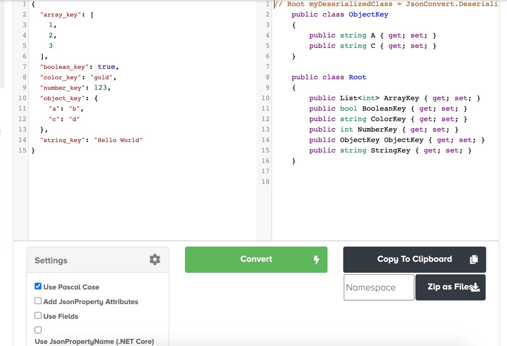

At where I work, we have a dogfood culture. For those who aren't in tech, here's a [wiki](https://en.wikipedia.org/wiki/Eating_your_own_dog_food) on "eating your own dog food". In short:

> Eating your own dog food or dogfooding is the practice of an organization using its own product. This can be a way for an organization to test its products in real-world usage. Hence dogfooding can act as quality control, and eventually a kind of testimonial advertising. Once in the market, dogfooding demonstrates confidence in the developers' own products.

Since my employer happens to make a lot of tools for developers, home and enterprise users, I have enjoyed the perks of having pretty much unfettered access to products and services like Office 365, Azure services (testing resources), toolings like Visual Studio (VS), and ~~glitchy~~ previewing experimental Teams, etc.

I haven't really used VS for a long long time, until recently, cuz naturally when it comes to building backend APIs, C# and VS would come first. It's indeed a mighty IDE[^fn1]! Autocomplete, you ask? Of course, but that would be IDE 101. Now with linters, plugins and suggestions, you can generate headers, auto-imports, comments, boilerplates for classes and methods, and beyond. It simply saves so much time to produce and debug codes. While truly impressed, I also kinda worry that one day with AI on the rise, it can start writing code itself and thus eliminate our profession for good. :( 

But the products aint really what I want to ramble today, at least not the tangible ones. I'd like to talk about the wheels a bit. As a programmer, one of the most famous quotes is:

> Don't reinvent the wheel.

In short, as counterintuitive as it may sound, laziness can be a virtue for programmers. I'm definitely not the hardest working programmer, so I'd like to briefly share the wheels that helped me recently.  

## OData

I haven't actually been using OData (Open Data Protocol) from last C# work many years ago. But evidently this OData thing didn't just get a room with REST (**RE**presentational **S**tate **T**ransfer), but I think they got married (hopefully not in Vegas eh) even - might not be in a monogamy though cuz I'm sure there're other claims on marrying REST.  

### What is REST?

> REST is is a software architectural style which uses a subset of HTTP. It is commonly used to create interactive applications that use Web services. Web service that follows these guidelines is called RESTful. Such a Web service must provide its Web resources in a textual representation and allow them to be read and modified with a stateless protocol and a predefined set of operations. This approach allows interoperability between the computer systems on the Internet that provide these services.

In essence, it relies on HTTP Methods (GET, etc..) to operate on a resource other than having a verb in the URI. For instance the following wouldn't be considered as RESTful:

* https://NotRESTCorp/API/getAllBooks
* https://NotRESTCorp/API/DelBook

### Why OData though?

While the philosophy of REST might be widely adopted, devs can implement however they deem fit. Take designing a suite of CRUD[^fn2] APIs for a book store, the followings can all be considered valid:

* https://AliceCorp/API/books/1
* https://BobCorp/API/book/1
* https://CharlieCorp/API/books?id=1
* The list goes on..

Wouldn't it be a dream come true if every one, regardless AliceCorp or BobCorp, could follow the same guidelines, like, desigining the APIs like this instead:

> https://WhoCaresWhichCorp/API/books(1)

That'd make integration engineers lives easier when they work with different APIs from different vendors eh? That's exactly what OData enables you.

### What can Odata do?

Using a metaphor, REST would be like a US Constitution that merely set up a few articles, while OData is the bills that actually provide actionable guidelines and rules.  

> OData is an OASIS[^fn3] [standard](https://www.oasis-open.org/committees/tc_home.php?wg_abbrev=odata) that defines the best practice for building and consuming RESTful APIs. OData helps you focus on your business logic while building RESTful APIs without having to worry about the approaches to define request and response headers, status codes, HTTP methods, URL conventions, media types, payload formats and query options etc. OData also guides you about tracking changes, defining functions/actions for reusable procedures and sending asynchronous/batch requests etc. Additionally, OData provides facility for extension to fulfil any custom needs of your RESTful APIs.

Of course, let's not forget it was Microsoft who initiated this, so you can count on its support in .NET ecyosystem. :)

You can also even perform SQL-like filtering with the resources, like returning all Categories with less than 10 products:

> GET http://host/service/Categories?$filter=Products/$count lt 10

OData does far more than standardizing the REST endpoints as a protocol. With its rich client/server libraries, you don't have to start everything from the scratch. 

Since it's has "Open" in the title, OData certainly works with other ecosystems like Java and Python as well. There're quite a few [libraries](https://www.odata.org/libraries/) on the official website.

I've also listed below a few [resources](#helpfullinks) that might be helpful for new learners on OData, as this write-up was meant for an introduction only.

Obviously, perhaps the most rivaling competitor nowadays is [GraphQL](https://graphql.org/), but hey I don't think it can fight OData in our .Net realm!

## Json2Csharp 

Back when I was writing Go programs, as backend devs, we'd have to write the API specs and implement them. It can be semi- monkey work to convert the oftentimes snake_case JSON keys to Go camelCase/PascalCase variables, type or fields, to a point that one of my coworkers went ahead and wrote a converter of json2go himself, and hosted on our intranet. He posted on our internal channel and naturally we found out he `reinvented the wheel`, cuz someone else already published an [online json-to-go converter](https://mholt.github.io/json-to-go/). He'd be mad at me for using the public one other than his cuz he argued they had the same functionalities - not to throw him under the bus but tbh, his version wasn't so smart on detecting the int32 values haha!

Anyways, since I'm writing C# now, I'd like to introduce [json2csharp](https://json2csharp.com/).

It's pretty straightforward to use. Here's an example I typed in:

As shown in the snapshot, you can configure the settings for things like:

* PascalCase or not
* Generate JsonProperty Attribute
* Use Fields
* Generate Immutable Classes

The auto-generated code was actually pretty high quality. You might need to rename a few here and there but a lot of heavy lifting was done already.

Of course, you might want to sanitize the Json values first before pasting into the input box. Can't be too careful nowadays.

## Drinking The Kool-Aid

Using wheels, when they work, certainly is a joy, but I'd like to caution that it might also create a reliance that can prevent you from understanding the bigger picture, much like in the timeless classic movie [The Good, the Bad and the Ugly (1966)](https://www.imdb.com/title/tt0060196/), Tuco “The Ugly” did get the job done and got his cut of the gold, but his hands were tied.. If you're only dotting the I's, and crossing the T's, it might block you from critical thinking of why it has to be like this cuz it just works and solves the problem, and more importantly, every one else seems to be using it!

But for now, I say drink the Kool-Aid! Maybe some day in future, we'd have the resources to reinvent the wheels whenever we feel like it - why do you think there're so many programming languages and frameworks?

## Helpful Resources

* [Understand OData in 6 Steps](https://www.odata.org/getting-started/understand-odata-in-6-steps/)
* [Create OData Endpoint Using .NET](https://docs.microsoft.com/en-us/aspnet/web-api/overview/odata-support-in-aspnet-web-api/odata-v4/create-an-odata-v4-endpoint)
* [Getting Started with OData Client](https://docs.microsoft.com/en-us/odata/client/getting-started)
* Online Visualization/Exploration of OData Services: [XOData](https://pragmatiqa.com/xodata/)

---

[^fn1]: IMO (That's **I**n **M**y **O**pinion), my line of business has way more acronyms than what's needed. So I strive to understand what every one of them stands for whenever I see one, and I'd like to extend the courtesy to my readers. So here, IDE = **I**ntegrated **D**evelopment **E**nvironment
[^fn2]: CRUD = **C**reate, **R**ead, **U**pdate and **D**elete
[^fn3]: The **O**rganization for the **Ad**vancement of **S**tructured **I**nformation **S**tandards
