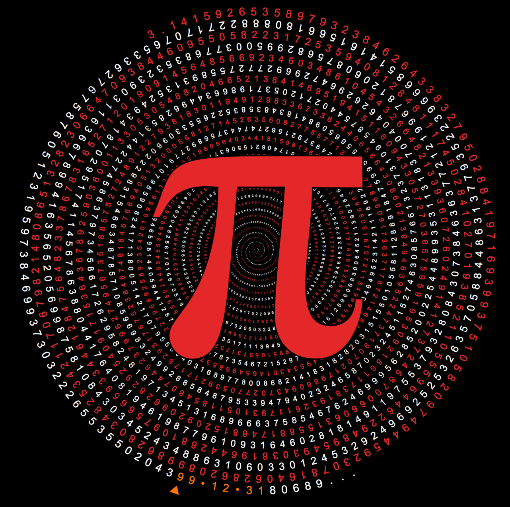
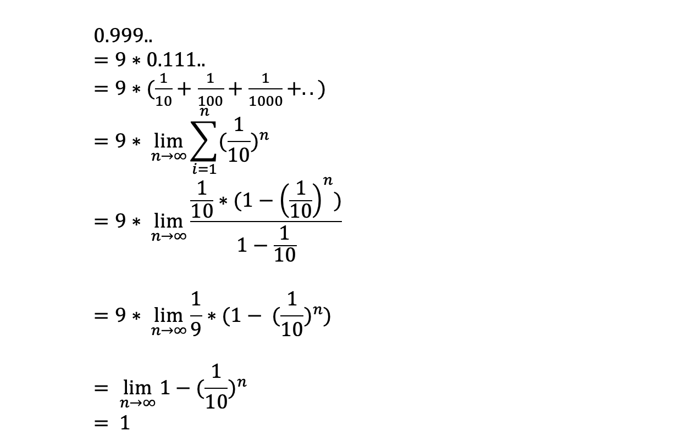

I know you probably got click-baited by the title *Life of Pi*, but this isn't gonna be about the great Ang Lee movie [Life of Pie (2012)](https://www.imdb.com/title/tt0454876/), I meant, sure, the protagonist's name "Pi" was indeed named after the greek letter `pi`, but this post is actually inspired by Pi Day, March 14 aka 3/14, otherwise I probably won't be this prolific in writing another post (twice a week might be too many!). 

So what is this `pi`? In short, we all now that it's the mathematical constant that represents the ratio of a circle's circumference to its diameter, with the value of:

> 3.141592653589793238462643383279...

Believe it or not, I actually just manually typed the above digits by heart. Back in the days, I used to be able to recite far more digits, prob close to 100 even. Unfortunately that's how much stayed in my memories as I grew older. I did a quick lookup online, that's actually a correct recollection! Woohoo!

I love the thriller drama series [Person of Interest](https://www.imdb.com/title/tt1839578/), in fact I might've watched the entire series more than once. The `pi` was referenced many times by the show, one of which I quote from [Fandom](https://personofinterest.fandom.com/wiki/Pi):

> Finch impersonates a high school teacher to approach their next number, a teenager attending this school. He lectures to the class on how `pi` is assumed to contain any finite sequence of digits within its never-ending decimal sequence, and stresses the fact that "now, whatever [they] do with this information, will be entirely up to [the student]".

That's so profound. You can actually find your social security number, date of birth, in fact, any finite sequence of digits in `pi`'s infinite digits, as long as you search further enough. I've found a [website](http://mypiday.com/) that visualizes searches for birthdays in `pi` for you.

You can input your birthday in the format of your choice, for instance, let's say a person was born December 31, 1999. I just did a search on the website for `19991231`, and it says it's found at `1,012,191-th` digit in `pi` (isn't this fascinating?):



I'd like to ramble a bit about the nature of `pi`, or more on how little we human race know about it really. So `pi` is a what we call irrational number. To understand it, we'd have to know what a rational number is.  

## Rational Number

Rational numbers are, in short, the numbers that can be represented by quotient or fraction p/q of two integers, a numerator p and a non-zero denominator q, when p and q are relatively prime / coprime.

A fraction of such number, when converted to decimal expansion, either terminates after a finite number of digits, or eventually begins to repeat the same finite sequence of digits over and over.

An example for the finite would be `1/2`, which is `0.5`. Or `2/1`, which is `2.0`.

As for the other case, an example would be `1/3`, which is `0.33333..` to the infinity. Or `5/11`, which is `0.45 45 45 45 45.. `. There's also a repeated pattern here.

Back in junior high, I actually asked my math teacher this question:

> We know 1/3 * 3 = 1, and `1/3 = 0.33333...`, so by the laws of equation, the left * 3 should be equal to right *3. We know 1/3 * 3 = 1, but on the right side, shouldn't `0.333... * 3` be equal to `0.999...`, and 1 will always be greater than 0.999... by an endlessly small margin?

My math teacher applauded me for my curiosity and said that was a great question. But he didn't answer directly other than mentioning  I'd understand this in the future when I learn more about mathematics, that `1 = 0.999... `. I didn't really buy that answer and secretly thought I had single-handedly discovered a mathematical paradox that my own teacher couldn't even explain, which of course, was debunked when I learned advanced mathematics in college. To this, I owe him an apology for being a cocky smart ass.

So a quick explanation of my teenager question via limit of series, by a 2021 Xiaofeng is:



You can also fact-check my steps on an online [solver](https://www.symbolab.com/solver/equation-calculator) by putting in the following code (it'll get rendered to a proper formula):

```
9\cdot \lim _{x\to \infty \:}\sum _{n=1}^{\infty \:}\:\left(\frac{1}{10}\right)^n
```

See? Mathematicians had that worked out a long time ago!

## Irrational Number

Why is it called `irrational number`? There's actually a story behind it.

It was dated back to ancient Greece. Pythagoras, who is best known for The Pythagorean theorem[^fn1] in the west world, had claimed all numbers in real life can be represented by ratios of numbers, aka `rational number` as explained in last section.

But one of his proteges, Hippasus, was able to deduce that the square root of 2 can't be represented by a ratio of rational numbers, by a beautiful contradiction proof, which I still remember vividly to this day:

### The Proof by Contradiction

So the sum of the areas of the two squares on the legs (a and b) equals the area of the square on the hypotenuse (c), what if a == b?

1. In that case, c<sup>2</sup> = a<sup>2</sup> + a<sup>2</sup> = 2 * a<sup>2</sup>

2. Let a = 1, then we have c<sup>2</sup> = 2 * <sup>2</sup> = 2

3. Say if c is rational, we'd have c = p/q, where p and q are coprime, that is no shared common factors other than 1

4. Then we have (p/q)<sup>2</sup> = 2, i.e. p<sup>2</sup> = 2 * q<sup>2</sup>

5. So p<sup>2</sup> is an even number, then p must be an even number too cuz an odd number times itself is still odd.

6. Let p = 2 * y since it's even. So based on step 4, (2*y)<sup>2</sup> = 2* q<sup>2</sup>, i.e. q<sup>2</sup> = 2 y<sup>2</sup>

7. So q<sup>2</sup> must be even then, and so is q

8. Wait, both p and q are even now? Then they have a common factor of 2.. which is against step 3
9. Contradition found, so c can't be p/q to begin with

QED!

Of course nowadays, we know the square root of 2 is an irrational number with value:
> 1.41421356237...

So that's where the name `irrational` come from. Greek mathematicians termed this ratio of incommensurable magnitudes `alogos`, or inexpressible.

Kudos for Hippasus for discovering this nearly 25 centuries ago! Legend has it that he was exiled and later thrown overboard to the sea by his fellow Pythagoreans, for discovering this "outrageous" `irrational` number. :(

`pi`, just like square root of 2 here, is an irrational number than cannot be converted to a ratio by rational numbers.

## To Infinity and Beyond

So rational numbers and irrational numbers together make up what we known as `real numbers`. Why the term `real` you ask? Cuz y'all mad mathematicians clearly weren't satisfied with the number we had available then, so they had to invent the `imaginary numbers`, also know as `complex numbers`. That is, to resolve of the question of: what is the square root of `-1`, which we all know that, no `real` number is, since the square of any real number is greater than or equal to zero. So the mathematicians came up with an `imaginary number` that makes this equation valid:

> i<sup>2</sup> = -1

You might wonder why? Why did mathematicians do that? To answer that, you'll actually need to pick some more advanced math theories. It seems like a useless toy theory, but in reality, it's actually being widely used our daily life, and is essential one might say. Ask BC Hydro analysts - I believe they can tell you how important it is in analyzing electricity!

I'm ashamed to admit that, as much as I write code for a living nowadays, I used to study mathematics for 6 whole years as a college and graduate school major (#washedupmathematician). While I couldn't make a career out of a mathematician, I remain a genuine interest in mathematics and still appreciate the beauty of it. I enjoy the pure pleasure of thinking, deducing and reasoning.

Math is probably considered as one of the most unpractical majors, right next to Philosophy perhaps. But without it, there will be no foundations of modern technology.

Great mathematicians are geniuses, thinkers, and even philosophies that look beyond their time, and can sometimes be perceived as borderline lunatics. In fact, Greg Cantor, the father of our modern set theory, was actually considered bipolar and spent his last days in a sanatorium. His theory, was indeed counter-intuitive, like the order of infinity, that is, there're different levels of infinity.

Let me ask this - do we have more even numbers or natural numbers? Since we know even numbers is a subset of natural numbers who can be divided by 2, so naturally, you might say of course, we have more natural numbers! But Cantor argued they actually have the same amount, the argument being, for every natural number, `1, 2, 3, 4, 5...`, if you time it by 2, then you have an even number. So there's in fact a 1:1 mapping of even numbers and natural numbers! So they have the same amount. IKR? Cantor also thus introduced different magnitudes of infinity for that matter, things are different in the infinity realm! Can't really elaborate it here[^fn2].

In the epic Chinese science fiction novel *Three Body* (Chinese: 三体), there're different levels of cosmos civilizations. The more advanced civilizations (not us earth people for sure) had achieved weaponizing the laws of mathematics and physics, such as, they can bend the speed of light, or even the laws of causality, or say reduce worlds' dimensions, to annihilate their enemies. Isn't that beyond our wildest imaginations?!

As an engineer, I'm oftentimes amazed and baffled by the fact we have constants, such as light speed and `pi`, in our real worlds. That can be a discussion easily leading to religions, or a higher power / designer of the worlds we're living in. Programmers would know how often we just declare a constant:

```csharp
public const LightSpeed = 299792458
```

So what if we're really living in a simulated environment that's administered by a higher civilization, like a `microverse` as described in one of the episodes in Rick and Morty? Or if we're just brains in a vat really?

---

[^fn1]: The theorem stipulates that the sum of the areas of the two squares on the legs (a and b) equals the area of the square on the hypotenuse (c). In China it is called the "Gougu theorem" (勾股定理).

[^fn2]: To quote Fermat's famous words here: I had a proof that was too large to fit in the margin!
