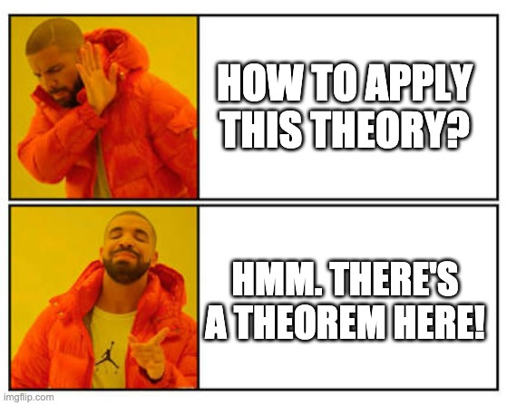
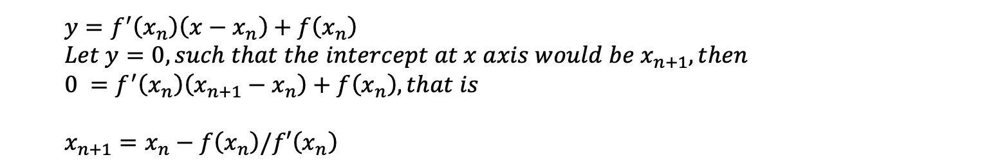
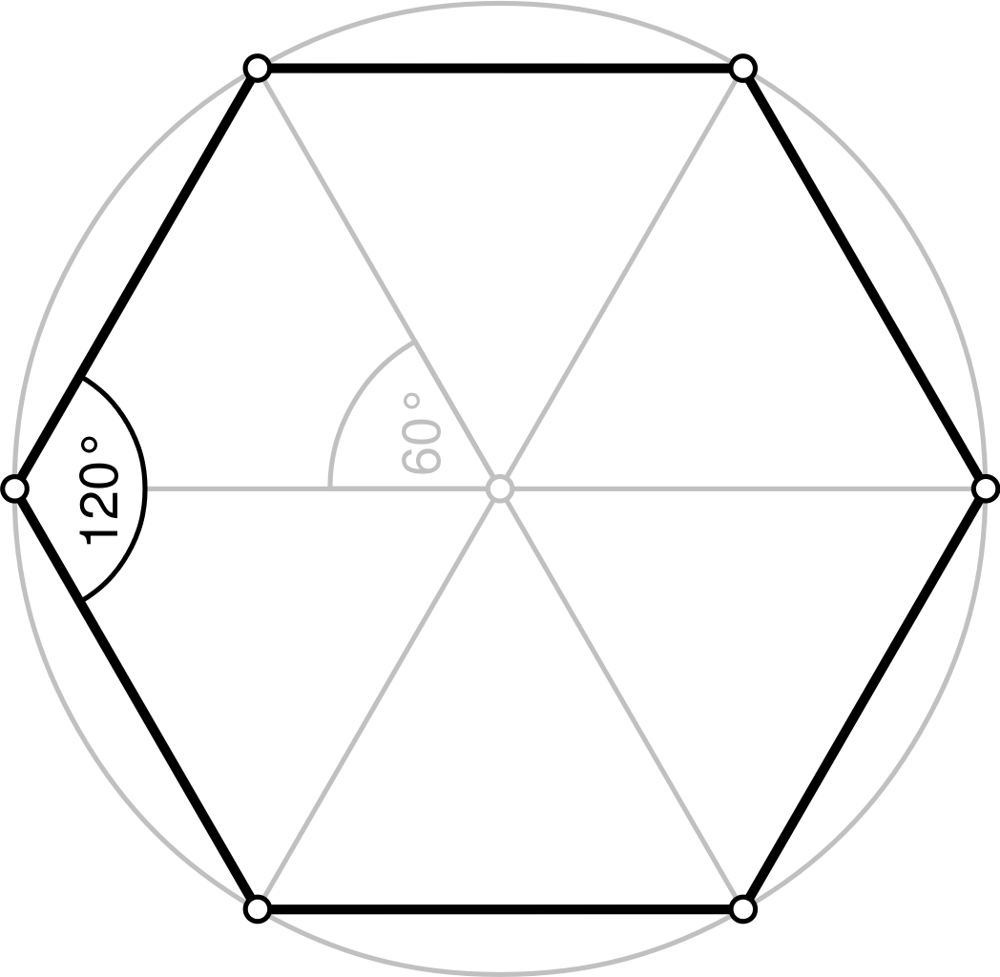
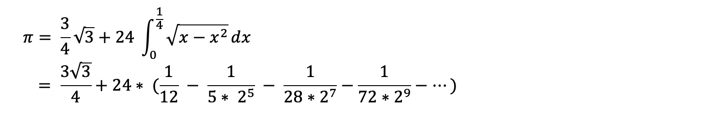

> Good, is simply not good enough.

You might hear people say this every now and then. But much less often, they would actually tell you what `good enough` is.

This post was initially intended as a sequel to my previous [Life of Pi, and.. Infinity](https://xiaofengyue.com/2021-03-14/life-of-pi) piece, but was also inspired later on by recent Azure outage news.

I'll kick start by explaining the difference between theory and engineering fields.

## Why vs How

This reminds me an old joke on theorists:

> Question: Which department is chancellor's favorite? Answer: math department. Cuz unlike other departments that keep asking for expensive equipments, all math department wanted is just pen and paper.

While it is not exactly Sheldon vs Howard as depicted in The Big Bang Theory, but yea, the show actually captured quite vividly about the differences between theorists and engineers.

Mathematicians care more about why. They value proofs - the more, the merrier. "Why there exists a bound or a constant", "why there should be one and only one", ... those are music to their ears. How to use it in real life? Sorry, that’s like.. unimportant detail. :D



Engineers, on the other hand, focus more on how. It'd be like: Sure sure, this sounds great and all. But how can we implement it to solve real world problems? Please feel free to spare me your fancy airtight proofs, cuz knowing it works might be `good enough` for the time being.

So that's what I think where the noticeable differences are. Speaking of which, this sounds eons ago to me, but my graduate school major was actually an unkosher hybrid one called computational mathematics. It dabbles a bit of both why and how, but.. of course, perhaps not diving deep enough to either haha.

In my previous article on [irrational number](https://xiaofengyue.com/2021-03-14/life-of-pi#irrational-number), I only gave the `Why`. Allow me to demo the `How` here now. There are, of course, many different ways, but I won't be enumerating them all here.

## A Guessing Game

Care to guess how we could calculate the irrational numbers? It is, for the lack of better words, a guessing game! To be consistent, I'll use square root of 2 and π as examples here.

### Square Root of 2

Surprise surprise, we can actually guess the value of square root of 2 to a certain precision (to simplify, let's just talk about the positive one here). In fact, we can only calculate it to a certain precision, cuz we'll never find out its exact value.

**Guessing by Binary Search**

Let x denote the square root of 2, using the squeeze or sandwich approach, we can easily find out

> 1<sup>2</sup> < x<sup>2</sup> = 2 < 2<sup>2</sup> = 4

Since we know the square root of 4 is 2, we can now say x is between 1 and 2. Whew, progress!

What if we compare x against 1.5, which is half of `(1+2)=3`? Since we know `(1.5 * 1.5 = 2.25)` which is greater than 2, so now we've established that x is between 1 and 1.5. We can then halve again the interval of `(1, 1.5)`, and repeat the process to get better results. This procedure is basically the idea of binary search algorithm. Does this sound like what contestants would do on The Price Is Right game show?

Here's a quick code snippet I wrote to automate this process (n = 2 in our case):

```python
def sqrt_binary(n, epsilon=0.000001):
    """ We only consider the non-negative square root here """

    # the ones that returns itself, .i.e. n in (0, 0.0, 0, 1.0):
    if n == 0 or n == 1:
        return n

    left, right, guess = 0.0, n, n / 2.0
    while abs(guess * guess - n) > epsilon:
        guess = left + (right-left) / 2

        if guess * guess > n:
            right = guess
        else:
            left = guess

    return guess
```

**Let There Be Newton!**

Binary search is really good and fast. In fact it's an `O(logn)` algorithm. Can we do it faster though? As we oftentimes hear jokes like:

> Unsatisfied with constant time, Jeff Dean created the world's first O(1/N) algorithm

For those of you who don't know who this Jeff Dean fellow is, he's basically the Chuck Norris of us programmers. What, you don't know who Chuck Norris is? You need to look him up!

Joking aside, it's actually very hard to beat binary search in terms of speed. Not to our Newton though - that dude figured this out quite some time ago. He argued that, for a given differentiable function:

> We can start with an initial guess which is reasonably close to the true root, then to approximate the function by its tangent line using calculus, and finally to compute the x-intercept of this tangent line by elementary algebra. This x-intercept will typically be a better approximation to the original function's root than the first guess, and the method can be iterated.

The iteration formula would be:



A visualization of the iteration process would be:


*Credit: [Ralf Pfeifer](https://en.wikipedia.org/wiki/Newton%27s_method#/media/File:NewtonIteration_Ani.gif). My German is a bit rusty, but I'm gonna guess `Funktion` is "function", and `Tangente` is "tangent"*

In this case, to get the square root of 2, we're really just letting f(x) = x<sup>2</sup> - 2, with the derivative `f'(x) = 2x`, to solve the x that makes `f(x) = 0`, . Of course, there's a twin negative square root on the other side the x axis too.

Here's a short code snippet I wrote in my favorite Python (n = 2 in our case):

```python
def sqrt_newton(n, epsilon=0.000001):
    """
    The square root of a given number n, with marginal room of epsilon
    """

    # Let's pivot using the input, for the sake of simplicity
    guess = n

    while abs(guess*guess - n) > epsilon:
        guess = guess - ((guess*guess - n)/(2*guess))
    return guess
```

As for speed comparisons, I did a quick run of both code snippets, with counters added. So for the given precision (epsilon) of `0.000001`, the binary approach looped `22` times before converging, while newton one finished in just `4` loops:

```
For the square root of 2, with precision of 0.000001

Using binary search approach, total rounds are: 22
The value is: 1.4142136573791504

Using newton approach, total rounds are: 4
The value is: 1.4142135623746899
```

See the difference? Amazing right?! Of course, this Newton method can be used to calculate other types of root as well. But there's a catch. Different mathematical functions yield to different curves and convergences, and the choice of pivot / starting point matters too. Of course, it's implied that it has to be differentiable functions too.

### Calculation of Pi

As for π, there have been numerous efforts to calculate its value since the dawn of our civilization thousands of years ago. There were also different approaches.

**Approximation by Hard Labor**

Since we all know π is a circle's circumference to its diameter. If we can't get the exact measurement of a circle's circumference, how about using a polygon inside the circle as an approximation?



As shown in the picture above, we have a hexagon inside the circle shares the same diameter. Let the circle's radius be `1`, we can easily calculate the hexagon's circumference is `6`. And therefore the circle's circumference is at least `6`, and π is therefore at least `6 / 2 = 3`.

If we draw a square of with each side same as the circle's diameter of `2`, then we'd know the square covers the circle entirely and some. So we now have an upper bound for the circle's circumference, which would be that of the outer square: `2 * 4 = 8`. We have now established π is smaller than `8 / 2 = 4`.

Great, now we know π is between `3` and `4`. Should we add more sides to the polygon, we'd have better approximations of the circle's circumference thus π. How hard could it be right?

Zu Chongzhi (Chinese: 祖冲之), an ancient Chinese scientist, was able to determine that π is between `3.1415926` and `3.1415927`. He held this record for over 900 years. To do this, he approximated a circle with a 24,576 sided polygon. Keep in mind that in his time, there was no such thing as calculators or computers. The amount of work would be insurmountable. And one tiny error would've thrown away years of previous work.

Here are more similar efforts I pasted from online search (disclaimer: there might be different sources claiming - fact checks needed):

> In 1596, Dutch mathematician Ludolph van Ceulen reached 20 digits, a record he later increased to 35 digits, using 1,073,741,824 sided polygon (as a result, π was called the "Ludolphian number" in Germany until the early 20th century).
> Dutch scientist Willebrord Snellius reached 34 digits in 1621, and Austrian astronomer Christoph Grienberger arrived at 38 digits in 1630, which remains the most accurate approximation manually achieved using polygonal algorithms.

The work must be tedious and repetitive. It took true grit and incredible attention to detail to achieve what these pioneers did. They literally dedicated years, and even decades of their lives to this cause. Respect.

**Newton Strikes Again**

It's actually a long proof to get his formula since it's using geometry and calculus, but Newton deduced the following series in year 1666 AD:



All of sudden results that needed decades of hard work now can be easily achieved in days using Newton's series. So I imagine no one ever tried to set the new π records by drawing polygons again. When Newton gave you a cannon, why fight with stones still eh?

Here's a [read](https://egyptonline.tripod.com/newton.htm) on the proof in case you're interested. It's also worth noting that Newton wasn't the first one who tried to represent π in infinite series, but the earlier ones converge too slow to be practically useful. Nowadays there're also other series formulas that yield faster convergence performance than his.

As an anecdote, once upon a time, there were some thoughtful [US lawmakers in Indiana](https://www.mentalfloss.com/article/30214/new-math-time-indiana-tried-change-pi-32) who tried to make our lives easier by mandating the value of π to be `3.2`, cuz they must've believed the value of `3.2` should be good enough. I totes get that, why all the hassle right? :D

## So What Is Good Enough

Epsilon, confidence level, granularity, precision, margin of error, 99.9999% SLA[^fn1].., all these fancy industry jargons, would boil down to this `good enough`.

To calculate the area of a circle given a radius in our daily work, `3.14` is probably `good enough` to represent the value of π. This is especially the case when we computerize it - cuz we can't keep endless decimals in the finite and precious bits, so we have to make a call on what's `good enough`. In order to send out probes and slingshot them accurately throughout the solar system, NASA needs to use only 15 decimal places[^fn2]. And let's not forget they were able to send human to the moon half a century ago!

You are buying `3.1` pounds of carrots priced at `2.99` per pound? Well we'll probably round it up to the nearest penny or quarter instead of `9.269` dollars, cuz just for us to complete this transaction, that should be `good enough`.

The beautiful digital photos you took with your most expensive cameras - they have fixed resolutions that are `good enough`. That's right, it's clearer than those from cheaper models cuz it contains more pixels. If you zoom in hard enough, you'll notice it gets blurry eventually. The movies and TV shows - they're really just pictures moving in 24 frames per second[^fn3] so human eyes are tricked to believe it's motional. Although on that note, human desires are really just insatiable - the threshold of `good enough` is ever-growing. Back in the days, I was perfectly contented with 720p, and would be thrilled for 1080p. But now that I'm shopping for a new TV, 4K becomes a minimal requirement. Call me old school, but I don't really know why we'd want something like 8K?

Machines are machines. At the end of day, however redundant we strive to keep in our systems, we still have a finite amount of hardware resources. Sure, there’re automatically scalable services like [Azure Virtual Machines](https://azure.microsoft.com/en-ca/services/virtual-machines/) or AWS EC2, but what if 90% tenants are scaling up at the same time, or surges emerge due to traffic load balancing caused by temporary partial regional failures? Then we’d have outage declarations, angry customers demanding heads must be rolling, and panicking on-call engineers who may start worrying about mortgage payments. :(

Statistics can be deceptive too. Here's a classic probability calculation:

*If a service only has 90% reliability on a single instance on 1 server. What's the overall reliability if we deploy it to 2 servers? The math for the likelihood of both servers are down would be, `(1-90%) * (1-90%)` that equals to `1%`, according to joint probability formula. So the chances of at least one server is responsive at any given time would be `1 - 1%`, which is a whopping `99%`. We can further do the math by adding more, e.g. three servers would give you `99.9%`. Ditto for four, five,... and beyond. Modern server farms usually have dozens to millions of nodes deployed!*

However, one bad launch may create a domino effect and errors will find the first chance to propagate whenever they can, so the "independent events" premise of the laws of joint probability might be violated and there goes all the many `9`s. Although this is just me rambling here as an example of theory vs practice, in reality, there're far more stories to the high availability and other service commitments and modern systems are built with very strong robustness in mind. So don't be alarmed. :)

So what's the takeaway here? Just think about the infamous Y2K bug:

> Until the 1990s many computer programs (especially those written in the early days of computers) were designed to abbreviate four-digit years as two digits in order to save memory space. These computers could recognize “98” as “1998” but would be unable to recognize “00” as “2000,” perhaps interpreting it to mean 1900. Many feared that when the clocks struck midnight on January 1, 2000, many affected computers would be using an incorrect date and thus fail to operate properly unless the computers’ software was repaired or replaced before that date.

But here we are, in the year of 2021 and we still managed to survive (some people may say it's debatable. Ask me again when covid is over). Although I can almost forsee there might be a Y10K problem on January 1, 10000. But I trust our future generations can handle this just fine!

Just like the value of irrational numbers, there’s no end in the pursuit of perfection. It may be hard for us to wait until 100% SLA to ship a service or roll out an update; we can only make the `good enough` decisions to the best of our knowledge, within timeframe and resource restraints, while always keep in mind that this is actually not good enough. And when there's a problem, we will find a solution, **always**. Growth mindset, folks!

---

[^fn1]: A service-level agreement (SLA) is a commitment between a service provider and a client.

[^fn2]: Source [here](https://kottke.org/16/03/how-many-digits-of-pi-does-nasa-use). Quoted: "The most distant spacecraft from Earth is Voyager 1. It is about 12.5 billion miles away. Let's say we have a circle with a radius of exactly that size (or 25 billion miles in diameter) and we want to calculate the circumference, which is pi times the radius times 2. Using pi rounded to the 15th decimal, as I gave above, that comes out to a little more than 78 billion miles. We don't need to be concerned here with exactly what the value is (you can multiply it out if you like) but rather what the error in the value is by not using more digits of pi. In other words, by cutting pi off at the 15th decimal point, we would calculate a circumference for that circle that is very slightly off. It turns out that our calculated circumference of the 25 billion mile diameter circle would be wrong by 1.5 inches. Think about that. We have a circle more than 78 billion miles around, and our calculation of that distance would be off by perhaps less than the length of your little finger."

[^fn3]: There're movies with higher frame rates like 120FPS (frame per second), like Ang Lee's recent [Gemini Man (2019)](https://www.imdb.com/title/tt1025100/) (I watched it, the plot is .. a bit underwhelming).
