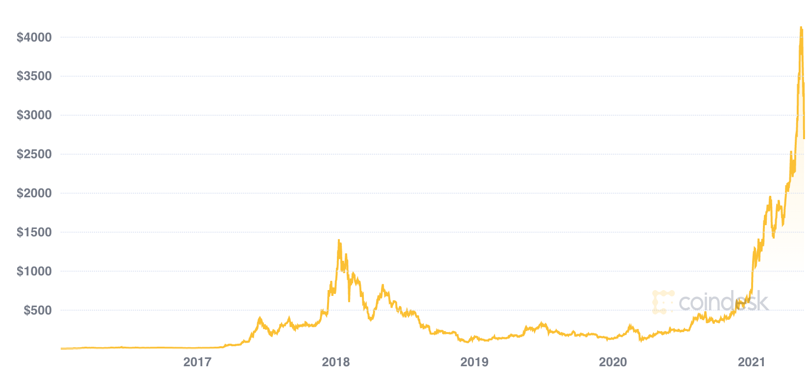
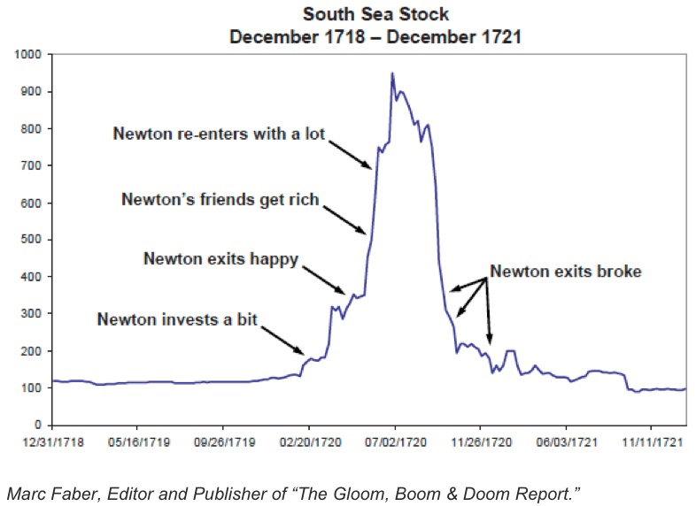
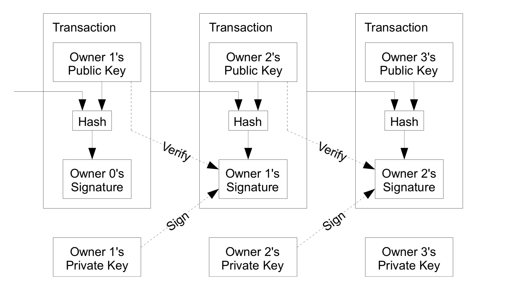
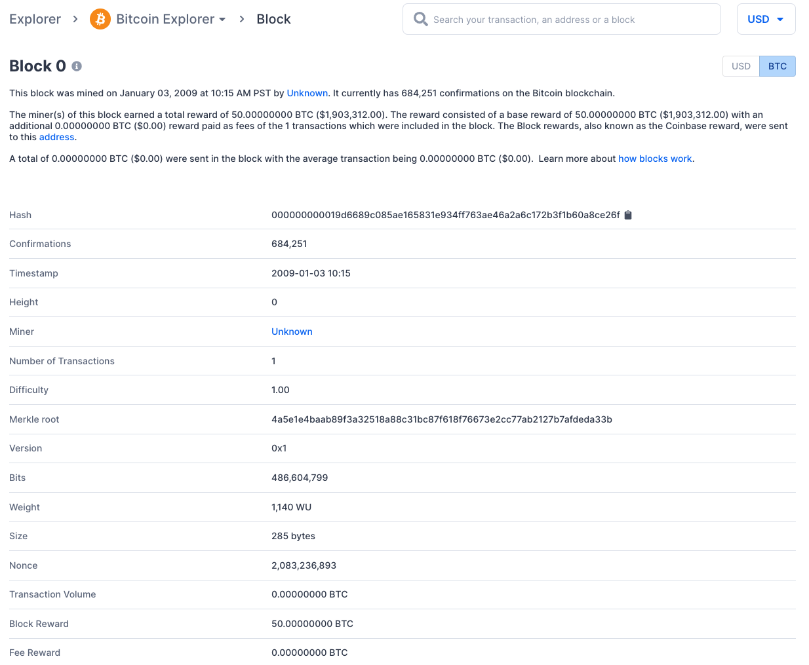

I've been pondering this write-up for a while now and have jotted down some draft fragments intermittently during the past few weeks. While it certainly could use more perfections, I decided it's time to release it to the wild!

> Disclaimer: I don't hold any crypto positions at the moment of writing this and possess no conflict of interests. The opinions in this write-up, if any, do not constitute any investments advices to anyone.

This is a daunting topic I chose to write this time - there's just too much stuff to fit into one blog post only, so I won't be able to cover topics like Merkle Trees, double spending or deflation, etc. Here's a table of contents, since there're many concepts to unravel:

* TOC
{:toc}

## Crypto as An Investment?

By now, you probably heard lots people getting rich from crypto (short for cryptocurrency) - for instance, recently there was a banker who [left Goldman Sachs](https://www.cnbc.com/2021/05/14/goldman-sachs-banker-quits-after-making-millions-on-cryptocurrency.html) and retired (very) early after making millions (of real money) from dogecoin speculations. Heck, there were even a few mentions of dogecoin from the SNL show a few weeks ago (I streamed that episode live).

This whole wave of "enthusiasm" reminds me a couple years back. Back then, I couldn't resist the temptation after knowing a few folks around me had made serious killings from crypto. Finally I put some savings into it and bought a few Etherium coins (ETH) at price I thought was at the bottom. Guess what? The market continued free fall and had no signs of bouncing back. I had to cut my losses. But had I held it until today as of May 18, I'd be making a whopping 1200% return (now you know where my Ferrari budget went)! Here's its price chart in USD over the years:



Crypto, while it's supposed to be a type of currency in the long run, lacks currently the fundamental quality of stability. Imagine today you can buy a coffee for 3.5 dollars, but tomorrow you'll need 5 dollars, and the day after only 1.2 dollars. So right now it's more a stock-like investment or speculation one might say.

Sure, a few people made from it more money than they could spend for life, but keep in mind that there're also more people who went broke straight. The highly volatile market welcomes daredevils who're not afraid to lose everything - although I think some of them actually care less about monetary returns but more about the thrill it brings, as what described in the fiction novel *The Player of Games*:

> The true gambler needs the excitement of potential loss, even ruin, to feel wholly alive.

If you have read my previous posts, you'd know how much I admire this Newton fellow who was a brilliant dude, one that only appears in human society probably once in a century or longer. We'd imagine with his mad mathematical skills, he would have made a fortune from his stock investment at his time. Let's see he actually did:



Interesting eh? :D

### Crypto != BlockChain

Under the hood, crypto runs on a technology called blockchain. But it's worth noting that crypto does not equal blockchain technology. Crypto relies on blockchain - one can even say it's a byproduct.

That said, there're blockchain use cases that do not generate or leverage with crypto coins, like the NFT (Non-Fungible Token) art/emoji collections that people have been auctioning for recently. Other scenarios might be tracing the product quality via blockchain as it represents immutable records.

## So what Is Blockchain

In Satoshi's seminal [paper](https://bitcoin.org/bitcoin.pdf), *Bitcoin: A Peer-to-Peer Electronic Cash System*, he (or other pronouns cuz that's only an alias) described as follows:

> We define an electronic coin as a chain of digital signatures. Each owner transfers the coin to the next by digitally signing a hash of the previous transaction and the public key of the next owner and adding these to the end of the coin. A payee can verify the signatures to verify the chain of ownership.



So in short, if we use a "block" to record transaction(s), and chain the blocks one by one at the end, based on the previous block, then together we form an immutable "blockchain" as a decentralized ledger. Just like the banks, your transaction history would be persisted, just not on a centralized database. Your balance, however, unlike what banks do, wouldn't be "stored" as it's based on transactions not accounts - instead, it's deduced from "unspent" transactions.

The first ever block, aka [genesis block](https://www.blockchain.com/btc/block/0) of Bitcoin looks like this (no need to redact as blockchain aims to be transparent):



A couple of quick explanations of not-so-obvious fields (I'll elaborate later as well):

* Hash: Unique identifier for the block. It has certain format of requirement of prefixing with X amount of 0s. In this one, `000000000019d6689c085ae165831e934ff763ae46a2a6c172b3f1b60a8ce26f` has 10 leading 0s. In the Proof of Work economic model, the miners must compete with each other to calculate the first valid value to broadcast to the network, to get rewarded with bitcoins (we'll elaborate later)
* Height: Number of blocks connected to this block. Since this block is the genesis block, so it's 0
* Difficulty: to denote how hard it is to mathematically calculate the accepted value. This difficulty increases over time, for instance, the hash value may later need to prefix with 11 leading 0s instead of 10
* Nounce: A random value / counter to calculate the hash. Miner needs to keep trying altering this value until they come out with a satisfying hash
* Block Reward: Well, the reward to whoever created this block. This reward reduces over time as well, as there's a cap to the total number of bitcoins in the system.

### Chain The Blocks

Before appending a valid "block", hard labor of calculations are in need to validate the transactions and building this block, which is done by decentralized node workers also known as miners. In the Bitcoin network, miners are rewarded by bitcoins and potential convenience fees (miner fees) too for completing the validation work and adding a block (page) to the ledger. This is also called mining cuz the "coins" would be mined as a result. This economic model is called Proof of Work, as just like a job, to get paid, you need to show proof of work somehow.

To understand how each block is chained together, we need to know what `hash` is, and how it's used in the process.

#### Hash Function

> A hash function or a message digest algorithm, is a procedure that maps input data of an arbitrary length to an output of **fixed** length. Output is often known as hash values, hash codes, hash sums, checksums, message digest, digital fingerprint or simply hashes. The length of output hashes is generally less than its corresponding input message length.  

This an example of input data of `YoYo` using SHA256 hash function:

```bash
>>> hashlib.sha256(b'YoYo').hexdigest()
'84c9fc5e1d04edd798c364535c4802daac9c635b3fe43d3f64f0a5a402142ff8'
```

Note that a good hashing function must have one-way characteristics. That is, you can't reverse engineer the output to get the input - you're gonna have to "guess" it if you have to. Also it should be deterministic too: A given input should always produce the same output - otherwise, it's not useful for integrity checks.

Hash is an essential part of block chain as it identifies a block. Take bitcoin network for example, the mathematical hard problem the miners need to solve to come up with a valid hash is: take the data in the block, and try adding a different random value (nounce) to keep hashing until they find a first hash value that satisfies certain criteria, e.g. must lead with X number of 0s.

Here's an example of finding the hash with only one prefixing 0. I'm using `YoYo` again as the block data (in actual block hashing, it's more fields combined), and `1,2,3..` as the attempted nounce each time. The guessing steps are:

```bash
>>> hashlib.sha256(b'YoYo1').hexdigest()
'd1a89c0e3a96db0f2dc09e22d549455bdbb55aa7203847ef67d4c8843317d8b6'
>>> hashlib.sha256(b'YoYo2').hexdigest()
'abe1c96dcd921628b98b4af7255aa844ce59c7c3b47d5c6af46e7f9526f0b459'
>>> hashlib.sha256(b'YoYo3').hexdigest()
'475eda1323b426695aea7abf3247192987b6e245651567f2c9302b1ee3ad744d'
>>> hashlib.sha256(b'YoYo4').hexdigest()
'f13842e25eede75da2ac149dd17960e3aac16331875c78379793cb7595b39c39'
>>> hashlib.sha256(b'YoYo5').hexdigest()
'4718a4f470ebad145bbff59a8d7d305f431c44468e4c322bc6b6d37eb66b984c'
>>> hashlib.sha256(b'YoYo6').hexdigest()
'a5ffe5ab250e55c443421a3fdfd626ade0f694f41049781d4720a948b0d1f64a'
>>> hashlib.sha256(b'YoYo7').hexdigest()
'd484805f1e8370d2709baa5d050f0b84a755c4a966ae8bcc19820ef5919de091'
>>> hashlib.sha256(b'YoYo8').hexdigest()
'd095dde9bb7f10e4842e38147cb3c0e6f617cbb3aaed0fd72b1fab062ccce2e4'
>>> hashlib.sha256(b'YoYo9').hexdigest()
'695fdc6fb1ed6137b7be126b5857250cd123225b06acde529d28242ac9eb3912'
>>> hashlib.sha256(b'YoYo10').hexdigest()
'32e6e5039c0e2d3b43dfcd9be856f573f7f3274c7b5c5f2429cf8035d34d7bb9'
>>> hashlib.sha256(b'YoYo11').hexdigest()
'0b9cc89c13833734315abbac092154e0d7241e445ab4b7b44f9ee5cdc77cfa87'
```

Look at that, it only took me measly 11 times to find a hash value with 1 leading 0, how hard could it be to find one with 10 leading 0s eh? It turns out to be a very hard and expensive exploring process as there's no short cut, and each hashing operation takes time. Since this is hex, every digit has `16` possible values (0,1..f), then the probability of a position is 0 is therefore `1/16` (we did it in 11 times in the examples above). So the chances of getting a leading consecutive 10 zeros is:

> (1/16) ** 10 = 1 / 1099511627776

That's 1 in `1,099,511,627,776`, i.e. over a trillion to 1 odds! As a comparison, I checked on BC [Lotto Max](https://lotto.bclc.com/lotto-max-and-extra/prizes-and-odds.html), the official main jackpot winning odds are 1 in `33,294,800`.

So finding a valid hash to build a block became a competition of computation powers. That's why you hear bitcoin miners set up "mining plants" near power stations cuz this will be consuming lots of energy, or accusations of how crypto brings environmental impacts as lot of its used electricity was generated by fossil fuels like coal.

The difficulty increases over time by asking more 0s to prefix as a qualified hash. As shown in the snapshot above, the genesis block only required 10 zeros for its hash. As a comparison, the [block 683906](https://www.blockchain.com/btc/block/683906) created on May 16, 2021 looks like this, and has 20 leading 0s

> 00000000000000000000c28c49343bf0fe63d8dbdb248acb2b7530cafd99d9af

Once a miner finds a valid hash in this lottery effort, he/she immediately broadcasts this finding to the entire network. Upon receiving, all the other miners stop trying to crack this block and move on to solve the next block using this one as a parent after validating it. So it's chained one by one like this. If there're multiple qualified findings at the same time, the longest branch wins (aka this block has more child blocks appended). That's why unofficially, there's a 6-block rule, that is, a transaction is fully confirmed only when 6 blocks confirmed (appended). This whole process is also known as a decentralized consensus.

There're other ways of chaining the blocks, like PoS (Proof of Stake), but I won't elaborate here.

## Symmetric, Asymmetric Encryption and Signing

To better understand blockchain, or ownership of a crypto, we need cover the concepts of "keys", in this case private and public keys, in asymmetric encryption.

### Symmetric Encryption

Let's start by explaining what symmetric encryption is - it's any technique where the same key is used to both encrypt and decrypt the data.

The Caesar Cipher is one of the simplest symmetric encryption techniques, and of course, one of the easiest to crack too. It's simply done by shifting each letter by k steps. A meaningful word in plaintext is thus scrambled to gibberish (same length though).

> The Caesar cipher is named after Julius Caesar, who used it with a shift of three (A becoming D when encrypting, and D becoming A when decrypting) to protect messages of military significance.

As an example, suppose Charlie wants to pass some gossip to others in the class, but he didn't want to use plaintext, so he shifted each letter by 3 to the right:

```
Plain text:     Alice and Bob sitting in a tree
Encrypted text: Dolfh dqg Ere vlwwlqj lq d wuhh
```

`A` became `D`, `l` became `o`... so it's not human-readable anymore. But his recipients knew beforehand that the encrypted text can be deciphered by shifting each letter by 3 to the right.

Encryption of a letter x by a shift k can be described mathematically as:

> E(x) = (x + k) mod 26

Decryption would be:

> D(x) = (x - k) mod 26

Here as you can see, the key `k` is the same for encryption and decryption. It's fairly easy to crack cuz:

* The key may be intercepted and then deciphering would be effortless
* Even if we don't have the key, we'll know they share the same pair of keys and some letters (such as e) have far more appearances than others (like x) - as people often say, all letters are created equal but some letters are more equal than others eh.

### Asymmetric Encryption

Asymmetric encryption is a type of encryption that uses two separates yet mathematically related keys to encrypt and decrypt data. The public key encrypts data while its corresponding private key decrypts it.

### Private Key

A secret number, known only to the person that generated it. A private key is essentially a randomly generated number. In Bitcoin, someone with the private key that corresponds to funds (coins) on the blockchain can spend the funds. In Bitcoin, a private key is a single unsigned 256 bit integer (32 bytes).

### Public Key

A number that corresponds to a private key, but does not need to be kept secret. A public key can be calculated from a private key, but not vice versa. A public key can be used to determine if a signature is genuine (in other words, produced with the proper key) without requiring the private key to be divulged.

Use case example:

> Alice wants to send something secretive to Bob. So she uses Bob's public key to encrypt first and then sends to Bob. Since Bob is the only one who has Bob's private key, he is the only one who can decrypt Alice's message

One of the best known kind is probably RSA (initials of its creators: Rivest, Shamir, and Adleman) that is widely used for secure data transmission. It relies on known difficulty of factoring the product of large prime numbers. So we can achieve the goal of asymmetric encryption that is:

* private key -> public key calculation is relatively easy
* public key -> private key calculation is next to impossible within a certain given timeframe (keys do expire)

A very much lite example of RSA algorithm is (actual implementation is way more complicated):

> You have a pair of random prime numbers, say (125371, 196169), and you use it to generate a `public key` of `24593903699 = 125371 * 196169`. And you declare that your `private key` is a pair of 6-digit prime numbers. So if someone wants to crack your private key, he/she would have to brute-force it by trying out all the factoring of this `24593903699`, which is a known hard problem. If we use very large prime numbers to begin with, the cracking process would take a very very long time, too much to be feasible.

As you can see, compared to symmetric encryption process, asymmetric ones have obvious benefits:

* No worries on risk of public keys being intercepted as they're meant to be public.
* Without the pairing private key, it takes impossible or impractical efforts to crack it

### Signature

Much like how you sign a cheque, signature is something that proves that a signing operation took place. Here, a signature is mathematically generated from a hash of something to be signed, plus a private key.

Signing would be like the other way around of encryption and decryption process:

> Alice wants to sign an IOU note with message of `I owe Bob 500 bucks`. So she signs with her own **private key** (not public key). And every one can use Alice's public key to decrypt this signature to reveal this message and verify. In this way, Alice cannot deny the authenticity of this note and no one else can forge this signature either since Alice is the only one possesses Alice's private key.

### How Does Crypto Ownership Work

It's relying on the public/private key system to prove possession of a coin. It's intangible and virtual only so you can't actually cash it in coins and put in your real wallets (you may certainly sell them in exchanges in fiat money like USD though).

> Alice wants to transfer Bob 1 bitcoin. So she has to have no less than 1 bitcoin to begin with. Her right of possession was proved by the fact that there exists 1 bitcoin that is locked by her public key so she's the only one who can unlock it using her one and only private key. And now that she's wiring it to Bob, she'll use Bob's public key to lock it, so Bob would be the only one who can unlock it aka spend instead. In a way, people's public keys are their receipt account number(there's still a conversion process in actual network).

So the system doesn't care who you are (anonymity right there). As long as you have the private key, you can unlock the coins that were locked by your pairing public key.

Q: What if I lost my private key?
A: Well, it's gone, for good. No one, including you, can touch that specific coins ever again. So don't lose it! If you search "lost bitcoin stories", you'll find quite a few heartbreaking poor fellows.

## Abel

Who is Abel? What has he to do with crypto or blockchain? Did I just put in the title to attract your attention? Well yes and no. Niels Henrik Abel was a Norwegian mathematician who died tragically young at 26 in 1829. But his left a legacy in this latest blockchain technology, cuz the signature algorithm, namely the Elliptic Curve Digital Signature Algorithm (ECDSA), can be traced back to his work on the Group Theory.

Let's start by explaining what an Abelian group is:

### Abelian Group

An Abelian group is a set, denoted as A, together with an operation • that combines any two elements a and b to form another element denoted a • b. The symbol • is a general placeholder operator for a concretely given operation. To qualify as an Abelian group, the set and operation, (A, •), must satisfy five requirements known as the Abelian group axioms:

1. Closure: For all a, b in A, the result of the operation a • b is also in A

2. Associativity: For all a, b and c in A, the equation (a • b) • c = a • (b • c) holds

3. Identity element: There exists an element e in A, such that for all elements a in A, the equation e • a = a • e = a holds

4. Inverse element: For each a in A, there exists an element b in A such that a • b = b • a = e, where e is the identity element

5. Commutativity: For all a, b in A, a • b = b • a

So the addition and multiplication in our basic algebra actually be classified as Abelian groups. But what if we define a more abstract group, and maybe come out with a public/private key system? Introducing ECDSA (Elliptic Curve Digital Signature Algorithm) that's widely used by blockchain.

### ECDSA

Here we go, we hereby define a group on an elliptic curve.

* The elements of the group are the points of an elliptic curve;
* The identity element is the point at infinity 0;
* The inverse of a point is the one symmetric about the x-axis;

Addition is given by the following rule: given three aligned, non-zero points P, Q, and R, their sum is `P + Q + R = 0`.

It's associate and communicative as you can verify on the curve below. So now we're in an Abelian Group!


*Credit: [Andrea Corbellini](https://andrea.corbellini.name/images/point-addition.png)*

Now if we move things around a bit, we have `P + Q = -R`. So that means, the sum of `P + Q` is R's x-axis symmetric twin.

If we do it further, let `P = Q` (P and Q converges, the line becomes a tangent), then we'd have a denoting of `P + P = 2P`, if we repeat this process, we could get `P + 6P = 7P ..`. Let

> `Q =  7P`. We call 7 as the logarithm of Q to the base P.

Here's a [visualizing tool](https://andrea.corbellini.name/ecc/interactive/reals-add.html) for the iteration process.

So now we have something that resembles the goal of asymmetric cryptographic algorithm: Given `K = kG`, where k being the private key and K is the public key. G is a selected point on the curve. It has certain merits:

* Given k, G, it's simple enough to get K.
* But given K and G, to calculate k is very very hard, right next to impossible

The actual implementation of ECDSA signing algorithm is a bit more complicated, as there're more steps like putting the curve on a finite field, etc. But that's pretty much the gist of the idea. There're many upsides of why using ECDSA: despite its abstract calculations, it provides shorter keys and faster speeds with same level of security. But it's less adopted compared to RSA at the moment.

#### Code Samples

Here's an example in golang for using ECDSA library:

```go
package main

import (
	"crypto/ecdsa"
	"crypto/elliptic"
	"crypto/rand"
	"crypto/sha256"
	"fmt"
)

func main() {
	privateKey, err := ecdsa.GenerateKey(elliptic.P256(), rand.Reader)
	if err != nil {
		panic(err)
	}

	msg := "Yo this is a message!"
	hash := sha256.Sum256([]byte(msg))

	sig, err := ecdsa.SignASN1(rand.Reader, privateKey, hash[:])
	if err != nil {
		panic(err)
	}
	fmt.Printf("Signature: %x\n", sig)

	valid := ecdsa.VerifyASN1(&privateKey.PublicKey, hash[:], sig)
	fmt.Println("Signature verified:", valid)
}
```

You may choose different curves like [Secp256k1](https://en.bitcoin.it/wiki/Secp256k1) (it was almost never used before Bitcoin became popular. Legend has it that other popular curves had NSA backdoors. So make you wonder who this Satoshi dude really is eh). The curve is defined as this:

> y<sup>2</sup> = x<sup>3</sup> + 7

You can also take a look at Etherum's [implementation](https://github.com/ethereum/go-ethereum/blob/master/crypto/secp256k1/secp256.go), or [Bitcoin's](https://github.com/bitcoin-core/secp256k1) in C.

## At The End

A few words to wrap up. I meant to provide a high level crash course for crypto, blockchain and some anecdote about a mathematician named Abel. Many concepts were intentionally watered down so this doesn't become a series. The main motives for me to write this were threefold:

1. Boredom due to COVID lockdown
2. Boredom x 2
3. I actually had to look up quite a bit in writing this, so it’s a good recap for me as well.

I hope this didn't waste 10 or 15 minutes of your time reading until this point. If you see anything amiss or debatable, ~~bite me!~~, let me know! It's entirely possible that my understanding wasn't up to date or 100% accurate.

Not gonna enumerate all the references and wikis here, but here are a few you can read further:

* A [Python Implementation](https://github.com/tlsfuzzer/python-ecdsa) of ECC (Elliptic Curve Cryptography) with support for ECDSA (Elliptic Curve Digital Signature Algorithm) and ECDH (Elliptic Curve Diffie-Hellman)
* Bitcoin [wiki](https://en.bitcoin.it/wiki/Main_Page)
* Block [hashing algorithm](https://en.bitcoin.it/wiki/Block_hashing_algorithm)
* Elliptic Curve Cryptography: a [gentle introduction](https://andrea.corbellini.name/2015/05/17/elliptic-curve-cryptography-a-gentle-introduction/)
