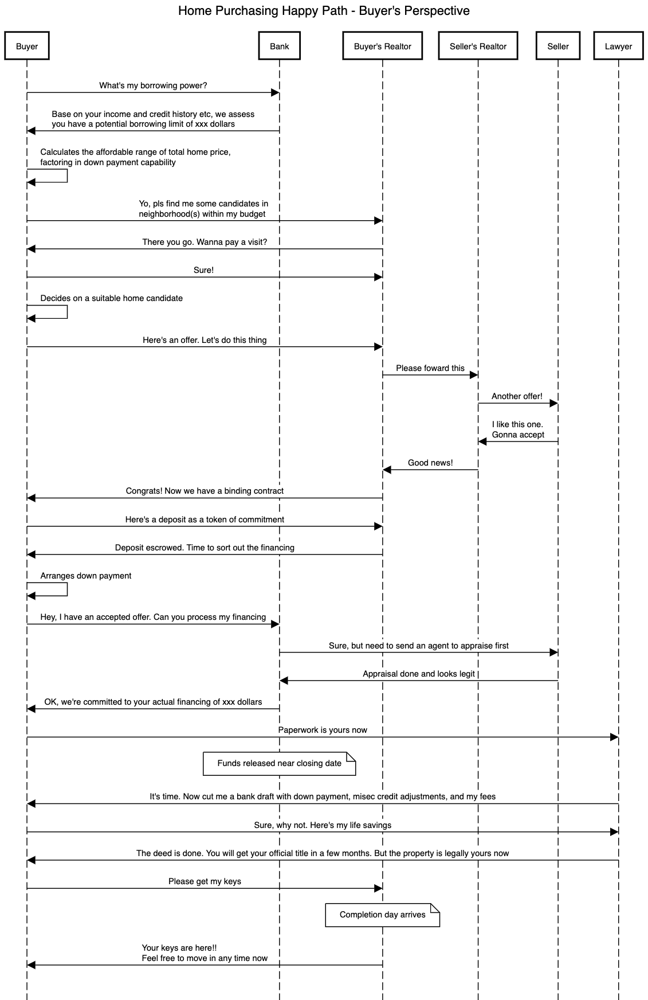
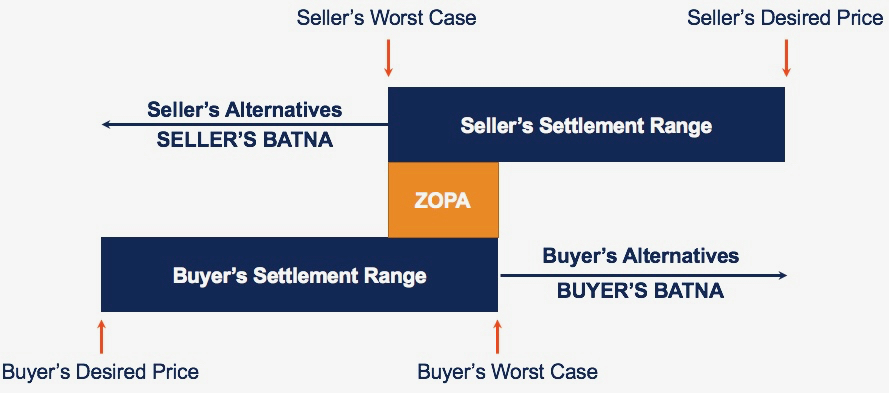
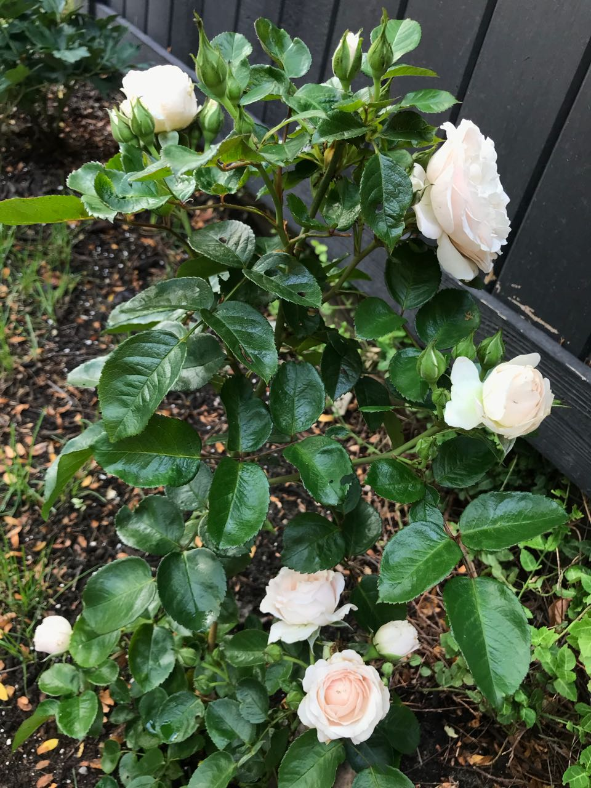
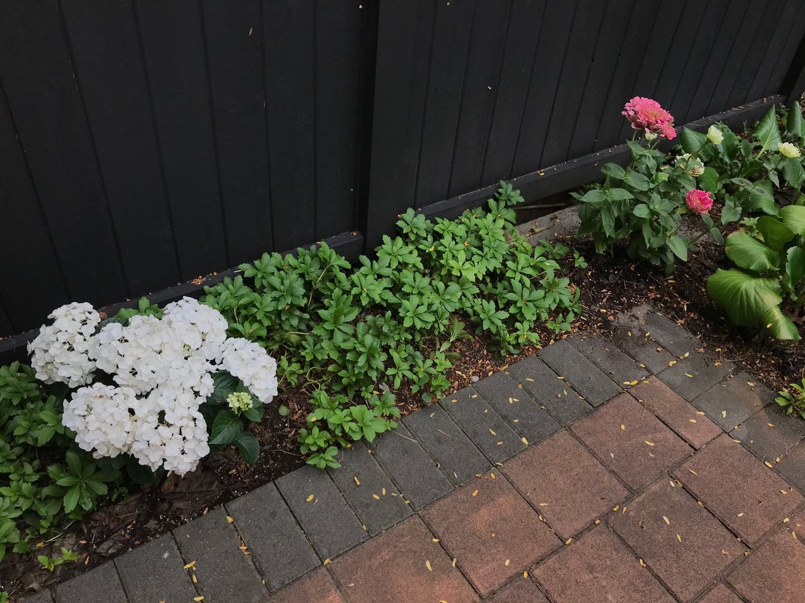

I have to admit it's been some while since my last post. But to be fair, I was fairly busy during the past few months with all the moving, home improvements, traveling and gaming (all hail to PS5, finally got one!!). Enjoyed quite a bit *dolce far niente*[^fn1] too for sure.

Now that I'm a bit more settled, vacationed, and fully vaccinated, I've decided to finish what I started a few ~~days~~ weeks ago on this BATNA (**B**est **A**lternative **T**o a **N**egotiated **A**greement) piece, to commemorate my first Canadian home purchasing experience earlier this year.

## How It Started

I've been wanting to get into the market, ever since I landed in Canada 3+ years ago. But I wanted to build my credit history here first, and secretly hoped the housing market would chill down a bit over time (it certainly did not..). Also I think newcomers who stayed in Canada for less than 2 years would be treated as foreign buyers still, in terms of the down payment requirements.

Oh how days just go by now with my pandemic WFH entering 1.5+ years strong. Every now and then I started to feel the year 2019, just like 1587[^fn2], was a true year of no significance - it sounds very distant and uneventful but it's actually a tipping point not that afar. Decades from now, historians might need to write a chapter for each month after 2019 given what everything went down!

Anyways, earlier in Spring 2021, when the housing market turned irrationally frenzy, with record-setting low rates and rocketing sales-to-active listings ratios, we figured it's high time that we took actions even when I actually wanted to wait for a bit longer.

## What The Whole Thing Looks Like

Since my day job is software engineering after all, here's a sequential diagram to describe the high-level process of home purchasing from a buyer's angle, based on our experience:

*A more scalable SVG file is [here](../assets/images/20210829/steps.svg)*
  
See, that's pretty straightforward. If anything amiss, I actually consulted different mortgage brokers and bank specialist first, and ordered a pre-inspection before preparing the offer too (always make **informed decisions**!). There oughta be more entangled arrows between the bank, realtors and lawyer too.

However, just like every architecture chart in software engineering, each step in the actual implementation may turn out to be a bit harder than what it appears. We did quite extensive research but still hit a few roadblocks here and there in the steps. I'm glad that all worked out eventually.

As part of the research, finding a desirable neighbored was a pretty big part. `Location, location, location!` I'm sure you'll hear that mantra from every realtor, but yea one may simply sweep everything under location:

* School catchment
* Amenities, such as malls, gyms, and parks, etc
* Access to public transportation
* Noise level
* And more

For us, with price constraints, first thing we did was to rule out Vancouver - it's just a sad fact :(. After checking out different satellite cities in metro Vancouver, we figured Burnaby South would be ideal. The only downside is school ain't exactly top-notch, but since we don't have any kids at the moment so at least it's not an immediate concern.

## BATNA, The Not-really-negotiation Offer Making

I wanted to single out the offer making step, aka what brings out this BATNA. So what is BATNA anyways?

> BATNA is an acronym that stands for **B**est **A**lternative **T**o a **N**egotiated **A**greement. It is defined as the most advantageous alternative that a negotiating party can take if negotiations fail and an agreement cannot be made. In other words, a party’s BATNA is what a party’s alternative is if negotiations are unsuccessful. The term BATNA was originally used by Roger Fisher and William Ury in their 1981 book entitled “Getting to Yes: Negotiating Without Giving In.”

In a buyer/seller scenario: 

*ZOPA = **Z**one **o**f **P**ossible **A**greement. Credit to [Corporate Finance Institute](https://corporatefinanceinstitute.com/resources/knowledge/deals/what-is-batna/)*

Well, for starters, negotiation means it's at least a two-way street. Since we were in a seller's market, there wasn't much to be done on the negotiation department, so it's more like a bidding in an auction.

There are a few popular traditional bidding/auction types[^fn3]:

1. Open ascending-bid auctions, aka English auctions, in which participants make increasingly higher bids, each stopping bidding when they are not prepared to pay more than the current highest bid. This continues until no participant is prepared to make a higher bid; the highest bidder wins the auction at the final amount bid. Sometimes the lot is sold only if the bidding reaches a reserve price set by the seller.
2. Open descending-bid auctions, aka Dutch auctions, in which the price is set at a level sufficiently high to deter all bidders, and is progressively lowered until a bidder is prepared to buy at the current price, winning the auction.
3. First-price sealed-bid auction in which bidders place their bid in a sealed envelope and simultaneously submit them. The envelopes are opened and the individual with the highest bid wins, paying the amount bid. This form of auction requires complex game theorization since bidders must not only consider their valuation but other bidders' valuations and what other bidders believe other bidders' valuations are. This is very prone to overbidding also known as Winner's Curse.
4. Second-price sealed-bid auctions, aka Vickrey[^fn4] auctions, where bidders place their bid in a sealed envelope and simultaneously submit them. The envelopes are opened and the individual with the highest bid wins, while actually paying a price equal to the second-highest bid. The logic of this auction type is that the dominant strategy for all bidders is to bid their true valuation, cuz if they win, they pay less than what they already prepared to; otherwise they've given their best efforts and hence have no regrets.

I personally favor the 4th one, cuz it's within every stakeholder's interests and may reflect the true valuation of the buyers - well I stand corrected, sellers may not like it :). Unfortunately in reality, sellers are using more a variant of the 3rd type. It's a sealed bid, but sellers are not obligated to go with the highest offer whatsoever. While the dollar amount surely carries the heaviest weight, they could also factor in offer's subjects (to financing/inspections, etc), or any other personal preferences. Therefore, as an old-school guy, I even asked my realtor to include a cover letter in our offer documents - but I think it's pretty much as ~~useless~~ useful as a cover letter in job hunting for a software engineering role. And of course, we had to make the offer subject-free and assumed the risk if things went south on our side as in this market, an offer with subject(s) was basically not even trying.

TBH it's definitely not the perfect home. But it's still one of the best we can find with our screening. Moreover, among our alternatives to a no-deal, it's a bit hard to pick a best one as BATNA. Let's see:

* Keep paying the Vancouver high rent
* Keep being financially vulnerable to the incoming inflation
* Keep going open houses and viewings in the middle of a pandemic
* Keep investing time and energy on the research
* Keep dealing with housing market and policy uncertainties
* Keep getting more and more anxious
* List goes on..

So our potential BATNA didn't look so great and it's within our best interests to overbid the asking price a bit, as long as it's bounded by our budget and calculated fair valuation. I even built a small regression model based on the statistics in nearby neighborhoods and their sales price in the recent months, factoring in my realtor's and friends' advices, to come up with a final number for my wife to sign off (cuz that's how democracy works haha). Of course, we were also prepared to lose the bidding war cuz as much as we badly wanted this, it's not the end of world if we can't get it. But guess what, we beat five other competitors and won our very first offer ever!

As a little caveat, banks actually appraise the property after you won an offer to make sure they have enough collateral. Say they promised you a potential borrowing power of 5 million (I'm not saying that's what I got), it doesn't necessarily mean they'll just max it out for you for any given properties. If you offered 5 million for a home, but their appraisal said it's only worth 4.5, then they can only commit to the financing calculations based on theirs not yours (so it's actually even less than 4.5 after deducting your required down payment). In this hypothetical case, you would have to figure out how to bridge the gap of this extra 500K without your bank's support cuz the two valuations diverged - of course, that's not the kind of the problem you'll have if you've got enough cash. As such, banks' post-offering appraisal is usually a good grader of this guessing game that's called offer making. Not to brag or anything, but my bank's appraisal was very much less than 1% short from what we offered. Hmm, maybe I should start a consulting business to sell my pricing strategies to home buyers!

## #SuburbanLife

I used to live in Kitsilano, which is close to downtown Vancouver and lovely beaches. I'd be lying if I say I don't miss any of those. But I don't actually hate #suburbanlife - in fact it's growing on me. And I must confess that I've been contracted with the guilty pleasure of horticulture. Here are some of my proud work:

Gardening is a lot of work that involves occasional Shawshank'ing holes using a tiny shovel size of a spoon (Can't really trust Amazon pictures!) to plant the new flowers, watering and fertilizing timely, and trimming every now and then, etc. But I find it pretty soothing, especially in this unique time of WFH.

Becoming a homeowner was pretty daunting in the beginning - just think about all that money owing to the bank now! It means more responsibilities (ahem financial obligations) and caring, but it's definitely a great feel to own something and have a more permanent `127.0.0.1` (nerd's denoting of home; yes I can be nerdy too). It can also serve as a great investment vehicle to hedge potential inflations especially when you finance - I'm well aware that it's not supposed to be a sure bet but we are not really speculating.

To end this write-up, I wanted to share this BATNA concept that I kept in my mind, as a framework that can be applied in various decision making scenarios. I'm sure some people may argue it's more an elaborated/glorified pros vs cons. Be that as it may, I believe it can be fairly useful as a thinking-out-loud tool and that sometimes one does it subconsciously already.

And yes, we do have an housing affordability issue here - what has our generation wronged the society to deserve this eh? :D

---
[^fn1]: It's Italian for "the sweetness of doing nothing". Basically, the time you enjoyed wasting wasn't wasted..
[^fn2]: *1587, a Year of No Significance*, by Ray Huang, is a great book and one of my favorite history readings. Check it out if you haven't.
[^fn3]: A [crash course](https://en.wikipedia.org/wiki/Auction_theory) on auction theory by Wikipedia.
[^fn4]: William Spencer Vickrey was a Canadian-American professor of economics, who won a Nobel Prize in Economic Sciences for his pioneering work. He was the first scholar to study second-price valuation auctions, but their use goes back in history with some evidence suggesting that Goethe sold his manuscripts to a publisher using the second-price auction format.
