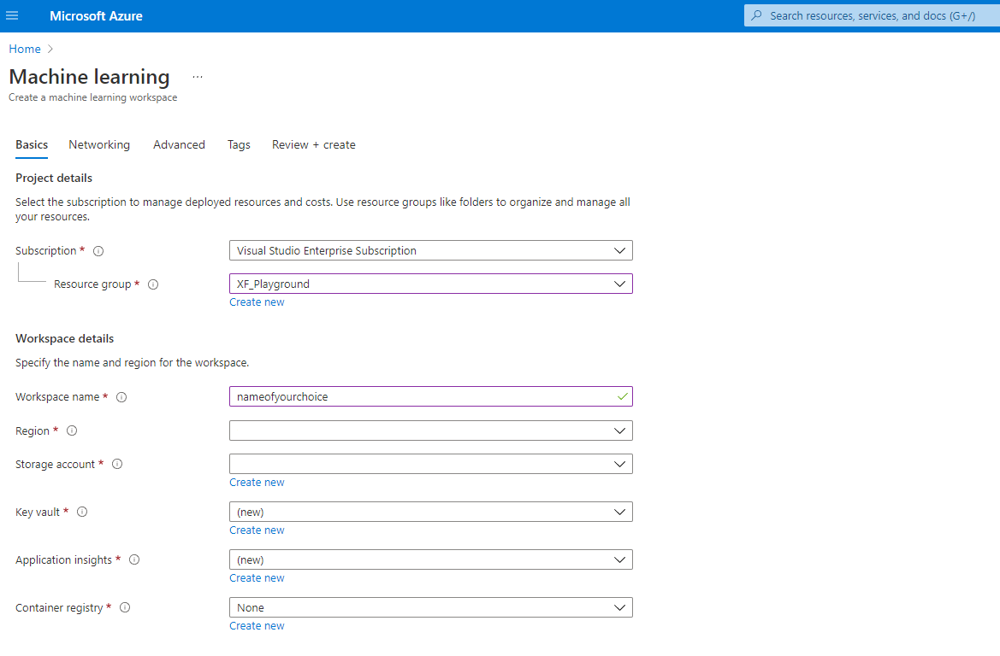
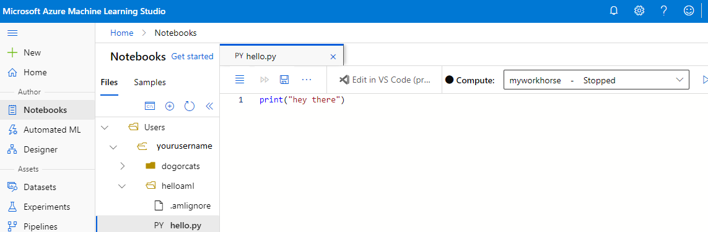
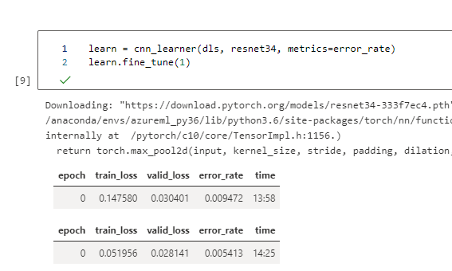
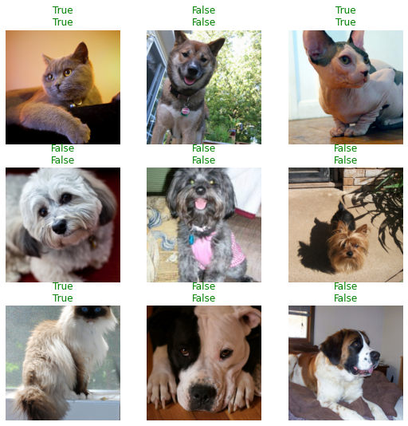
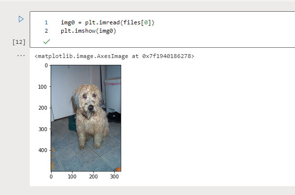

Before I realized it, it's October already! We all know what that means - <!--more--> 2021 is almost gone! Can't really say I'm sad that it's gonna be over soon-ish, but am getting a bit sentimental for sure. Yet another year of WFH! Hopefully this situation will be improved soon and we can get back to the previous mundane civilization.

Back in this January, I made some simplified resolution items - usually the new year resolutions don't make it through February, but possibly due to the pandemic house arrest this year, I actually made some meaningful headways this time. I hereby share them and where they are as follows:

1. Become a reader and read more books: I've finished reading 10 books this year to date! I'm currently in the progress of reading another one called *Fooled by Randomness: The Hidden Role of Chance in Life and in the Markets*.
2. Become a runner and lose some pounds: The running part didn't happen as much as I hoped (Part of me blame the "Raincouver" weather :D). But I did lose quite a bit over 10 pounds so far since January, mostly due to low glycemic dieting as suggested by my doctor.
3. Start a pet project in AI field: This is yet to happen..

After finally finishing up playing the most awesome video game ever otherwise known as Red Dead Redemption 2, and binge-watching Squid Game, I had come to the conclusion that it's high time to get the ball rolling on my AI pet project. That, plus in the spirit of Microsoft FHL (Fix, Hack, Learn, i.e. Hackathon) week, I decided to carve out some time to try out AzureML (Machine Learning) offering and poke around with it. Just a disclaimer in case any of our corporate lawyers stumbled upon this:

>I trained the models after hours from my own personal Azure account (although as a full-time Microsoft employee, I do enjoy some perks like receiving a monthly Azure credit worth a few hundred bucks. So thanks Uncle MS!).

## Why Not Use Your Own Machine

Duh, why not use your own laptop/desktop to do the AI experiments? Why rent if you can own? Well, despite the fact that I do have 2 personal laptops (1 ThinkPad and 1 MacBook Pro) at home, I find it easier to just resort to a cloud provider instead. Main reasons being (obviously there must be tons of other pros vs cons, but I'm not gonna enumerate them here):

### Hardware Limitations

For home computing devices, the hardware is usually designed to be good enough for daily uses. Unless you were able to cough up big bucks when you placed the order, chances are your home computer may not stand the demanding AI computing responsibilities. Your CPU might overheat and the system might freeze before your training even concludes. Say somehow you made it to work, then chances are you can forget about watching a movie or doing other activities on the side during the hours of running.

Of course, you are free to build your own dream workhorse machine. Convincing the wife aside (unlikely gonna be an easy sell), there's also an availability concern. I'm sure you've heard the recent global chip shortage (well what isn't nowadays?), so it could be difficult to get your hands on a good GPU card or other parts you really wanted.

### Flexibility

If you're provisioning the resources in the cloud, you get to change it at your pleasure and the time you deem fit. You want a GPU-heavy machine instead? Done! Hmm, 8G RAM didn't cut it? How about a 28G provision for a few dollars more? All good.

### Maintainability and Security

Say Nvidia came out with a new chip that's 2x faster than the previous generation, you'd want it right? Keep pursuing a top of the line configuration is a fool's game that's simply exhausting, and is a blackhole for your hard earned dollars. There's no end to it.

Or if your SSD hard drive is approaching life expectation due to frequent reads/writes, to a point that it poses a risk to your data security and stability in near future, then you might want to purchase new ones for replacements. Even if you're not selling the used ones on Craigslist (good for you btw), you'd still need to wipe the data clean before disposal - the best way to do it IMO, is with a good old-fashioned hammer!

There are also other wears and tears, which usually happen noticeably faster when you do a lot computation heavy AI/ML tasks.

The cloud providers, however, will take care of all these for you. Their cost is amortized due to the massive user base, so you can rent, aka subscribe to, the services for a reasonable pound of flesh. Instead of the traditional SaaS (Software as a Service), it might be more an ML as a service (MaaS? lol).

### Development Environments

Oh, let's not forget about the potential hardship of setting up the development environments! Have you heard a special situation for programmers that's called dependency hell? It's very real. Oftentimes, when you are setting up a new library, it might complain about the missing dependencies, but then the missing dependencies also complain about their own missing ones, so on and so forth.. It's like the dream-in-dreams in the movie *Inception*, only that it's probably not easy to wake up from here (good thing is, you don't have to kill yourself for it!). After spending the better half of the day on Stack Overflow desperately searching for answers, you finally figured out why and got the missing piece and boom, guess what? your machine/OS doesn't support it!

Cloud providers, however, oftentimes have development environments integrated for you, so you can use it out of the box.

## AzureML Setup

Now let's get to the actual setup of AzureML. First off, kudos to the folks who authored this decent documentation on how to set up the [resources](https://docs.microsoft.com/en-us/azure/machine-learning/quickstart-create-resources) - it was really helpful.

Since I already had a personal Azure account with an active subscription, so here's what I did:

### Create A New ML Workspace

It's fairly easy, after logging into [Azure portal](https://portal.azure.com), type Machine Learning in the search bar and hit Enter, select Create then Next.

A couple of mandatory fields I had to fill out or create resources for, but it was straightforward and there were tooltip hints too. Advanced configurations like network were possible too but I was feeling lazy and just went with defaults. Here's a redacted snapshot for the creation page:



Just like that, within a few minutes, I got myself a machine learning workspace!

### Get A New Notebook and Test with A Python Helloworld

Think of a notebook as an online UI for your ML IDE. Again there are great step-by-step online [instructions](https://docs.microsoft.com/en-us/azure/machine-learning/tutorial-1st-experiment-hello-world) on Microsoft docs, but it's even easier than it sounds.

Simply log into AzureML [studio portal](https://ml.azure.com), and pick the workspace created earlier. Then on the left sidebar, click on the Notebooks, create a new folder under Users/yourusername, then right click on the folder, select "Create a new file" from the context menu, choose file format as Python. That's it.



Oh actually that's not it haha, to be able to run it, you'd need to create a Compute instance. As shown in the picture above, I created one called myworkhorse. It was a CPU virtual machine, with measly 4 cores, 14G RAM, 28GB storage but that sufficed my need and was budget friendly.

## Here Comes FastAI

The reason for me to use [fastai](https://www.fast.ai/) for experiments was simple: it's simple, literally. With it, I could apply Transfer Learning technique easily.

### Transfer Learning

So what is transfer learning? I was able to grab this great online definition:

> Transfer learning is a machine learning method where a model developed for a task is reused as the starting point for a model on a second task. It is a popular approach in deep learning where pre-trained models are used as the starting point on computer vision and natural language processing tasks given the vast compute and time resources required to develop neural network models on these problems and from the huge jumps in skill that they provide on related problems[^fn1].

It's basically what Newton said about standing on the shoulder of the giants. Here are some more notes excerpted from Standford Course CS231n: Convolutional Neural Networks for Visual Recognition to explain the popularity of transfer learning:

> In practice, very few people train an entire Convolutional Network (model) from scratch (with random initialization), because it is relatively rare to have a dataset of sufficient size. Instead, it is common to pre-train a ConvNet on a very large dataset (e.g. ImageNet[^fn2], which contains 1.2 million images with 1000 categories), and then use the ConvNet either as an initialization or a fixed feature extractor for the task of interest.

### What It Looks Like in AzureML

Similar to the Python helloworld file creation process, I created a notebook file under a new folder called dogorcat, as I was trying to build a dog/cat classifier on AzureML (It makes sense to me to use pets to get started with a pet project! Disclaimer for PETA: no dogs or cats were harmed in this experiment to the best of my knowledge!).

There's a great [quickstart documentation](https://docs.fast.ai/tutorial.vision.html) offered by fastai, which I basically followed verbatim, except that somehow the pre-installed fastai by AzureML wasn't up to date, so I did have to upgrade first after hitting many errors (don't panic if you see something like "name noops is not defined"):

> !pip install fastai --upgrade

Here's the code segment for the prep work that can be run from a Jupyter notebook:

```python
from fastai.vision.all import *

# Download the Oxford-IIIT Pet Dataset that contains images of cats and dogs of 37 different breed
path = untar_data(URLs.PETS)

# Retrieve all the images recursively
files = get_image_files(path/"images")

# Define a label function and load the data
def label_func(f): return f[0].isupper()
dls = ImageDataLoaders.from_name_func(path, files, label_func, item_tfms=Resize(224))

# There be dragons: the transfer learning that combines the data and a model for training, 
# and fine tune a pre-trained model (here I went with resnet34 by ImageNet) in just two lines of code
learn = cnn_learner(dls, resnet34, metrics=error_rate)
learn.fine_tune(1)
```

There we have it. The training didn't take very long:


Let's find out how it'd do:

```python
# False -> Dog; True -> Cat
learn.show_results()
```



Now, can it predict whether the image in files[0] is a dog or cat?

```python
learn.predict(files[0])

# Output: ('False', tensor(0), tensor([9.9999e-01, 5.8680e-06]))
```

So the oracle is telling us it's a dog. Let's reveal the files[0] image then:



I mean I'm no dog experts but I think that's pretty close! Amazing, right? :D

More things can be done but I'm not gonna elaborate here.

## Software 2.0

As you can see from the example above, to get a classifier working, I barely had to write more than 10 lines of code. This is considered a low-code or no-code experience. Of course, it's made possible only cuz lots of hard work were put in behind the scene by the cloud engineers and OSS (Open-source software) communities. Also, picking up these AI concepts/jargons and getting to know how to apply them will take some time too.

I've recently started working on systems engineering for AI projects and have been exposed to the concept of Software 2.0[^fn3], or Data-centric AI as other people like to put it. While I don't necessarily work on the specific AI parts directly atm, I find the concept refreshing.

In a YouTube [talk](https://youtu.be/06-AZXmwHjo) earlier this year, Andrew Ng mentioned:

> AI System = Code (model/algorithm) + Data

As people often say, data is the new oil now and is food for AI. Since I'm still learning all these ideas, my understanding could be inaccurate: In Software 1.0, engineers mostly deal with code. But in 2.0, for AI systems engineers, we'd need to work with models and data too, not just code; and time on actual coding may be even less. Good data is hard to come by and yet we need a large quantity of it, let alone the amount of work involved in data processing like labeling and sanitizing, etc.

A side note not so related to the AI topic, just as another food for thought, I do personally believe in the distant future, be it Software 3.0 or 10.0, most of us engineers will be freed from the nitty-gritty of working on a really complex language or framework. Since the demand for software engineers would likely decline sharply in this case, the lucky ones who are still left employed may just write some very high-level human-readable instructions or algorithms in pseudo programming languages like Python that resembles natural languages more - Just as an example, how many people know how assembly language or compilers work nowadays anyways? The often-thankless, heavy lifting, grunt work of low-level/infrastructure programming would have been long done by human geniuses and might be maintained by AI robot programmers already. Even the DevOps and platform engineering roles could be at risk as these work may be automated by then too. That said, are we software engineers essentially digging our own graves by eliminating most of future jobs in our line of work? Hmm.

## Epilog

After the experiments, I can see how my coming pet project(s) might live in AzureML now! Maybe I'll even ramble more about it here too. Stay tuned! :D

Oh, one more thing, a pro tip: don't forget to shut down the compute instance when you're done with it, that is, if you'd like to keep your home from being foreclosed (jk.. it ain't that expensive. But it's a good habit to keep and will save you some $$ and possibly some trees too)!

Until next time! Ciao.

---
[^fn1]: A [Gentle Introduction](https://machinelearningmastery.com/transfer-learning-for-deep-learning/) to Transfer Learning for Deep Learning by Jason Brownlee.
[^fn2]: [ImageNet](https://www.image-net.org/) is an image database organized according to the WordNet hierarchy (currently only the nouns), in which each node of the hierarchy is depicted by hundreds and thousands of images. The project has been instrumental in advancing computer vision and deep learning research. The data is available for free to researchers for non-commercial use.
[^fn3]: A great [article](https://karpathy.medium.com/software-2-0-a64152b37c35) on Software 2.0 by Andrej Karpathy,  director of AI at Tesla.
