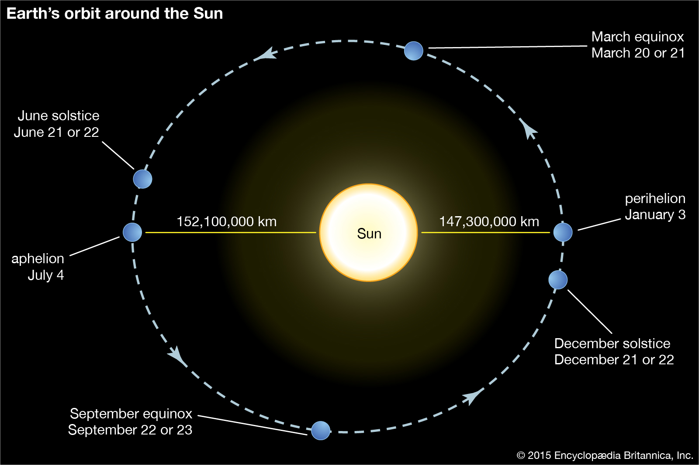
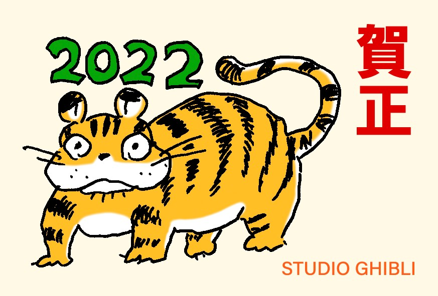
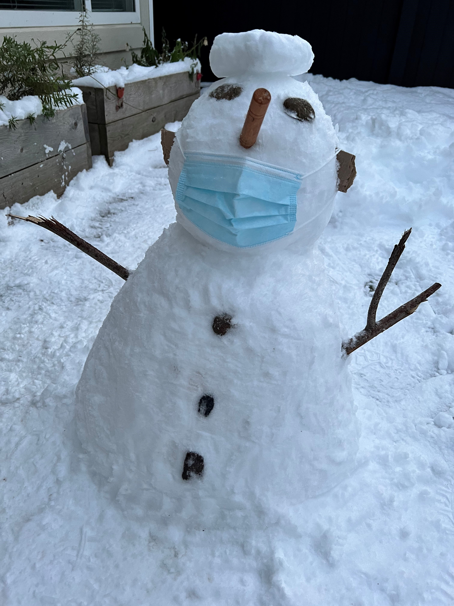
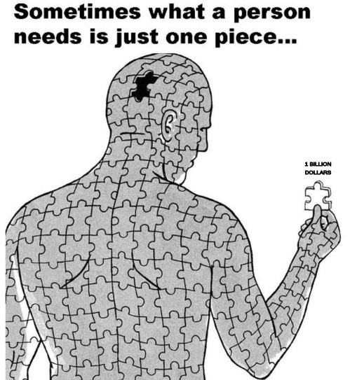

~~2020~~ 2021 is officially a goner! I still can't believe it's 2022 already.

However, if you think about it, a year is really the time it takes a planet, earth in our case, to orbit a full cycle around its star. Since it’s a circle it’s technically completing a full cycle basically at any given point. The choice of starting point, in this case, January 1st, is a bit random. I don’t want to dive into all the religious discussions but we all know how the Gregorian calendar started - sure one might argue it’s cold winter here in Northern Hemisphere so January 1st makes total sense, but it could well be otherwise elsewhere since earth is round[^fn1]. 

So mathematically speaking, 12am January 1st isn’t that different from that of December 31st. Same can be said for any days since time moves constantly in one direction and waits for no one. Time doesn’t care about human, nor does earth. All these concepts of year, month and day etc, are merely inventions of human from empirical observations. The calendaring, which btw has many different versions in different civilizations, is insignificant and barely matters in cosmic metrics (Yes I watched every episode of Rick and Morty multiple times! And I am a bit documentary junkie too). So from time to time, I'd have mixed feelings and question why we use years to measure our lives. As part of Asian culture, young generations oftentimes get pushed to finish life events or are expected to achieve certain things by certain milestones, for example, it might be a criminal worthy offense for someone who's still unmarried by 35 in parents' eyes. I, for one, have been resenting this kind of pressure, be it from peer or not. I mean, it makes sense to say Mark Zuckerberg accumulated more billions than his years on earth so years are actually a good metric for him - but perhaps 99.999% of the population can't say the same. What's the rush anyways. #YOLO!

That said, I won't deny that the measurement of a year could still be very valuable in our society. Without rituals and ceremonies, life is probably nothing more than one monotonous day repeating another. A new year always provides the sense of a fresh start and hope. Although as I grow older, I feel less and less excited about new years, most due to the fact that unlike wine, I don’t really age that well. Kids yearn for new years and holidays since they get to have gifts, new clothes, and no-school. But adults? probably not as much!

Fun fact, Spring Festival, the day that marks the beginning of a new year in lunar calendar, typically starts later than that of the Gregorian calendar, which is February 1st this year (and it varies every year). Therefore it's a bit limbo status between the Gregorian New Year's Day and the lunar equivalent. Now you know what to say when you want to procrastinate a new year's resolution. :) 2022, according to the Chinese Zodiac System, is the year of tiger, my personal favorite. Here's a drawing from the artist Hayao Miyazaki with an unfailing childlike appetite:

## A Brief Looking Back

As Socrates once famously said, *the unexamined life is not worth living*. I wanted to do a proper 2021 in review during the past 10-day holiday break. I thought since Guido was able to invent Python during the Christmas week, I should be able to write some stuff down too. But here’s what I did instead:

* Spent time with family and friends. Properly dined and wined.
* Binge watched some movies and TV shows. Thank you Disney+!
* Finished reading a new book. That's two days w/o much screen time and it was a pretty interesting read too. Was gonna finish another book but hey it's the holidays!
* Played (a lot of) video games. Mostly on FIFA and Last of Us.
* Played Mahjong three days in a row with our neighbor. Turned out I might be a grandmaster at this game (it's mostly luck based IMO but then I must've been blessed with hot hands haha).

Oh, I also spent one afternoon doing this (it was really big snow!):

So with all that, I didn't really get around to finish a more detailed annual review as I intended. Another reason is that everything in 2021 seemed to be just a blur and went by in a jiff. Sure it’s not a year of insignificance since we became a homeowner for the first time. But I didn’t really recall too much that’s so memorable. I had a great time at work and was able to be involved in some very interesting projects with fantastic colleagues; there’s a week-long road trip to Whistler and Joffre in the summer, but that's pretty much all the bigger outings. Ooh oh, I recently got an overdue upgrade to the iPhone 13 Pro Max and a pair of AirPods Pro, no complaints so far. I have to admit that I had my doubts on the AirPods Pro, but I don’t any more! 

## An Equally Brief Looking Forward

As for my new resolution, it ain’t really gonna be so radically different from last year’s. I will continue spending more time on reading and learning, but other than that, here’s some items among other things that I wanted to prioritize: 

1. Health. My weight loss curve basically plateaued from the dieting. I intend to make an effort in exercising more. I was very close to place an order for a Peloton fitness bike had my wife didn't veto this impulse purchase just in time. One needs to take care self before taking care of others. Health, both mentally and physically, is the foundation of our very existence, and is of paramount importance especially in the middle of a pandemic.
2. Career development. I’d like to achieve more professionally, in and out of work. More importantly, I want to see a clearer path at this critical stage of my career.
3. Make more meaningful connections and explore new experiences. Due to the nature of my profession, I've been privileged to WFH for nearly two years (respect and thanks to the essential workers who have been risking their lives to keep our society functional). Risking sounding ungrateful, but WFH does have its own drawbacks too. Sure, it's great to have home-cooked lunches every day but the doing dish part is probably less enjoyable (more 1pm meetings pls so I can get myself out of house chores. :D). More noticeably, social and outdoor activities have been inevitably impacted a great deal. While I strived to stay in touch with friends thru virtual and offline hangouts, it has been less than minimal compared to the pre-pandemic days. It was also very hard to get to know new people or even coworkers. Time to get more creative and proactive on this front.

Unlike KPI or OKR, I’ve decided these goals may not conform to the [SMART principles](https://en.wikipedia.org/wiki/SMART_criteria) for the time being. My wife oftentimes accused me for being too organized and regimented; and I could be very much guilty as charged. Like when we were out on vacation, I'd plan things down to the hour, e.g. we'd have to be somewhere by 1500 hours so we could max out the # of visited attractions and experiences, etc. While I frown upon her care-free attitude at times, I get where she's getting at - as people say, it's not only the scenery you miss by going too fast; you also miss the sense of where you are going and why. Maybe taking baby steps and seeing incremental progress would be a great start. Why not play it by ear eh? The key is to take actions and actually get moving.

While 2022 reads 2020-too, I sure hope it’s better than 2020! The recent throwback of the pandemic due to the omicron spike seems very ominous, but to be fair, every year since 2020 has been an annus horribilis. One can only hope the situation will improve soon-ish. I, for one, have been grounded from traveling overseas for precisely two years by now. I mean technically I could still, but it’s hard to justify all the quarantine time at hotels as vacations - also flights have been ridiculously scarce and expensive, not to mention the numerous mandatory tests required by the authorities. Despite all that, I'd still very much hope to put my hoarded-up vacation days to use some time this year. Staycations are good and all - but you know what's even better? An actual vacation!

On a more cheerful note, I do hear new vaccine and medication research is making meaningful headways. So hopefully we don't need to learn any more Greek alphabets beyond omicron..

As a tradition, Chinese people like to wish people prosperous and affluent for New Year greetings[^fn2] instead of just the plain vanilla Happy New Year. So I hope y’all get rich in this new year of tiger! And above all, stay safe!

---
[^fn1]: On the off chance you belong to the faction of [flat-earthers](https://www.forbes.com/sites/trevornace/2018/04/04/only-two-thirds-of-american-millennials-believe-the-earth-is-round/?sh=67bc10237ec6), I am not a very good polemicist and I ain’t gonna try to convince you. As the old sayings go, seeing is believing. I was only brought up and taught to believe this way since I can’t argue with science but personally I haven’t been up to the space to verify the earth’s roundness (or flatness for that matter :D). I do hope one day soon I’ll have half a million US dollars around to spare for a short LEO (Low Earth Orbit) tour. I mean, both Jeff Bezos and Richard Branson did it not so long ago, how hard could it be right.
[^fn2]: you'll hear Kung Hei Fat Choy in Cantonese, 恭喜发财 (gōng xǐ fā cái) in Mandarin. Literally means wishing you great happiness and prosperity.
