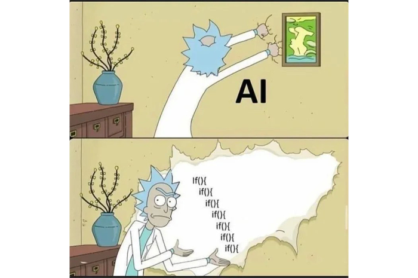
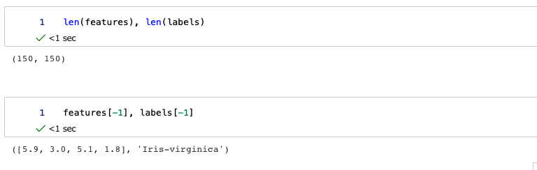
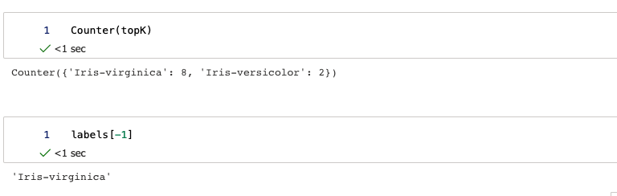
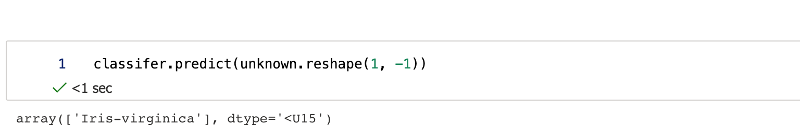
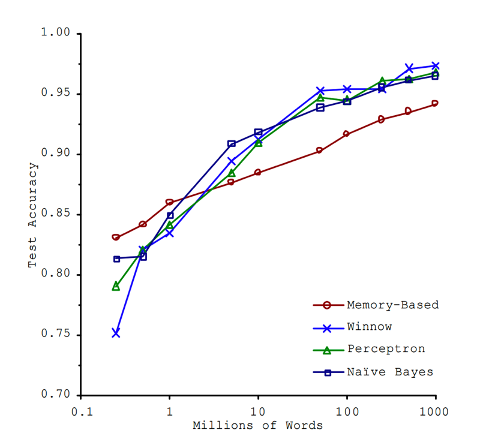

> Corporate drone by day, renegade techie by night. <!--more--> Too old for theatre, and too bored for anything else, Xiaofeng was looking for a challenge. And in the AI project he found it.

Well, those are definitely not the exact quotes from Amy Adams and Meryl Streep's great movie [Julie & Julia](https://www.imdb.com/title/tt1135503/). And unlike Julie, I don't have Julia Child's 524 recipes to reference from either (I sure won't update that many episodes!). Instead, I'll use this new AI (Artificial Intelligence) blog series as notes for my learnings from various sources. As mentioned in my previous posts, I have been playing around with AI pet projects after hours when I'm not entirely immersed in video games, so it's high time that I jotted more stuff down.

What I'd like to cover:

1. What I have learnt in the field. This series will be literally digitizing my notes
2. While it's AI series, it'd be mostly about ML (Machine Learning). I'll explain later
3. What I think I understood (naturally it could be inaccurate, so take it with a grain of salt), and my own explanations
4. What *recipe* I have tried, along with thoughts (Of course, my opinions are just mine, especially the good ones!)
5. Random AI-related ramblings, cuz sometimes I do have attention deficits and may lose my train of thoughts - But I'm guessing there is a reason why people host their own sites..

What I probably won't do:

1. A full-fledged AI 101, cuz that's what textbooks and courses[^fn1] for
2. A history of AI development. Perhaps not even a brief one as this ain't a paper!
3. Add lots of mathematical formulas and deductions. I'll refrain from doing too much of it, mostly cuz it's a bit time-consuming typing them (definitely not cuz it might be too complicated to pick up and explain. :D)

This new blog series will get a prefix of `AI Notes`, and `AI` in <a href="/tags">Tags</a>. I intend to update this intermittently as I have time and am in the mood :). Hopefully it'd be useful to my readers, and I do hope so - as people oftentimes say, if you can't explain something well, maybe you didn't understand it that well!

As the inaugural post, I do feel obligated to cover a bit context so it's not too abrupt. I'll pick a lower hanging fruit, KNN (K-Nearest Neighbors), as the first recipe to talk about. Here's a table of content since AI is an intimidating topic in general:

* TOC
{:toc}

## Prologue

### What's AI

If you follow tech newsletters, you'll hear an ocean of buzzwords like AI, ML, Deep Learning, Data Science.. but what are they really? To make it worse, there seems to be many versions of definitions too. I have to admit that, these still baffle me as I think their boundaries are not as clear-cut. Here's a drawing I dug out on the internet I thought might be good to show their relations:


*Credit: [Jen Looper](https://twitter.com/jenlooper)*

*What is AI (artificial intelligence)?*[^fn2]

> Artificial intelligence is the capability of a computer system to mimic human cognitive functions such as learning and problem-solving. Through AI, a computer system uses maths and logic to simulate the reasoning that people use to learn from new information and make decisions.

*What is ML (machine learning)?*

> Machine learning is an application of AI. It’s the process of using mathematical models of data to help a computer learn without direct instruction. This enables a computer system to continue learning and improving on its own, based on experience.

So in short,

* Machine learning is considered a subset of AI. But I've seen people using them interchangeably and that's something I might be doing too here.
* Deep Learning is subset of machine learning methods based on artificial neural networks inspired by human brain.
* Data Science, on the other hand, is an interdisciplinary field that covers a broad range of domains, such as ML，Big Data, Data Mining. TBH, I am still confused where Data Science is drawing the line nowadays.

A common gotcha is to equate AI to some kind of expert system. For instance, when you call your credit card company, you may be greeted by a smart answering system, sometimes known as Interactive Voice Response (IVR). A typical call might be like

```text
Hi, thank you for calling ABC Credit Card. 
If you like to continue in English, please press 1. French 2 (caller picked 1)
If you're calling about your a stolen card, please press 1. Statements 2; Pay your card 3 (caller picked 2)
If you know your credit card number, please input now. Otherwise please hold, you'll be connected to a representative 
...
```

As you can see, it's basically a rule-based machine with lots of nested **if**s. And Rick Sanchez revealed this a long time ago :)



While I won't disagree that a rule machine is indeed *smart*, it needs human to teach *knowledge* to it constantly and thus isn't intelligent or flexible enough yet. A system that can only deduce won't suffice in our needs of AI. That's where the part ML comes in, as we'd want the system to possess *knowledge* and *learn* to improve itself - hence Machine Learning.

### Why AI Is Interesting

AI is already omnipresent in our daily lives. Even if you don't use voice assistants like Siri or self-driving technology, you'd still be serviced by AI in some ways. Applying for a credit card? Your profile may be assessed by an AI system instead of a human agent, so you may get approved in a few minutes! Doing online shopping at 1am? Well your credit card company may route your transaction to an Anti-fraud AI System first. Seen a great comedy movie last weekend? Netflix is sending a new curated list of similar movies you might also like!

And if you too are a movie junkie like me, likely you've already met AI in:

* HAL (Heuristically programmed ALgorithmic Computer) 9000 in *2001: A Space Odyssey*
* Marvin in *The Hitchhiker's Guide to the Galaxy*
* Sonny in *I, Robot*
* Chitti in *Enthiran*
* Ava in *Ex Machina*
* Jarvis (Just A Rather Very Intelligent System) in *Iron Man*. In case you haven't seen *Avengers* (Really?), I won't spoil how it evolved!
* Just about everything in *The Matrix* series (they really should've stopped at trilogy! the fourth was.. meh)
* Skynet in the *Terminator* series

Of course, in some great TV series too. Such as:

* The Machine in *Person of Interest*
* Let's not forget all the hosts in *Westworld*

The list goes on!

As a newly-minted gamer, I also enjoyed *Detroit: Become Human* and how the many endings vary based on different choices (don't you wish you could just go back in time and retry a different life choice too?). I have yet to play through *Cyberpunk 2077* as I'm saving it for a longer vacation to binge (probably on a long weekend!). Aside from the games themed in androids and cyborgs, the NPCs (non-player character) are AI based too (I hated the zombies in *Last of Us* so much). It's also interesting to picture what if NPCs become sentient - a possibility discussed in the 2021 movie *Free Guy*.

As for engineers, whether not in this AI field specifically, I'd say it's much beneficial to know more about AI in general. Personally, I like how AI abstracts real-world problems via mathematical modeling and (lots of) trade-offs.

## Basic Concepts

As an occupational hazard, I resent jargons / acronyms in general (although I'm guilty of using them frequently myself..). I'd always like to give a bit context at the beginning of the wikis and docs I author. So here's an attempt to explain some concepts first.

To do AI/ML tasks, we need data first. When we have collected certain amount of data, we'd have a dataset. Take the famous [Iris flower dataset](https://en.wikipedia.org/wiki/Iris_flower_data_set) for example:

> The data set consists of 50 samples from each of three species of Iris (Iris Setosa, Iris Virginica and Iris Versicolor). Four features were measured from each sample: the length and the width of the sepals and petals, in centimeters.

I don't think I could differentiate these Iris species in real life (they all look flower to me!). Here's an example picture I found online:


*[Source](http://www.lac.inpe.br/~rafael.santos/Docs/CAP394/WholeStory-Iris.html); although I took the liberty of renaming the pic to iris-musketeers here. :)*

So:

* A record/entry of the object, in this case flower, is called a sample
* A trait such as sepal length, is called a feature or attribute
* The value of a feature is called attribute value
* The space that contains all the attributes is called attribute space, or sample space.
* The process of obtaining *model* from dataset is called learning or training

To classify AI from the angle of the problems it tries to solve, we'd have:

1. Supervised learning, where the data have clear labeling. In the Iris example, the data would have been clearly marked which features map to what flowers. In a dog/cat classifier, the training data would need to be tagged to differentiate dogs and cats first. A common scenario is classification (discrete targets like categories) and regression (continuous values). This is more a deductive, top-down approach, aka specialization. "If it walks like a duck and it quacks like a duck, then it must be a duck". We draw conclusions based on certain known data and deduction.
2. Unsupervised learning, where the training data have no labeling. Common scenarios could be clustering and anomaly detection etc. This is more an inductive, bottom-up approach, also known as generalization.
3. Reinforcement learning, an area of machine learning concerned with how intelligent agents ought to take actions in an environment in order to maximize the notion of cumulative reward. Remember the famous AlphaGo? It's based on reinforcement learning.

There's also semi-supervised learning, where only some of the data have labeling. This could be due to data loss or simply not enough labeling.

Does this labeling sound fancy? Well it isn't at all. In fact, you might've done it many times already. When you try to register or submit a form online, likely you'd be asked to select all the bridges/chimneys/stairs from a set of pictures, to prove you're not a robot (eh!). That's basically data labeling work that helps Google to sort and sanitize data. But unlike works done on Amazon Mechanical Turk or data labeling farms, you ain't gonna get paid for it! On the plus side, by doing so, we're preventing robots from accessing key internet resources, so maybe their eventual uprising would be delayed! :)

## KNN As An Example

### The Problem

KNN (K-Nearest Neighbors algorithm) is a type of supervised learning that could be used in classification. Due to its simplicity, lots of textbooks use it as an introductory example.

The ask is: given a labeled dataset and a new data point, find out K closest data points (nearest neighbors) to this new data point. We can then draw insights / conclusions based on the labels of these K neighbors, e.g. if more than K/2 neighbors belong to the same label, then the new data point is predicted to likely (>50% chance) belong to this label/category too. That's right - you know what people oftentimes say, a man is judged by the company he keeps! Here's an visual, for 2D data points, i.e. (x, y):


*Image Credit: [DataCamp](https://twitter.com/DataCamp/status/1037324501757976577)*

### The Dataset

We could continue using the Iris flower as an example for this KNN problem. There are multiple dataset examples online. I'm using the [dataset](https://archive.ics.uci.edu/ml/datasets/iris) from UC Irvine here.

An excerpted data dump would be:

```text
5.1,3.5,1.4,0.2,Iris-setosa
4.9,3.0,1.4,0.2,Iris-setosa
5.7,2.8,4.1,1.3,Iris-versicolor
6.3,3.3,6.0,2.5,Iris-virginica
...

Attribute Information:
   1. sepal length in cm
   2. sepal width in cm
   3. petal length in cm
   4. petal width in cm
   5. class: 
      -- Iris Setosa
      -- Iris Versicolour
      -- Iris Virginica
```

With a little beautifying magic:

|sepal_length | sepal_width |petal_length | petal_width | class (label) |
| ---           | --- | ---   | ---         | -- | --- :|
|5.1|3.5|1.4|0.2|Iris-setosa|
|4.9|3.0|1.4|0.2|Iris-setosa|
|5.7|2.8|4.1|1.3|Iris-versicolor|
|6.3|3.3|6.0|2.5|Iris-virginica|

Each data sample data point here would contain 4 attributes/features. If we only value 2 features of these Iris flowers, e.g. sepal length and sepal width, and denote them as (x, y), then we'd have a 2D Descartes space as shown in the KNN visual above. It's a bit hard to visualize a 4-dimensional space though, considering we're currently only living in a 3D one..

### The Hard Way

Let's try to crack it the hard way first. This is what I did in the AzureML to set things up (you can find some generic environment setup info from my previous FastAI [post]()):

```text
!mkdir data
!wget https://archive.ics.uci.edu/ml/machine-learning-databases/iris/iris.data
!mv iris.data data/
```

Populating the data for features and labels:

```python
import numpy as np
from collections import Counter
from math import sqrt

features, labels = [], []
with open('data/iris.data') as f:
    for line in f:
        if not line or line == '\n':
            continue
        sl, sw, pl, pw, label = line.rstrip().split(',')
        features.append([float(sl),float(sw),float(pl), float(pw)])
        labels.append(label)
```

A snapshot of the training data:


I should do a proper randomized training/test data split, but I'm feeling lazy. So I'm using the last feature -> label (150th) as the sole test data point/mapping here.

```python
# TODO: proper train/test cut, instead of just taking the first 149 here to train.
# Use numpy arrays for more convenient distance calculations later
features_t = np.array(features[:-1])
labels_t = np.array(labels[:-1])

# Testing new data point. Let's pretend we don't know what class/label it longs to for the time being
unknown = np.array(features[-1])

# Use Euclidean Distance formula here. https://en.wikipedia.org/wiki/Euclidean_distance#Higher_dimensions. 
dists = []
for f in features_t:
    # Gotta love numpy!
    dist = sqrt(np.sum((f - unknown)**2))
    dists.append(dist)

# argsort returns the *index* of the sorted elements. By default, it's ascending order
nearest_neighbors = np.argsort(dists)

# Let's find out the top 10 nearest neighbors' labels in accordingly
k = 10
topK = [labels[i] for i in nearest_neighbors[:k]]
```

Let's check if the results match our expectations:


So among the 10 nearest neighbors, 8 of them were marked as *Iris-virginica*. We can then *predict* that there's a 80% chance this new data point belongs to *Iris-virginica*. Of course, we know the new data point maps to the last entry of the labels, so we can reveal that it's actually indeed *Iris-virginica*! Ta-da!

### The Wheels

Needless to say, in reality, there's little need to re-invent the wheels. Take our beloved [scikit-learn](https://scikit-learn.org/stable/) for example, it already has this KNN algorithm implemented. It's dead simple to use:

```python
from sklearn.neighbors import KNeighborsClassifier

# Get an instance
classifer = KNeighborsClassifier(n_neighbors=10)

# Start training. Fitting = finding patterns in the training data, aka getting the "model" here
# Notice how we're actually not saving the returned "model" here
classifer.fit(features_t, labels_t)

# Let the oracle machine begin! Had to reshape the "unknown" to 2D array as per the API requirement
classifer.predict(unknown.reshape(1, -1))

```

Let's see how it did:


Look, same result as the hard way above, with few lines of code! But you don't need to know how to calculate the distances or get the predictions. It's probably faster too. :(

As for this particular Iris data, you don't even to need to port the data like I did. It could be just two lines and you're done with it:

```python
from sklearn import datasets


iris_data = datasets.load_iris()
```

## Thoughts

This post actually took me much more after hours to wrap up than I initially estimated. I mean the experiments and learnings were done quite a long time ago. I thought hey why not digitize the notes and write about it - this oughta be quick (famous last words!).

This KNN is a fine example of how the AI data training process goes. Although there's one thing very special about this KNN in particular that I liked, it's the data is the model here, as we're just calculating a new data point's distance against our dataset on the fly. In the `classifier.fit(...)` routine above, we're not actually saving the returned *model* while we should've in other AI algorithms.

As mentioned in my previous FastAI/Software 2.0 [post](), there's already this new trend called Data-centric AI, which emphasizes the importance of good data. In our KNN example, a good dataset is everything. But other algorithms are also heavily dependent on the shape of the data too. In the somewhat counter-intuitive Microsoft paper *Scaling to Very Very Large Corpora for Natural Language Disambiguation*[^fn3] in 2001, it stated that the size of the dataset used to train the model mattered far more than the choice of ML approach. And, the performance differences between the models became very small as the dataset grew large [^fn4]. As shown here:



So what do want for AI?

```text
Data!
Data!!
Data!!!
...
```


---
[^fn1]: There are literally tons of materials online, such as the [ML for Beginners](https://github.com/microsoft/ML-For-Beginners) by Microsoft.
[^fn2]: Courtesy of [Microsoft Docs](https://azure.microsoft.com/en-ca/overview/artificial-intelligence-ai-vs-machine-learning/#capabilities).
[^fn3]: Scaling to Very Very Large Corpora for Natural Language Disambiguation; [paper](https://dl.acm.org/doi/pdf/10.3115/1073012.1073017) hosted on ACM.
[^fn4]: There's also this NFL (No Free Lunch, not the one with great Super Bowl half-time show and epic commercials!) Theorem: through rigorous mathematical proof, Wolpert and Macready indicated in their [paper](https://ti.arc.nasa.gov/m/profile/dhw/papers/78.pdf): "..that any two optimization algorithms are equivalent when their performance is averaged across all possible problems".
