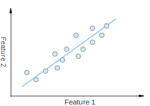
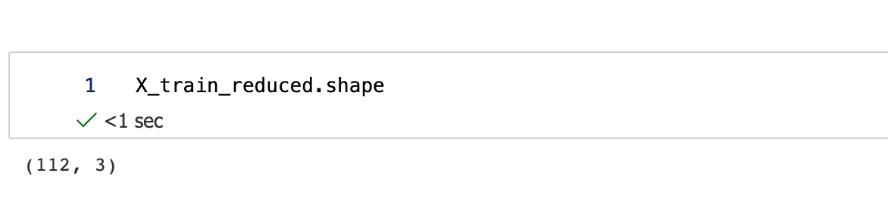

Since when productions of 90-min movies had become a crime? <!--more-->

It was a Friday night - the feeling of starting a weekend was simply great, especially cuz I'd been hella busy at work. After a good 15 minutes of selecting a movie, missus and I decided to watch [*Jungle Cruise*](https://www.imdb.com/title/tt0870154/) at our home theatre, courtesy of Disney+. The movie was OK I guess, well perhaps a bit more than OK since Emily Blunt was starring. But if I were to be snarky about it, I don't think it needed 2 hours to tell this seemingly extended Disneyland commercial[^fn1]. Just since when directors suddenly couldn't tell a good story within the good, old-fashioned 90 minutes frame? I get that with the inflation and all, producers may want the viewers to get the money's worth. But IMO, quality matters more than quantity here.

I'm sure the original film rolls added up to way more than 120 minutes' worth, so with a little further editing of the no-so-important scenes, we could get roughly the same watching experience in 90mins, without losing much of the storyline (imagine the accumulated time it'd save for humanity. Ahem, Disney, take a moment!). That editing process, would be somewhat resonating with what I wanted to ramble today: **P**rincipal **C**omponent **A**nalysis (PCA), an algorithm that's widely used in AI and statistics.

## The Problem

So what is PCA? Why would we need it?

Before answering these, let's recap what features are. As mentioned in the previous Iris flower example, a trait such as sepal length, is called a feature or attribute. In the original dataset in KNN [post](), we were tracking 4 features, namely sepal length, sepal width, petal length and petal width. If we say each feature is a dimension, then this Iris dataset would be a 4-dimensional one.

But that's a lot of data to compute when you have many entries, what if we can distill out a smaller dataset, without losing too much characteristics/representation of the data? Or as what Bezos might better put, how do we accomplish ~~more~~ roughly-the-same with less (#frugality)?

The most naive way to do it, is simply dropping one of the dimensions entirely, say we decide not to care about petal width for the flowers, then this Iris dataset would have been reduced to a 3-dimensional one. But, we'd lose track of that trait entirely and this is a pure loss that'll impact hugely on the classifier accuracy. Can we do better?

Here comes PCA for the rescue:

> **P**rincipal **C**omponent **A**nalysis (PCA) is a statistical procedure that extracts the most important features of a dataset, by reducing the dimensionality of high-dimensional datasets while preserving the original structure and relationships inherent to the original dataset. It'd fall under the unsupervised learning category.

Let's dive into it.

## The Math

As I kept saying, visualizing a 4-dimensional dataset/space can be a little hard given we live in a 3D world. So to help with the explanation, let's try a 2D one for a dataset with 2 features:


*Credit: [OpenCV.org](https://docs.opencv.org/3.4/d1/dee/tutorial_introduction_to_pca.html)*

As such, if we denote x-axis (horizontal) for feature 1, y-axis (vertical) for feature 2, then we'd have a classic 2D Cartesian coordinate plane, with data points in the form of (x, y), for feature 1 and feature 2 values respectively. If we simply drop all the values from feature 2, then all the points will "fall" on the x-axis since we now only have values from feature 1. Vice versa for dropping all the values from feature 1. Mathematically, we call this "fall" experience a "projection".

If we follow the ideas of the previous x/y axis projections, but instead find a new axis (line) for all the data points to project to, in a way that the maximum diversity / representation of the datasets is met - an example would be the blue line in the visual above. Then we've reduced the data dimensionality from 2D -> 1D, cuz we can then use 1 axis instead of 2 to represent. Similarly, we could reduce N-dimensional datasets to N-1 ones.

Note that this particular 2D visual looks awfully like a linear regression problem but it's actually very different. In linear regression, the y-axis would be the function value instead of a peer feature. It's an entirely different scenario.

In math, we use variance to denote the diversity of the data:


where μ denotes the average of the data. If we do a "demean" process that normalizes the data, then μ would become 0. So the variance formula could be even simpler to compute.

In this 2D example, if we denote `X` as the dataset, and `w` as the line/axis we so desire to find, which in this case would be a 2D vector. Then all of the data, after projection to this new `w` axis, together with the "demean" operation and some vector calculation, we'd end up a target function to maximize:


In this 2D case, `w` only has 2 coordinates. But if we expand `w` to n-dimensional, we'd have


To solve this, we'd need to employ a technique called gradient ascent. Since I promised not to talk too much on mathematical formulas, I'll stop here (citing Fermat's famous words here again: *I had a proof that was too large to fit in the margin.* :D).

## The Wheel

Luckily this has been shipped out of the box by many libraries, one of which would be our beloved scikit-learn. I'm just gonna save a day's sweat implementing it from scratch (life is hard enough, let's not do everything the hard way..), and simply call the APIs for a demo.

I'll piggyback on my previous AzureML setup (local environments should work just the same), and load the Iris dataset with an one-liner:

```python
from sklearn import datasets
from sklearn.model_selection import train_test_split
from sklearn.neighbors import KNeighborsClassifier


iris_data = datasets.load_iris()

X = iris_data.data
y = iris_data.target

# Let's do a proper train/test split this time
X_train, X_test, y_train, y_test = train_test_split(X, y, random_state=42)
```

Taking a peek at the training dataset's shape:


It has 112 entries, with 4 features each, aka a 4-dimensional one then.

To establish a baseline, let's see how the original dataset would do in a KNN classifier:


OK, not too shabby. Finished in 11.5ms; achieved 100% (1.0) accuracy from test sets.

We now then start the PCA procedure. Since we're reducing a dimension, I'm gonna go ahead and call it `dimension_reducer` (an even cooler name would be `dual_vector_foil`, but it seemed only working for 3D -> 2D[^fn2]).

```python
from sklearn.decomposition import PCA


dimension_reducer = PCA(n_components=3)

# learning
dimension_reducer.fit(X_train)

X_train_reduced = dimension_reducer.transform(X_train)

X_test_reduced = dimension_reducer.transform(X_test)
```

The resulted data shape has indeed one less dimension:


Alright, let's see if we can accomplish roughly-the-same with less resource:


Whoa, same accuracy with nearly 90% less time! It's almost like.. too good to be true. Although this is a relatively smaller dataset. If we use a larger dataset, we'll see the classifier accuracy does suffer when dimensionality gets reduced by PCA.

I did some quick experiments to show how the KNN classifier's performance changed with reduced dimensionality via PCA, based on the [handwritten digits recognition](https://scikit-learn.org/stable/auto_examples/classification/plot_digits_classification.html) dataset from scikit-learn, which originally is a 64-dimensional (features) set, with 1,347 entries.

The code would be nearly identical, except at the beginning you'll need to load the digits dataset instead:

```python
digits_data = datasets.load_digits()
```

Benchmark results on AzureML:

| Dimensionality | Classifier time (ms)   | Classifier accuracy |  
| --- | ---   | ---         | -- |
| 64 | 7.86 | 0.9933333333333333 |
| 32 | 5.12 | 0.9911111111111112 |
| 8  | 2.52 | 0.9644444444444444 |
| 4  | 2.43 | 0.88 |
| 2  | 2.01 | 0.64 |

As we can see, 8-dimensional space was probably the Goldilocks Zone here. The performance time was saved by nearly 70% compared to the original 64-dimensional data, but the accuracy didn't really drop much. 4-dimensional and 2-dimensional seemed not worth the hassle, based on the performance results.

## Other thoughts

While PCA is very handy in AI training and statistics, I do believe we already use this approach in our daily lives all the time. Human brains are designed to ignore unimportant details. When looking at a very long news article, how many of us actually read every last word of it? English is not my first language, but I can still reduce long sentences to short ones without losing the gist. You can just start by losing the clauses - it doesn't take a grammar expert to reduce a sentence from:

> A long sentence, in which the writer delays the core to the middle of the sentence or in which the core is broken up so readers have to remember how the sentence started, is more difficult to read.

to something like:

> A long sentence is more difficult to read.

Better yet, most of us can even read this scrambled gibberish without any issues[^fn3]:

> Aoccdrnig to a rscheearch at Cmabrigde Uinervtisy, it deosn't mttaer in waht oredr the ltteers in a wrod are, the olny iprmoetnt tihng is taht the frist and lsat ltteer be at the rghit pclae. The rset can be a toatl mses and you can sitll raed it wouthit porbelm. Tihs is bcuseae the huamn mnid deos not raed ervey lteter by istlef, but the wrod as a wlohe.

Lots of people go further than that, like when reading an end-user license agreement (EULA) or other fine prints, most folks would spend no more than 10 seconds before clicking the big "I Agree" button. We probably should read them though[^fn4]. :D

Aside from the visual perceptions, human brains have this similar ignoring mechanism for sounds too. MP3, for one, would be an algorithm that took advantage of this.

Since my team works on audio AI, I've been wandering myself in the audio encoding realm from time to time, which reminded me that I had this antique MP3 player I bought eons ago. I managed to dig it out from our home vault over the weekend. Surprisingly, with my numerous relocations after college, it still has not lost (who knows, it might become a family heirloom!):


It's probably still functional but I haven't used it for a long long time since the smartphone age began - it sure brings me back! Now to think about it, I must've got it when I was a freshman. It'd cost me a fortune, probably a month's worth of allowance at the time. Definitely wouldn't have got it without a bit help from scholarships (good times eh).

The reason why MP3 is not longer as popular cuz the underlying algorithm is a lossy one, which came in handy during an age of pricey storage but perhaps not as much at the times of abundance like present. In order to reduce music file sizes, the MP3 algorithm applies a fine-tuned psychoacoustic model, to dynamically edit out audio signals safely, i.e. without significant losses in the consciously-perceived quality of the sound to human ears. In short, it relies on the temporal masking effect: the presence of a strong audio signal makes weaker audio signals in the proximity imperceptible. This methodology, in my view, also aligns with the principles of PCA, in a very smart yet manipulative way.

## To Wrap up

As much as I'm all for the morale of PCA, first thing first, cutting down to the chase and all in general, I still find it's a bit too much to say one has "seen" a movie after watching a 5-minute short video explained by some YouTuber or Tik Tok influencer (my wife does that from time to time, and we'd bicker over it). There are also online book clubs in China, where someone'd pick a book, read it, abstract out the gist and then explain to the followers in merely 30 minutes or less, so now one can claim he/she has "read" a book without having to actually read it - I think that's, just like the 2-dimensional digits example above, "PCA" went too far. Call me old school, but I'm just not really a big fan of this fast-food'ing movement. :)

With that, I conclude my ranting today. Until next time!

---
[^fn1]: Later I learnt it was indeed inspired by the Jungle Cruise ride, an item wasn't available in Shanghai Disneyland Resort. No wonder I had no recollection of it.
[^fn2]: As I mentioned in my previous posts before, in the epic Chinese science fiction trilogy *Three Body*, the more advanced civilizations had achieved weaponizing the laws of mathematics and physics, one of which would be a tiny `2D/dual-vector foil`. When applied, it reduces other worlds’ dimensions, to annihilate any enemies or burgeoning civilizations that might be later threats. That's like, an entire three-dimensional star system would be flattened into a breathtakingly beautiful 2D oil paint.
[^fn3]: Source: University of Cambridge [study](https://www.mrc-cbu.cam.ac.uk/people/matt.davis/cmabridge/).
[^fn4]: Why reading the find prints can be [rewarding](https://www.npr.org/2019/03/08/701417140/when-not-reading-the-fine-print-can-cost-your-soul): Georgia high school teacher won a $10,000 reward after she closely read the terms and conditions that came with a travel insurance policy.
