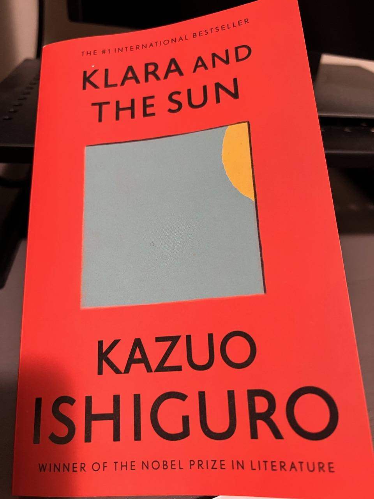

I have to admit that I'm really behind on my reading list this year<!--more-->, due to the amount of hours I poured into video games (I managed to beat close to 10 titles this year to date thanks to the staycations I enjoyed dearly).

A few months ago, a coworker of mine recommended a book called *Klara and the Sun*; so I bought it the next day. I read a few pages around bedtime, but found it not really riveting - it was quite bland. So a few months later, I was still at page 20 or something. Then in a Sunday I decided I should really finish what I started, so I cut off my screen time that day from 9am to 9pm, and finally pulled it off.

What I am about to tell will entail some spoilers of the book. Since I hate to be spoiled myself, I'd like to extend the courtesy of not doing it. Consider yourself warned should you decide to keep scrolling down!

## The Book

Here's the edition I acquired:

### The Story

The plot is actually not super complicated. The whole book is basically a self-narrated diary / memoir of an AF (Artificial Friend) named Klara, to look back her life spent an unspecified city in an unspecified time in future.

This future society is obviously highly advanced so much so that AI had become sophisticated enough to be kids' companions. The story began by Klara telling her observations by the store window, and her "thoughts", while she's waiting to be bought by a kid. During that period, she had developed, if not pre-programmed, a worship towards the Sun. It's fair enough given she'd be powered by solar, in addition to what she observed so-called nourishing miracles performed by the Sun.

Given there were newer models available at the same time, the store manager had a hard time selling her. Luckily, a little girl named Josie had developed affections towards Klara and picked her as AF.

Did I mention this society is very advanced in technology? Turns out AI wasn't the only area these future human made a break-through - so did biotech evidently. Future human kids would have the option to be "lifted" (The author didn't really explain, I had to deduce from later chapters), a procedure that could bring them eugenic advantage to ensure their success when they grow up. In fact, the ones who didn’t get "lifted" would have a very slim chance to get into top schools, let alone moving up in the society. Yup, I think it's exactly like what's described in the great 1997 movie [Gattaca](https://www.imdb.com/title/tt0119177/). But there's a catch, this "lifting" operation itself isn't 100% safe. Josie had a sister who passed away due to the failure, and Josie herself had been ill as a side-effect. As such, some parents chose not to get their kids "lifted" - Josie's neighbor and best friend (and secret lover) Rick would be one of them.

Josie lives with her mother - her parents were separated. The mother seems to be a very successful and tough woman in the society (well these AFs must cost a bit). As Josie's condition worsened, mother had taken her to an "artist" for portraits. But Josie was kept from the truth that these "portraits" weren't actually paintings, but rather gatherings of information so should Josie dies one day, an AI would take her place and impersonate her to be the new Josie. Klara was asked to taken on this job and she accepted without hesitation.

Later on, it seemed that Josie became even more ill and was about to die any time soon. The story took a sharp turn when the Sun performed another "miracle" by his curing sunshine to Josie's bed via the window opened by Klara. Josie gradually got well and recovered.

As Josie gets older, the day came when she was going to leave for college. She and Rick also parted ways due to the fact that only one of the two was "lifted" and that they began to have different ideals and visions of their own lives.

Klara ended up on some scrap yard; she had her fair share of "aging" as the years passed by. It's not explicitly told but presumably she was abandoned. She was there reflecting her life and was happy with her memories. THE END.

There were also other characters and side stories but I think above is pretty much the gist. It's worth mentioning that almost every human character seemed to be morally questionable and not likeable as compared these AFs.

### Writing

Like I said, the book started off pretty bland but it did get more interesting. Kazuo Ishiguro's writing style seemed to be that way - lots of dialogues; wording wasn't badly sophisticated either. Initially I thought it was because Kazuo wasn't a native writer (he was born in Japan, but moved to UK when he was a kid), but later I think it's perhaps more intentionally that way to mimic the tone of an AF. I mean, who am I to speculate a Nobel laureate anyways. :D

Overall, I love the cold-ish feel of the writing. Also I applaud Kazuo for not using too many archaic words. As a non-native English speaker, I find some books tend to use an unnecessary amount of fancy words and cryptic sentence structures. I'm glad *Klara and the Sun* wasn't one of them.

One bone I had to pick, is some acronyms or concepts (like lifting) weren’t explained beforehand (or at all!). As a C++ programmer and person with AMMNS (Acronyms Make Me Nervous Syndrome), I frown upon those who don't declare things upfront! :)

## My Takeaways

I'd give this book at least a B+ or even A-. Kudos for a good story well told. I like the many references to the worship of the mighty Sun. We human should be too! After all, the Sun is the ultimate power source of our planet and influences our measurement of time even.

I like most the part where Klara was going through her memories and had an epiphany:

> Mr. Capaldi (the "artist" who was doing Josie's portraits) believed there was nothing special inside Josie that couldn't be continued. He told the Mother he'd searched and searched and found nothing like that. But I believe now he was searching in the wrong place. There was something very special, but it wasn't inside Josie. It was inside those who loved here. That's why I think now Mr. Capaldi was wrong and I wouldn't have succeeded.

This is so deep and yet relating. I found it somewhat resonating with what [Coco](https://www.imdb.com/title/tt2380307/) the movie (it's so touching) mentioned about different levels of death (Romans must've figured this out long time ago since they had the punishment of *Damnatio memoriae*[^fn1]):

> When there's no one left in the living world who remembers you, you disappear from this world. We call it the Final Death.

So really, what differentiates a real person and a highly advanced AI? Even if an AI can simulate what a person can feel (what's "feel" to them?) and can be "uploaded" with a real person’s entire life's worth of memories, it'd need to convince every other real human connections in order to be "recognized" and "accepted" to one of the human. Touché!

So the takeaway to me is, memories and experiences are indeed the most precious thing to us real human - we oughta strive to live our lives to the fullest, create legacies and lasting memories, for ourselves and our loved ones as much as we could before we grow too old to do much, given our life span is somewhat limited (at least for now until we can be immortal some day).

### Immortality and Subscription

I personally think death is a great thing. It's the ultimate equalizer - whether someone is a mighty King or a common citizen, each one of us would need to face it some day. It puts a TTL (time to live) for every human being, so we could have a sense of urgency and discipline to achieve meaningful things.

But what Klara initially was ask to do, i.e. taking on Josie's memories and pretend to be her indefinitely, was an attempt for immortality of some form. In fact, if you think about it, if you could upload your brain / memories, do you have to upload them to an android? You could well upload to the cloud (something like Azure Human Memory Service in future) so you don't have to worry about hardware maintenance and depreciation. I think some eccentric billionaire claimed he already did so (I always will be skeptical).

But then you'd need to make sure you have enough wealth or sustainable income to renew a **subscription** regularly and indefinitely! Imagine what they'd do to your memories (or *the immortal you*, so to speak) if you bank account came out short over time - something that had been depicted in Amazon Prime TV series *Upload*.

As a consumer, I am not really a big fan of the idea of subscriptions. Not just cuz I'd need to pay a fee regularly, but I prefer the feel of ownership over renting as part of a subscription. For example, there were a couple great PlayStation games I initially played through as part of my subscription membership but I bought them anyways just to "own" and collect.

But as an engineering professional in the tech industry, I can totally relate to the benefits of subscriptions to the business as they provide predictable and steady revenue streams. It also made a lot sense for cloud service providers as there'd be ongoing maintenance costs.

I, however, resent the idea of some carmakers trying to abuse this concept of subscriptions. It's one thing to subscribe to a satellite navigation service, but a complete different another thing to pay recurring fees for hardware that buyers already paid for, such as paying an additional monthly fee for heating seats[^fn2]. I get that carmakers would be able to save a lot by mass-ordering standardized parts so they can pre-install everything and then sell different features by subscriptions. But that's just not right. We did **buy** the car, which means the parts would need to be included. As a driver myself, I dread this would become a new industry norm. Ownership matters!

But taking a step back, part of me thinks the idea of ownership is a "scam" too, since we don't really live forever, we can't really own anything in perpetuity. Maybe it's just like the famous tag line of Patek, you never actually own anything; you merely look after it for the next generation. :)

Think about it - do you really own your home? You'd need to pay property tax and other fees every year for as long as you "own" it in your life. The moment you can't pay, they'd put a lien on it and perhaps next thing would be foreclosure. In a way, you're paying a subscription fee to the civil services.

Do you really own your iPhone? There's this thing called *planned obsolescence*, a business strategy[^fn3] in which the obsolescence (the process of becoming obsolete, that is, unfashionable or no longer usable) of a product is planned and built into it from its conception, by the manufacturer. Apple ain't even trying to hide the intention - there's a so-called iPhone Upgrade Program you can subscribe to, where you can get a new iPhone *every year* by trading in the previous generation. I meant, how is this environment-friendly?

Although, on the other hand, could we human be under planned obsolescence by our creator so immortality was never meant to be achieved?

---
[^fn1]: Damnatio memoriae (condemnation of memory) was a punishment reserved for certain people the Romans decided to dishonor for one reason or another. It involved trying to get rid of all records that the person ever existed.
[^fn2]: BMW starts selling [heated seat subscriptions](https://www.theverge.com/2022/7/12/23204950/bmw-subscriptions-microtransactions-heated-seats-feature) for $18 a month.
[^fn3]: Source: Kem-Laurin Kramer, in User Experience in the Age of Sustainability, 2012.
