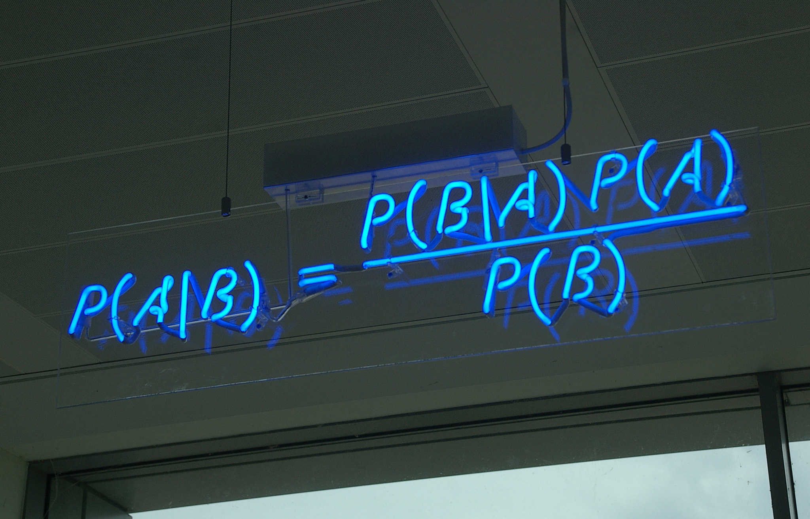
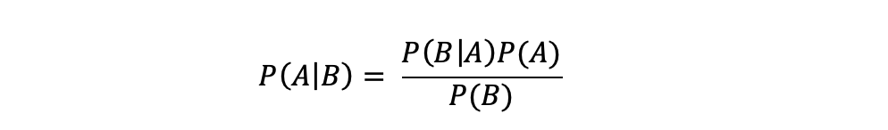
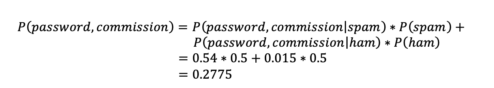
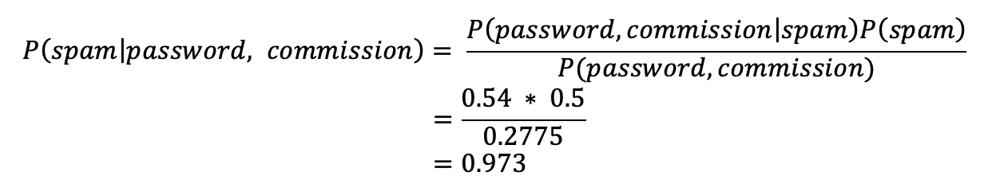
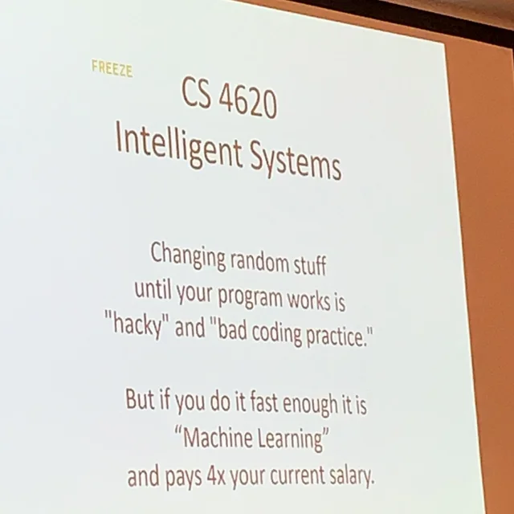

> I have a joke about Bayesian, but it requires prior knowledge<!--more-->.

Forgot where or when I first saw this joke, but I get a smile every time I read it. If you don't get the joke now, you should when you finish reading this piece.

This is something that I've been wanting to write for a long time now. It's simple enough yet can be a bit hard to explain. Let's start with an email.

## The Nigerian Royals

> DEAR SIR,
>
> URGENT BUSINESS PROPOSAL.
>
> WE HAVE 50 MILLION U.S. DOLLARS WHICH GOT FROM <!--more--> OVER INFLATED CONTRACT FROM CRUDE OIL CONTRACT AWARDED TO FOREIGN CONTRACTORS IN THE NIGERIAN NATIONAL PETROLEUM CORPORATION (NNPC). WE'RE SEEKING YOUR ASSISTANCE TO REMIT THIS AMOUNT TO YOUR ACCOUNT. YOUR COMMISSION IS 30 PERCENT OF THE MONEY. ALL I NEED IS YOUR BANK CARD NUMBERS AND PASSWORD.
>
> ...
>
> YOURS FAITHFULLY,
>
> PRINCE ALYBAS ISLASSGIBFOREALS

Back in the days, I used to receive quite a few greetings and (urgent) business proposals from quite a few different Nigerian princes who needed my help with large sums of funds transfer, citing the technical difficulties they were facing as former royal family members. However, to my regret, I unfortunately didn't act on them in time. Had I taken up on the offer, I probably won't have to work for a living!

Joking aside, we all know by now it's very much likely a scamming effort and thus is a spam email (they even come with other languages now, badly translated by AI tools judging by the look). Most modern email services will be able to automatically identify them and put them directly into Spam or Junk folders. But how do they determine the likelihood of an email being a spam? To answer that, we'd enter one of the most fundamental theories that our modern AI relies upon, the Bayes theories, which is named after the statistician Thomas Bayes.

## The Big Idea

SO what is Bayes rule? In essence,

> Bayes' rule can be described in one sentence: by updating our initial beliefs with new information, we get a new and improved belief [^fn1].

Here's the formula:

*Photo Credit: [Matt Buck](https://www.flickr.com/photos/mattbuck007/3676624894)*

In which:

* `P(A)` is the initial belief, i.e. prior probability, observed independently
* `P(B|A)` is a conditional belief, i.e. the probability of B given the event of A
* `P(B)` is the probability of this new event, aka the proof or evidence
* `P(A|B)` is the updated belief, i.e. posterior probability. The probability of A now that B has happened

The deduction of this theorem is actually pretty straightforward. Let `P(AB)` denote the probability of A and B both happen at the same time. Then:

> P(AB) = P(B\|A)P(A)

But also,

> P(AB) = P(A\|B)P(B)

So we'd have:

> P(A\|B)P(B) = P(B\|A)P(A)

Move `P(B)` from left side the equation to the right, then voilà, we have the Bayes formula:

It's a simple but powerful idea. Let's work on an example to get acquainted:

> When a machine is fine-tuned, there's a 99% probability it'll produce qualified products. But if the machine has a certain failure, the probability of producing qualified products is reduced to 60%. Now when we start the day today, we believe there's a 90% chance our machine is fine-tuned. After we turned on the machine, the first product turned to be qualified. So what's the new (posterior) probability of the machine is fine-tuned?

If we let A denote the event of machine is fine-tuned, and let B denote the event of qualified products being produced. Then in this case, we're really looking for `P(A|B)`. We'd have:

* P(A) = 0.9, which is the initial prior belief
* P(B\|A) = 0.99, which is the conditional belief that B given the event of A
* P(B) is trickier as it's not given out of the box. But we can derive it indirectly by P(B) = P(B\|A)P(A) + P(B\|-A)P(-A), where -A denotes the event of A not happening. So we'd have P(B) = 0.99 * 0.9 + 0.6 * (1 - 0.9) = 0.951

Then we'd have `P(A|B)` as follows:

> P(A\|B) = P(B\|A) * P(A) / P(B) = 0.99 * 0.9 / 0.951 = 0.937

That is, after seeing the first qualified product, our confidence, aka posterior probability of the machine's fine-tuned, has now been boosted to 93.7%, from our initial prior belief of 90%.

So back to our Nigerian email, how do we determine the likelihood of it being a spam? As the laws of Bayes asked, we'd need to set up some initial beliefs first. We can establish them by tallying up existing emails and labeling them in accordingly, i.e. preparing training data, as what we call it in AI or machine learning(ML). Say:

1. Out of 100 spam emails, the word `password` appears in 90 of them, and `commission` appears in 60
2. Out of 100 normal emails (or what we'd like to call ham as compared to spam), the word `password` appears in 5 of them (could be legit emails like when you ask to reset your password cuz you forgot it), and `commission` appears in 30 (let's say this dataset is taken from a salesperson's inbox)
3. Assuming initially, we have equal chances of getting spam and ham emails. i.e. P(spam) = P(ham) = 0.5

So in the Nigerian email above, the question becomes, what is the likelihood of this email being a spam given we found out that it contains both the words `password` and `commission`, i.e. `P(spam|password,commission)`. Let's get to it - we already know:

* P(password\|spam) = 90/100 = 0.9
* P(commission\|spam) = 0.6
* P(password\|ham) = 0.05
* P(commission\|ham) = 0.3

Then we'd have:

* P(password, commission\|spam) = P(password\|spam) * P(commission\|spam) = 0.9 * 0.6 = 0.54
* P(password, commission\|ham) = P(password\|ham) * P(commission\|ham) = 0.05 * 0.3 = 0.015

And thus:

By the power vested by Bayes formula, we then arrive at:

There you go, initially we give the benefit of doubt to any new email with half/half chance of spam. But after seeing both words of `password` and `commission`, the chance of it being a spam is now 97%! Magic, isn't it? What we just did would basically be a back-of-the-envelope Naive Bayer email spam filter / classifier.

But what about the 3% that might be legit emails? Well, we call them false positives. We can mitigate it by setting a threshold, say only when the likelihood exceeds 99%, we determine this is a spam email. We can also add more evidences and parameters in the training datasets, e.g. with more keywords.

That, in a nutshell, is how your spam folder accepts new tenants. And yes, your emails do get scanned by service providers, although not just for spams, but for the purposing of displaying personalized ads too (kinda scary isn't it? but that's how the big bucks are made).

To keep the system effective, the training dataset must be updated periodically and frequently, after all, the half-life of knowledge[^fn2] is getting shorter and shorter. Data is everything in the age of AI. But with the rising of the generative AI, I think it's becoming hard to get more man-made real data to feed them. Soon enough, we might be running of real data for AI to train!

Although, in the Nigerian prince hustle, why do they still use the same old script that was from decades ago? Can't they improve on it - I mean some of them even have overt typos and syntax errors, let alone the ALL CAPS. Moreover, why do people still fall for it? The answer is simple: it's a two-way street. While the recipients are filtering their emails, the senders are also "filtering" their targeted audiences by sending the blatant scam emails in massive scale - if you fall for it hook, then very likely line and sinker ensue; and you'll end up giving them a pay day. Otherwise, it's no use to further engage.

## Epilog

We human use this try/error Bayesian approach all the time. Bayes is all about updating beliefs. We modify our opinions with objective information: Initial Beliefs + Recent Objective Data = A New and Improved Belief. That's how we build our positive feedback loop and how we learn from more experience. But hey, AI/ML seem to do it a lot faster than us:

---
[^fn1]: The Theory That Would Not Die: How Bayes' Rule Cracked the Enigma Code, Hunted Down Russian Submarines, and Emerged Triumphant from Two Centuries of Controversy, by Sharon Bertsch McGrayne. I have to say it's a quite text-heavy book, nevertheless with many riveting stories and caveats.
[^fn2]: The half-life of knowledge [wiki](https://en.wikipedia.org/wiki/Half-life_of_knowledge){:target="_blank"}.
