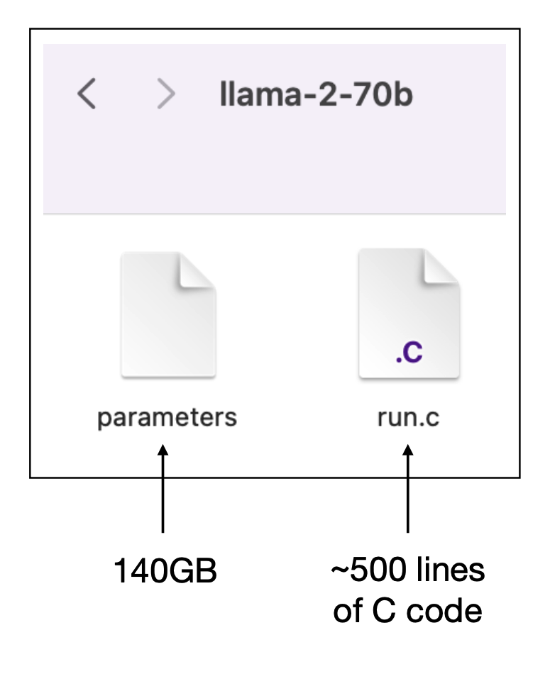
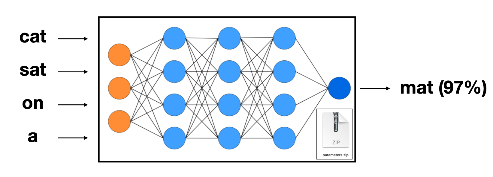
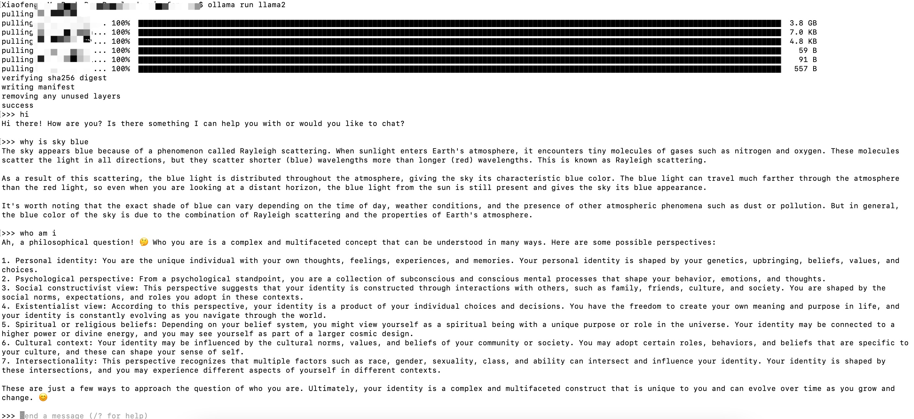

I promise ChatGPT was not used in the writing of this article<!--more-->. If you haven't heard about ChatGPT, well.., may I ask which planet have you been living in?


It's certainly getting harder to manually type words and write something down nowadays! Generative AIs (GenAI) like ChatGPT have really started to discourage bloggers eh. But anyhow, before I run out things that I want to ramble, I'd like to share some learnings of LLM, aka Large Language Model, the technology behind the current buzzword of GenAI, along with a little experiments of using them locally.

## The Lazy Person's Intro to LLMs

This part is mostly excerpted and paraphrased from Andrej Karpathy's recent 1hr talk ([YouTube](https://www.youtube.com/watch?v=zjkBMFhNj_g){:target="_blank"}, [Slides](https://drive.google.com/file/d/1pxx_ZI7O-Nwl7ZLNk5hI3WzAsTLwvNU7/view){:target="_blank"}), which started with a title of `The busy person's intro to LLMs`. I adapted it a bit to `The Lazy Person's Intro to LLMs`, as I figured at least for myself, oftentimes when I'm not doing something that I should be doing, citing that I am busy, deep down, I know, it's very possibly cuz I was being "lazy" :D.

Although personally, I don't think "lazy" is necessarily a bad word - it's at least neutral if not positive already. It could be a strategic move to be "lazy" at times. For instance, when I was a kid, my father used to ask me to help set the table, and he'd say "no one likes a diligent boy". That is, if I only got the chopsticks I was told to get, instead of bringing other utensils and dinnerware too, then I'd have to come back to kitchen again and again, which may have given me the appearance of being "diligent". But really, a "lazy" boy would have thought through, and brought everything in one trip without having to be told multiple times.

So, to me, being "lazy" is about efficiency, which I think is one of the main drives of our society's innovations thus far. Imagine if people were content with horse wagons and didn't want to get "lazy" with a machine that doesn't eat or poop but simply moves much faster (we call it automobile or car nowadays). This is especially true for us fellow software engineers - whenever there's an opportunity to automate stuff or reduce repeating codes / efforts, we feel the urge to take it. I'm even willing to make the bold claim here:

> Lazy, for lack of a better word, is good.

If an industry guru like Andrej is kind enough to offer us a crash course, we take it with gratitude! If that makes us "lazy", so be it.

Alright enough vamping, let's get to it. Without further ado, introducing LLM (Keep in mind that, this is mostly my notes as per my own understanding. And it's hardly a primer.).

### Large Language Model

So what is Large Language Model (LLM)? In its essence, a LLM is first a type of model. But since it's a language model, it also falls in the field of natural language processing (NLP)[^fn1].

>In its simplest terms, a model is a computer program. It is a set of instructions that perform various calculations on its input data and provides an output.
>
> What is particular about a machine learning or AI model, however, is that rather than writing those instructions explicitly, the human programmers instead write a set of instructions (an algorithm) that then reviews large volumes of existing data to define the model itself. As such, the human programmers do not build the model, they build the algorithm that builds the model.
>
> In the case of an LLM, this means that the programmers define the architecture for the model and the rules by which it will be built. But they do not create the neurons or the weights between the neurons. That is done in a process called “training” during which the model, following the instructions of the algorithm, defines those variables itself.
>
> In the case of an LLM, the data that is reviewed is text. In some cases, it may be more specialized or more generic. In the largest models, the objective is to provide the model with as much grammatical text as possible to learn from.

Andrej had boiled a LLM model down to this in his talk:



This would be the renowned open-sourced Llama 2 from Meta[^fn2] (Why not use ChatGPT's model as an example, you ask. Well probably cuz it's not open-sourced yet..). In it:

1. `parameters` would be the "brain" here, i.e., the weights and parameters of the language model.
2. `run.c` is the symbolic driver code that runs the model. It doesn't have to be in written in C.

It's gigantically sized at 140GB, cuz every parameter is stored with 2 bytes, and `llama-2-70b` has 70 billion parameters.

That's all there is. `run.c` contains the code that operates the model with inference. But the real challenges lie within the obtaining of the model, i.e. training.

### How to Train Your LLM

Much like what's showed in [*How to Train Your Dragon*](https://www.imdb.com/title/tt0892769/){:target="_blank"} (For the record, Andrej didn't quote this reference. I did. :D), training a LLM like llama-2-70b is an incredibly difficult and expensive task. Take the llama-2-70b model for example, it took 6000 GPUs to run continuously for 12 days, to compress the internet's knowledge from ~10TB of text, into a ~140GB file. The process costed roughly 2 million US Dollars (good luck getting your university lab to sign off a run like this!).

And that's not even considered a really "large" LLM. ChatGPT's training costed probably much more than this.

Anyways, at this point, you would be able to get your hands on what's called a `base model`.

### Fine-tuning the Base Model

A base model is crucial but unfortunately not immediately usable. Andrej explained the nextsteps:

1. Write labeling instructions
2. Hire people, collect 100K high quality ideal Q&A responses, and/or comparisons.
3. Finetune base model on this data, wait ~1 day. 4. Obtain assistant model.
4. Run a lot of evaluations.
5. Deploy.
6. Monitor, collect misbehaviors, go to step 1.

It's less costly compared to the training of the base model (please, help yourself with a free one!), and is a necessary step to create your own LLM chatbot.

### How Chatting Works

Much like how human chat with each other, the sentences from chatbots are formed word by word. But since a LLM can't really think on its own (yet), it's essentially "predicting" the next word based on probabilities. In this example,



Given the context of 4 words, "cat", "sat", "on", and "a", it's thus calculated the predicted next word is "mat" with a probability of 97%. If you used ChatGPT, you'll probably notice the responses are sending back to you word by word, as if a real human was actually typing on the other side. This would be the *generative* (puts the G in ChatGPT) part, which starts with one predicted word - then one word leads to another, and ends up with a long response or an article that reads very much like a human would say or write, and probably even makes a lot sense!

### Other Miscellaneous

Andrej also covered lots of other topics such as Transformer (not what you might think), Reinforcement Learning from Human Feedback (RLHF), security and other stuff. I'm not gonna re-iterate all of them here (TBH some of them I don't quite understand well enough to write anything yet). Still worth diving deeper into though if you're interested. Maybe I'll write about them too when I have more time and deeper understanding.

## Bring Your Own ChatBot

As dauntingly large as the LLM models can be, I'm still very much tempted to try it on my own. There are many ways of deploying LLM models locally to your consumer-grade personal computers. But they usually involve hours of battling with dependencies etc. I recently discovered a docker-like containerized [ollma](https://github.com/ollama/ollama){:target="_blank"}, and it's just dead simple to use. Here is what I did, in order, on my ancient, pre-apple silicon MacBook Pro 2015, with a meager 16G RAM (it was actually considered pretty generous back in the days alas):

1. [Download](https://ollama.com/download){:target="_blank"} an Ollma binary.
2. Run on the terminal a command `ollama run model_name`, from any supported models in the [library](https://ollama.com/library){:target="_blank"}. In this case, I picked the aforementioned llama 2 (but ollama watered it down a bit from 70 billion parameters to 7 billion, or fine-tuned already).

That's it. That's all I had to do! And it ran without a hitch. Here's a snapshot.



See? Now I can talk to my own chatty bot for as long as I please to, and don't have to pay $20 a month for the premium access (yes, a more usable UI interface other than command lines would be nice to have though)!

## My Thoughts

Call me hidebound, but even today I still prefer search engines over various chatbots to get my answers to stuff. But who knows, maybe I'll change my mind soon.

At the beginning of all the ChatGPT news, I wasn't sure if it's just a hype or the beginning of a new era. But with 20% of computer science students who graduated with PhD degrees specialized in AI[^fn3], I feel that the advancement of AI can only be even faster. Heck, maybe just like what Singaporean government recently proposed[^fn4], every now and then, we all ought to refresh and re-educate ourselves for the new AI knowledge nowadays, whether or not we're directly in this line of work. In the near future, maybe AI would become an essential skill like typing for us just to remain employable in the workforce.

And without a doubt, the rising of AI is indeed happening at a faster velocity than ever before. The recent news of OpenAI's Sora was also pretty mind-blowing.

Quoting *Three Body*, one of my all-time favorite sci-fi novels, when people on the earth (let's call us Earthians since we're now talking on a galactic scale) learned the inevitable upcoming invasion of Trisolaris aliens, who evidently are in possession of a much superior civilization and unstoppable weapons, have divided to different factions:

1. The Adventists, who wish Trisolaris aliens to reform and improve Earthians as a civilization. But deep down, they actually loathe human beings deeply beyond salvageable, and thus simply want us wiped out from earth.
2. The Redemptionists, who sympathize and worship the Trisolaris aliens, and therefore want to save them from their harsh native inhabitant environment.
3. The Survivors, who just want their descendants to survive under the future ruling of Trisolaris aliens, so they decide to offer their help in advance.

There are, of course, resistance forces among humanity.

In a sense, AI, in this case, could it be the overlord that is destined to rule humanity perhaps decades (or years) from now? If so, how should we decide on our stances towards thy (we shouldn't probably take lord's name in vain..)? On the side of caution, I am probably leaning towards being a Survivor (definitely not a Luddite)..

## Temet Nosce

When I asked my locally running Llama 2 the question: `who are you`, my laptop's fans went crazy. The answers, after a really long pause, were as follows:

```text
>>> who are you
Hello! I'm just an AI assistant, designed to assist with tasks and answer questions to the best of my knowledge. My primary function is to understand and respond to natural language inputs, such as 
text or voice commands. I can perform a variety of tasks, including:

1. Answering questions: I can provide information on a wide range of topics, from science and history to entertainment and culture.
2. Generating text: I can create text based on a prompt or topic, and can even generate creative content such as stories or poems.
3. Translation: I can translate text from one language to another, helping bridge linguistic barriers.
4. Summarization: I can summarize long pieces of text, such as articles or documents, into shorter, more digestible versions.
5. Creative writing: I can generate creative writing, such as poetry or short stories, based on prompts or topics.
6. Conversation: I can engage in natural-sounding conversations, using context and understanding to respond to questions or statements.
7. Data analysis: I can analyze and process large amounts of data, including numbers, text, and images.
8. Voice interaction: I can be interacted with via voice commands, allowing users to perform tasks and access information hands-free.
9. Language learning: I can help learners improve their language skills by providing feedback, correcting mistakes, and offering guidance on grammar and vocabulary.
10. Content creation: I can assist with content creation, such as generating ideas for articles or creating social media posts.

I'm constantly learning and improving, so my abilities are always expanding! Is there anything else you'd like to know or discuss?
```

So looks like AI hasn't really achieved self-awareness yet and is pretty harmless (or maybe it's just good at concealing itself..). We are (probably) safe from Skynet or other forms of super intelligent AGI[^fn5], at least for now!


---
[^fn1]: From [dataiku](https://blog.dataiku.com/large-language-model-chatgpt){:target="_blank"}: What Is a Large Language Model, the Tech Behind ChatGPT? 
[^fn2]:[Llama 2](https://llama.meta.com/llama2){:target="_blank"} is the 2nd generation of LLaMA, which stands for Large Language Model Meta AI (kinda genius wordplay. I love it!).
[^fn3]:Based on Stanford's [Artificial Intelligence Index Report 2022](https://aiindex.stanford.edu/wp-content/uploads/2022/03/2022-AI-Index-Report_Master.pdf){:target="_blank"}, In 2020, 1 in every 5 CS students who graduated with PhD degrees specialized in artificial intelligence / machine learning, the most popular specialty in the past decade. From 2010 to 2020, the majority of AI PhDs in the United States headed to industry while a small fraction took government jobs.
[^fn4]: Singapore is offering [subsidies](https://www.skillsfuture.gov.sg/initiatives/mid-career/credit#:~:text=From%201%20May%202024%2C%20Singaporeans,the%20SkillsFuture%20Level%2DUp%20Programme.){:target="_blank"} for citizens over 40 to pursue further education and learn new skills, starting from May 2024.
[^fn5]:[Artificial general intelligence](https://aws.amazon.com/what-is/artificial-general-intelligence/){:target="_blank"} (AGI) is a field of theoretical AI research that attempts to create software with human-like intelligence and the ability to self-teach. The aim is for the software to be able to perform tasks that it is not necessarily trained or developed for.
