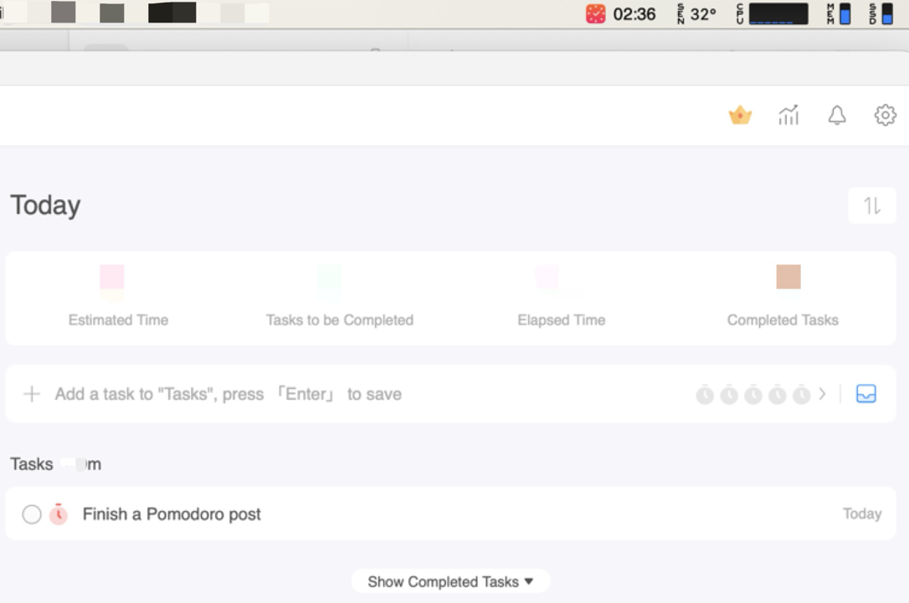

Striking through a todo item brings me a lot of joy<!--more-->.

In fact, since I joined the software industry some time ago, I’ve almost always started my working day with running a bash script[^fn1] I wrote, which prompts questions like when I punched my card, before creating a timestamped journal file in my folder `xfiles`, with pre-populated contents including todo items of the day etc. I even aliased it to a command called `ilog` so I can run it anywhere in my terminal. The initial intention was to figure out what time I can get off work (flexible hours as it may, we still need a day's worth of working hours). But I realized how useful it could be to track todo items or park my train of thoughts of the day etc. So I kept the habit ever since.

To help with crossing out todo items, I sometimes use a bit help from a technique called Pomodoro (I can't do the Italian accent, but Google says it sounds like *paa-muh-daw-row*).

## Pomodoro Technique

I have learned and practiced Pomodoro a long time ago, and it’s not a new technique. I don’t always resort to it, cuz it’s a bit nuclear option that’s invoked only when I had to cram for finals / papers, or struggle to get many prioritized stuff done. Recently, for some reasons, I had been attending way too many meetings (there was a day I had 7 meetings, each 30+ mins alas). So I started to leverage Pomodoro again, to help with the work (yea yea meeting is work too..).

Here’s an intro[^fn2] for it:

>The Pomodoro Technique is a time management method developed by Francesco Cirillo in the late 1980s. It uses a kitchen timer to break work into intervals, typically 25 minutes in length, separated by short breaks. Each interval is known as a pomodoro, from the Italian word for tomato, after the tomato-shaped kitchen timer Cirillo used as a university student.

The original technique has six steps:

1. Decide on the task to be done.
2. Set the Pomodoro timer (typically for 25 minutes).
3. Do the task (can't spell `pomodoro` without `do`!).
4. End work when the timer rings and take a short break (typically 5–10 minutes).
5. Go back to Step 2 and repeat until you complete 4 pomodoros.
6. After 4 pomodoros are done, take a long break (typically 20 to 30 minutes) instead of a short break. Once the long break is finished, return to step 2.

A few personal customizations I’ve made:

* I personally don’t follow the suggested standard timer slots to the letter, as I find 25 minutes a bit short - I typically double it to 50 minutes per pomodoro.
* But my cadence for long breaks is also subsequently adjusted, e.g. to every 3 pomodoros instead of 4.

In a way, pomodoros are just like sprints in our agile / scrum practices. So if you’re good at estimating the level of efforts (we call them story points) for tasks, you can absolutely go with dynamic pomodoros. Although I personally believe it's nothing short of an art form to accurately estimate (and commit to) how long it takes to do anything[^fn3].

There are many Pomodoro apps available in the market. Here’s a snapshot of the freemium one I use (to avoid potential conflict of interests, I'm not gonna name it here):

The app also offers other premium features like cloud sync, and detailed reporting etc. As tempting as they sound, I’m just too cheap to get on a subscription for it..

## To Wrap up

As a testimony, I actually was able to wrap up this post within 2 pomodoros! This might be a new personal record for a post like this (see, it works!).

In reality, the situations are oftentimes fluid and sub-optimal. It’s hard to be truly distraction-free during the pomodoro times. There are always notifications, email alerts, and some other stuff (sometimes, having multiple screens is not necessarily a good thing) that may want your attention. For me, I also practice end-of-day *Inbox Zero*[^fn4] at work, so it takes great discipline[^fn5] not to read an email right away - red dots and unattended notifications do bother me a bit. To help reduce the risks of potential interruptions, you can always set up calendar blocks, snooze notifications, and/or wear a noise-cancelling headset, etc. So adjust accordingly!

Oh, and one more thing. If you’re old-school, or simply don't want the hassle of apps (I get it, even software professionals don’t necessarily like apps), you can always spend a few bucks getting an hourglass or a real kitchen timer where this technique originated from. Alternatively, as a pro tip, some timepieces do come with a timer that can immediately help with this situation. For instance, the iconic Rolex Submariner has a rotating bezel that gives you up to 60-minute countdowns, which makes it perfect for Pomodoro practices. The only catch is, you may need to budget slightly more than you’d for a kitchen timer (and perhaps getting on a wait list first). Here, putting on my Don Draper hat, I even came up with an absolutely original tagline for Rolex[^fn6]:

> Rolex Submariner, the lazy man’s Pomodoro.

---
[^fn1]: I’m not sure if I should open-source the script, not out of concerns of company legal stuff (I developed it after hours), but mostly cuz I think it’s fairly simple to write one if you know bash (or python/perl). How about this, if you are curious enough and want this badly, you can find a way to track me and ask me for a copy. :D
[^fn2]: [Pomodoro Technique](https://en.wikipedia.org/wiki/Pomodoro_Technique){:target="_blank"} from Wikipedia.
[^fn3]: At times, much like marriage vows, we might end up committing to a task with a potentially open-ended scope and vague requirements. Yes, I know, it's a lame joke. :D
[^fn4]: A term coined by Merlin Mann, *Inbox Zero* is an email strategy by which the goal is to always keep your inbox 100% empty. There are some big benefits to this: Everything is always handled, and you don’t waste time re-reading an email for the third time before actually taking action. Source: 4 [Strategies](https://www.themuse.com/advice/4-strategies-for-keeping-your-inbox-empty-which-one-is-right-for-you){:target="_blank"} for Keeping Your Inbox Empty.
[^fn5]: I proud myself for being a disciplined and organized person, but in retrospect, sometimes I probably take it too far to an unhealthy level. My wife also accused me oftentimes when I plan a vacation trip, I tend to arrange things back-to-back and follow them too rigorously, so much so that we'd need another vacation from that regimented vacation.. So yea, occasionally dialing it back a bit might do you good.
[^fn6]: Disclaimer: *this isn’t a sponsored post. To Rolex marketing: if you’re seeing this, ahem, I am actually not against sponsorships. :D*
