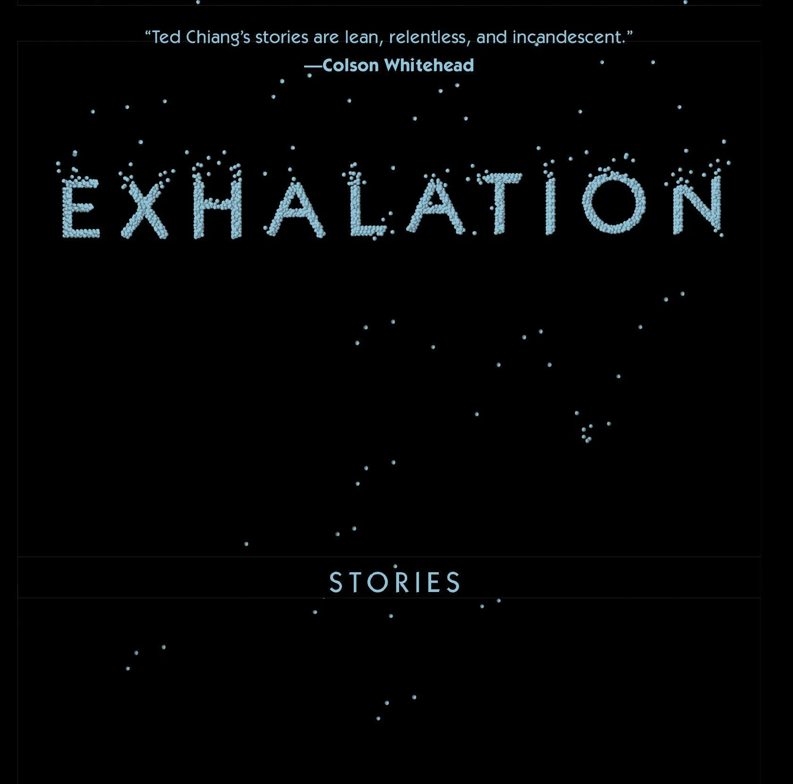
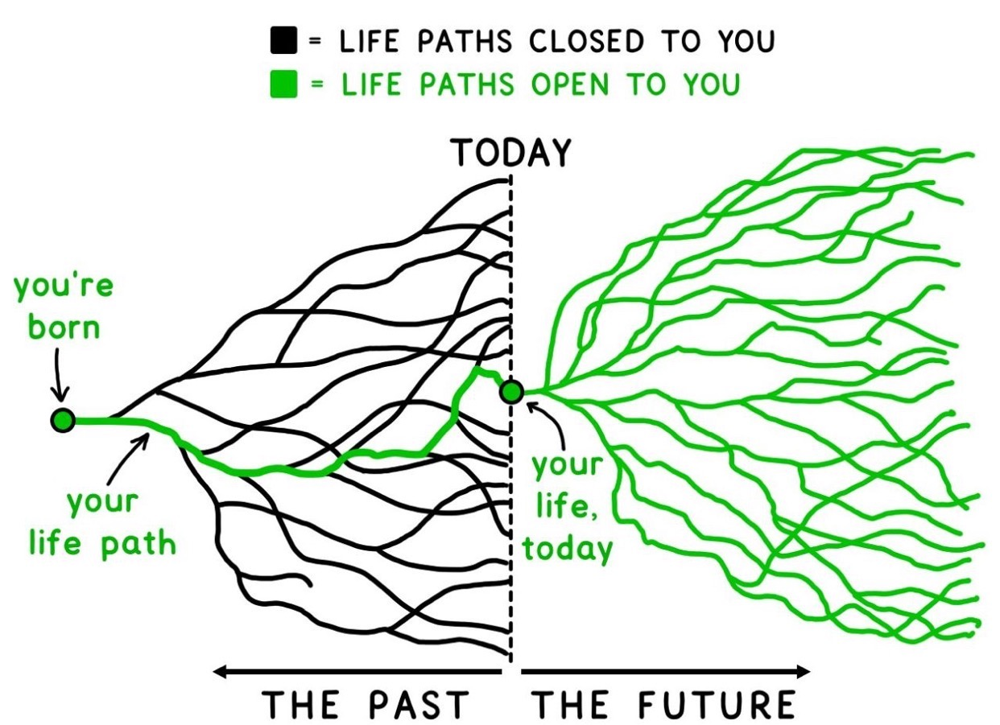

> One will not read a book unless it's borrowed<!--more-->.

That's a quote from an essay written by Mei Yuan (袁枚), a Chinese poet from a few centuries ago. I remember the pain of having to recite the whole piece, as it was part of my literature curriculum during junior high. While I'd definitely forgotten most of the essay, this well-known first sentence that still rings a bell today. It is so true though - I have quite a few books I bought years ago that are still collecting dusts in my bookshelf, awaiting a *right* time for me to read.

Long story short, I figured that if a book has a return date then it's probably a good thing - I'd be forced to timebox the reading. Granted, extensions are allowed; local libraries here are just too kind to even impose any overdue penalities, but I do want to honor the timelines and would hate to inconvenience library staff and people on the waiting list. So there you go, another book crossed off the reading list!

As a standard disclaimer, what I am about to tell will entail some spoilers of the book. Since I hate to be spoiled myself, I'd like to extend the courtesy of not doing it to others. Be advised before scrolling down!

## The Book

Here's the loaner edition I got:

## The Stories

The entire book consists of nine independent stories. Some of them are longer than the others; some stories share similar plots but are in different setups. Here I'm going to cherry-pick a couple of my favorites only.

### The Merchant and The Alchemist's Gate

The writing style of this main story reminds me of the fairy tale collections of *One Thousand and One Nights*, especially with all the storytelling to *mighty Caliph* references here and there, and the story-in-a-story unravelling like the movie [*Inception*](https://www.imdb.com/title/tt1375666/){:target="_blank"}. The whole story seems to be a letter or report to the ruler.

The merchant, Fuwaad ibn Abbas, who lived in ancient Baghdad and traded fabric for a living, stumped upon a shop. The shop owner then showed him a time travel portal, i.e. a gate that was made possible by alchemy, and shared with him three related stories from the time travelers.

#### I. The Fortunate Rope-Maker

A young man named Hassan, who worked as a rope maker, traveled to future, and discovered a hidden treasure that'd make him rich, with the help from... wait for it... his older rich self in the future! That's pretty much the gist put in an oneliner. The unanswered question is, however, how did his future self become rich to begin with? The same plot happened in my favorite show *Rick and Morty*, where in an episode that explains how Rick invented the portal gun for time travel - well, it turned out that the future Rick time-traveled back and gave him the technology directly! Huh, then how did the future Rick invent the portal gun?

This seems just an elaborated recursion to me (if you don't know what recursion is, click here[^fn1]).

#### II. The Weaver Who Stole from Himself

This is a sad story compared to Story I. Ajib, a young man who learnt the Hassan story and decided that he'd try the same. He traveled to the future, but only discovered himself living in the same house as before, without a luxury life style at all. Although he did find a chest of gold coins in the room so he decided to take it with him to his present time.

He instantly started living a luxurious life and was finally able to marry his sweetheart that he couldn't afford to before. Unfortunately, his sudden wealth had attracted unwanted attention and as a result, his new wife was taken by robbers as a hostage. Ajib paid the ransom with the entirety of all his new fortune and successfully got his wife back. But his wife insisted that they should pay back the fortune, as Ajib claimed that it was given to him from another man. So the couple works diligently for decades and saves by putting gold coins to a chest in their house, one piece at the time. The hardships in life have costed their affections to each other, while Ajib now only awaits his younger self to travel through time, and take the chest so he'd find peace.

This sounds yet another recursion story to me, only the result is always gonna be unfortunate in every loop. Poor Ajib can't catch a break as Hassan!

#### III. The Wife and The Lover

In this story, Raniya, Hassan's wife, also traveled through time, but only to help Hassan to secure the treasure he "found", which turned out be hidden by a band of thieves to be begin with. She also taught the younger Hassan how to be a better lover (does cheating with another version of your spouse in a different timeline count as cheating though..?).

To summarize the three stories, I think the idea is very similar to the [*Back to the Future*](https://www.imdb.com/title/tt0088763/){:target="_blank"} trilogy, except that in all these tales, none of the protagonists actually altered the future. The paradox is they all did things and interacted with their future selves, but only to reassure the already-known outcomes and realities that have happened (or are destined to happen) in future. Everything was written on the wall, with an endless religious reincarnation vibe. It is also worth noting that this doesn't seem to be a multiple universe story, as no new universes were branched off as results of different decisions. All in all I find it pretty clever and refreshing.

### Exhalation

This is the bespoke story of the book. Although it's actually very technical and geeky. It seems to be a log written by a scientist.

In a setup that's definitely not our world, there exist sentient robot-like beings, who can think independently. They get their air from lungs that can be swapped - just like how you'd fill up your tank at a gas station, you can get a new lung filled with air.

But the scientist wanted to see how their brains function and figure out why people seem to think slower over time. He made the ultimate sacrifice and dissected his own brain, and documented every step. He eventually made the discovery that the brain functions by air propagating through the gold leaves in it, and thus is subject to the atmospheric pressure. But the pressure's supply isn't eternal, and will eventually be gone as the universe slowly reaches its inevitable heat death, which is called *equilibrium* in the story, but we all know what it is as per the second law of thermodynamics - after all, everyone of us is at the mercy of entropy as an arrow of time[^fn2].

I like the story quite a bit but it's kinda hard even to paraphrase it. It's a very deep topic disguised in a sci-fi setup. I like how the author carefully framed the story via mechanical organs like lungs and brains (yes I think he might be a nerd..).

### Anxiety Is The Dizziness of Freedom

Okay, this one is a bit warm-hearted story for a change, and is by far my most favorite one in the series.

In an unspecified time of the future, technology had evolved so advanced that with the help of the quantum physics, plus a bit computing magic, people can now talk to others in different parallel worlds or universes via a device called prism[^fn3] - this reminds possibly the most convenient deus ex machina in sci-fi movies[^fn4] nowadays.

Based on the many worlds theory, every decision you make, as little as flipping a coin or casting a dice, will set off a chain reaction and spawn off a new parallel world from you current branch.

This is what it's like for everyone of us in our current universe (can't remember where I got it):

Don't you just want to know what your path might've been if you decided on something differently at a certain time of your life? Perhaps if you chose another major to study, or if you got a different first job, or collected a few bitcoins back when it was a dime apiece? Well, look no further, this prism device can hook you up with someone, even a different version of yourself, in another parallel universe. You can then chat and find out what your life might've been based on an event timeline. Won't that be convenient?

This is a pretty lengthy piece, with different side stories. I'll pick the Dana one since it's my favorite. So this girl Dana, had always been living with guilt for what happened to her best friend Vinessa. When they were in high school, they got busted for taking some illegal drug called Vicodin (Dr. House's favorite no less!) that Dana took from her home. In a panic, Dana chose to pin it on Vinessa instead. Since Dana was a good student back then, school took her words for it and suspended Vinessa. Vinessa then went on a downward spiral - *shoplifting, staying out all night, coming to school drunk or stoned*, and eventually became a what people might say, failure of the society. Vinessa used this event as a leverage against Dana and constantly asked for money from her by emotional blackmailing.

Dana can't say no to Vinessa due to her guilt and is anxious all the time, until one day she received a mail package with many videos from different parallel universes (presumably captured via prism), where the different versions of Danas would talk about their lives and the different choices they made at the Vicodin event. It turned out, no matter what Danas chose, Vinessas always went on self-destruct routes, and Danas always felt guilty about it.

At that point, Dana had come to a realization that, maybe that's the destiny of her and Vinessa. You can't be responsible for what happens to other people for their own decisions. It's hard to change yourself, let alone change others.

There it is: *anxiety is the dizziness of freedom*. The exact saying actually came from a different psychoanalytic book, but was never explicitly mentioned in the actual stories - the author never cited it again beyond the title.

Personally, I believe it's almost always good to have the freedom of options, but it can be burdening to us for the choices we made. I'd like to think that I've made more good decisions than bad in my life so far, but in fact, I oftentimes wonder about what-ifs like Dana did. I have picked up, however, a concept called radical acceptance over the years, which is similar to the what's said in the famous Serenity Prayer:

> Grant me the serenity to accept things I cannot change, courage to change the things I can, and wisdom to know the difference.

In mathematics, optimization is a state when you can't practically improve. Since we can't time-travel (yet), whatever happened in the past, however less than ideal it is, it is what it is and we cannot change it. So instead of worrying about what-ifs, we should really learn how to accept and focus on what we can change. No need to beat yourself up for what happened in the past or overthink it. Don't be too hard on yourself - give yourself a pat on the back!

## Final Words

I looked up the author Ted Chiang. And just as I suspected, he's actually a computer science major - and yet he writes books, instead of software programs, for a living. :D

I like his writing style. It's concise, elegant, and cut-down-to-the-chase. He seems well trained in existentialism, and also understands the art of leaving blanks[^fn5] with an exquisite minimalist taste. That said, I haven't fully got his other work though, namely *Story of Your Life*, better known by its movie adaption [*Arrival*](https://www.imdb.com/title/tt2543164/){:target="_blank"} - perhaps another time!

Overall I'd give this book a mark of 9.5/10, on the account that Ted is Asian not Bsian (haha jk.., it's simply a very well crafted book!). I'd highly recommend it to any serious readers.

---
[^fn1]: Well, as what they say, to understand recursion, you must first understand recursion. Click for more: 👉🏽
[^fn2]: To quote Professor Brian Cox: *Life, just like the stars, the planets and the galaxies, is just a temporary structure on the long road from order to disorder. But that doesn't make us insignificant, because we are the Cosmos made conscious. Life is the means by which the universe understands itself. And for me, our true significance lies in our ability to understand and explore this beautiful universe.*
[^fn3]: Funny thing is I actually work with [Prism Analytics](https://www.workday.com/en-us/resources/prism-analytics/data-hub-use-cases.html){:target="_blank"} at my current job (No no no, I don't think it's the same one Snowden worked on before. :D). The *prism* mentioned in the book is a near acronym that stands for *Plaga Interworld-Signaling Mechanism*, which isn't totally made up - it's somewhat legit. I was able to track down an actual [paper](https://arxiv.org/abs/quant-ph/9510007){:target="_blank"} published in 1995, namely *Proposal for an experimental test of the many-worlds interpretation of quantum mechanics* by R. Plaga (what can I say, I like doing research!).
[^fn4]: Here's a [meme](https://www.reddit.com/r/memes/comments/d2o0uc/quantum_meme/?rdt=45749){:target="_blank"} on reddit for the quantum reference in movies (Yes Marvel Studios, we're looking at you!).
[^fn5]: It's hard to explain the idea of *leaving blanks* but in Chinese arts we call it 留白 (liú bái), which is *an artistic idea that teaches artists not to use any elaborate techniques to painstakingly carve out every precise detail of the desired effect, but simply to hint at it and allow the audience to experience the message in their own heads.* [Further reading](https://actavictoriana.ca/culture/the-art-of-nothingness-an-approach-to-appreciating-chinese-art/){:target="_blank"}.
