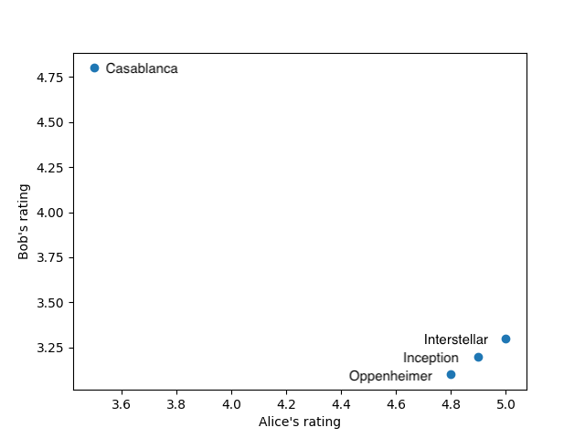
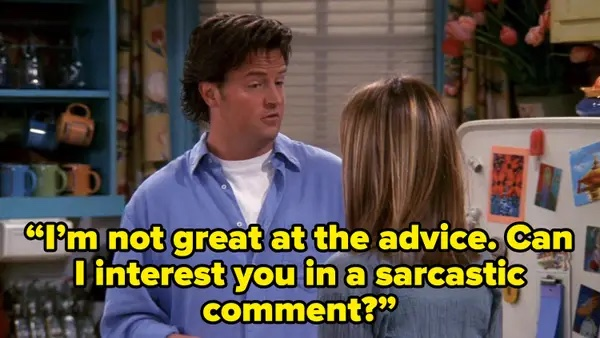

> The difference between life and the movies is that a script has to make sense, and life doesn't<!--more-->. ― Joseph L. Mankiewicz[^fn1]

That being said, I am guilty as charged, a movie junkie (or at least I used to be). I have watched tons of movies from various streaming services and in theatres. Although it's getting harder for me to carve out time for this kind of luxuries, as I became busier and busier with life and work. I guess to a point that, I am starting to get more frequent get-back-to-us push notifications from apps, like this:

Or in other occasions, it'd just show a text in the notification with something like *We think you'd like the following movies*. When I clicked into the notifications, however, oftentimes I only found out that the recommended movies had already been sitting on my watchlist or watched already. Well, first off, good job Prime Video for correctly predicting movies that I want to watch next. But perhaps next time, maybe consider cross-referencing my watchlist or watch history first before sending the recommendations out[^fn2]?

I actually watched *Oppenheimer* in the movie theatre, not just cuz the sound effects and everything, but also cuz my wife always feels the obligation to provide live commentary if we watch movies at our home theatre and it bothers me a bit. Now that I've been on staycation for the holidays, I can finally catch up on some books and movies, and publish this stashed blog too!

Joking aside, I think this is actually a pretty good topic to ramble about. So today I'll talk a bit about recommender systems, since I actually worked on it back in the days before coming to Canada. Let's start with a caveat.

## The Target Mailer

As Forbes reported[^fn3] in 2012, an angry man went into a Target outside of Minneapolis, demanding to talk to a manager:

> “My daughter got this in the mail!” he said. “She’s still in high school, and you’re sending her coupons for baby clothes and cribs? Are you trying to encourage her to get pregnant?”
>
> The manager didn’t have any idea what the man was talking about. He looked at the mailer. Sure enough, it was addressed to the man’s daughter and contained advertisements for maternity clothing, nursery furniture and pictures of smiling infants. The manager apologized and then called a few days later to apologize again.
>
> On the phone, though, the father was somewhat abashed. “I had a talk with my daughter,” he said. “It turns out there’s been some activities in my house I haven’t been completely aware of. She’s due in August. I owe you an apology.”

Well one thing we know for sure - that was indeed *targeted* ads! It's good detective work but perhaps too good and one might even say it's creepy. So how does it work under the hood?

## What's Recommendation

In essence:

> Recommendation is the task of suggesting items that might be of interest to a user, such as movies to watch, articles to read, or products to purchase. Recommendation systems are crucial to businesses, such as Amazon, Netflix, Spotify, and YouTube[^fn4].

It's ubiquitous nowadays with the inundation of information flows. The endless scrolling mode of TikTok or Wish wouldn't be possible without the power of the recommender engines behind the scene. I'll elaborate a bit on a common technique called Collaborative Filtering.

## Collaborative Filtering

> Collaborative filtering is based on the assumption that people who agreed in the past will agree in the future, and that they will like similar kinds of items as they liked in the past. The system generates recommendations using only information about rating profiles for different users or items.

Let's start with the user-based filtering algorithm with a movie recommendation scenario.

### User-Based Filtering

Say we ask different persons to rate the movies they have watched recently, with only binary scores, i.e. thumbs up (1) or down (0). If we use row for the persons (user), and columns for the movies (item), we'd have a matrix like this:

|Person | Inception | Casablanca |  Interstellar | Oppenheimer|
| ---           | :---: | :---:   | :---:         | :--: |
|Alice|1| 0 | 1|1|
|Bob| 0 |1| 0 | 0 |
|Charlie |1| 0 |1| ?|

Then the idea of recommendation would be finding the similarities between users. In this case, we knew Alice liked *Inception*, *Interstellar*, and *Oppenheimer*, while Bob liked/disliked quite the contrary. Charlie is a new user who hasn't watched as many, but we can easily see he shares more similarity with Alice than Bob. Since Alice also liked *Oppenheimer*, the recommender will now suggest *Oppenheimer* to Charlie, predicting that he might also enjoy it.

That would be the long and short of user-based collaborative filtering. Although I would personally like a feature that recommends what I may dislike based on that fact that people who disliked A also disliked B. I mean, a similarity is a similarity, right? It could be a desired (and premium) feature for some people! Why leave money on the table?

### Item-Based Filtering

The idea of item-based filtering is similar to user-based filtering, but we flip the user/item to get a transpose of the previous matrix. In this case, let's ask people to rate movies from 0 to 5 instead:

|Movie | Alice | Bob |
| ---   | :---: | :---:|
| Inception | 4.9 | 3.2 |
| Casablanca | 3.5 | 4.8 |
| Interstellar | 5 | 3.3|
| Oppenheimer | 4.8 | 3.1|

If we put Alice's ratings on the x axis, and Bob's on the y axis, then we can chart the above matrix to the following:

We can clearly see that, while Alice and Bob differs in their movie tastes a lot, there's a pattern for the movies of *Inception*, *Interstellar*, and *Oppenheimer* - they seem to belong the the same group or cohort (well we also know they all happen to be works of the great Christopher Nolan), as they are neighbors on the chart. So when Charlie comes in and said he'd liked *Inception* and *Interstellar*, we can then safely predict that he might also like *Oppenheimer*.

In the Target mailer story above, the girl in high school probably purchased a series of products that other pregnant women tend to buy together or in sequence, so Target assumed this girl'd be pregnant as well and suggested more products like baby clothes and cribs by sending coupons.

In a way, it's similar to clustering algorithms like [KNN](https://xiaofengyue.com/2022-03-26/ai-notes-knn){:target="_blank"}, based on the content similarity or correlation via distance formulas, using the user behavioral knowledge.

But please, do a little fine-tuning with common sense though. For example, after I bought a refrigerator, maybe don't send 30 more ads for other refrigerators - my food preserving needs are kinda limited; it could be another decade later before I want a new one.

## Epilog

In reality, it'd be far more complicated matrix computing for both collaborative filtering algorithms, as the scores may carry different weights in similarity formulas, and users may be to the tune of many millions[^fn5], which will be very hard and expensive to compute with increased dimensions (10 million users x 100k items = 1 trillion data points in the matrix!), and may require advanced optimizations like [PCA](https://xiaofengyue.com/2022-05-07/ai-notes-pca){:target="_blank"}, etc. Recommenders also like to pre-compute instead computing on the go due to the amount of workload involved.

Besides Collaborative Filtering, there also exist many other recommendation algorithms, e.g. content discovery, user profiling, and different hybrid approaches, etc. The efficiency and efficacy metrics are also well studied (Netflix used to host a movie recommendation competition called [Netflix Prize](https://en.wikipedia.org/wiki/Netflix_Prize){:target="_blank"}).

But in my opinion, the key of recommender systems is, like any other AI problems, procuring the data. The recommendations are only as good as the quality of the data. Without an abundance of up-to-date data, these recommenders wouldn't be able to do the magics, which also brings a cold start challenge as the algorithms would have to start with none or little data to begin with, and iterate from there - the initial recommendations wouldn't be as accurate. The more recommenders know about you (and others), the more accurate recommendations you'll get.

The recommender systems work on a wide range of scenarios, not just limited to suggesting you new movies, products or services, but also social networks and beyond, so long as you model the problem properly. In the eyes of the math and algorithms, they probably are not that different, lots of which could be abstracted to a mathematical model of *user who did something also did something else* - it could be:

* ...
* *audience who liked Movie A also liked Movie B* (potential shared mutual movie tastes)
* *customers who enjoyed Diner A also enjoyed Diner B* (potential shared mutual food tastes)
* *users who bought Product A also bought Product B* (potential shared mutual product interests)
* *people who friended Person A also friended Person B* (potential shared mutual friends)

Speaking which (I guess I do tend to make more cutaways than *Family Guy*), I don't really have a big presence on social media other than occasionally checking LinkedIn. In fact I'm not even on Instagram, TikTok, or Snapchat[^fn6].

But even I know this: if two users who share dozens of mutual friends, and yet are still not friends, even after many repeated recommender advices like *Do you know XX?*, in an extended period of time. Well, is it possible that there was a reason for that? Like, gee, I don’t know, you wouldn't think there is a remote possibility that they know each other very well in real life but they just don’t want to friend each other? Take a hint, recommender!

---
[^fn1]: I realized I occasionally tend to pay homage to the writers of Criminal Minds, cuz almost every episode of it begins and ends with a quote. I hope they didn't patent this pattern and I sure don't want any legal troubles (FWIW I haven't seen any newer episodes for ages and doubt if they ever quoted this :D).
[^fn2]: Prime Video is the worst among the streaming platforms. It recently introduced intrusive ads, at the beginning and in the **middle** of the movies! You can buy yourself a way out by upgrading to Ad Free for an extra monthly fee (but beware they don't consider trailers as ads). I can't justify the upgrade since I rarely watch on Prime and it doesn't seem they've got lots of good contents either, so occasionally I need to put up with it. Here's a free advice to Amazon: why not take it further, e.g. deploy attention tracking systems, so if viewers so much look away or mute during ads, they will get penalized with 2x ads (next offense it'd be 4x!).
[^fn3]: [How Target Figured Out](https://www.forbes.com/sites/kashmirhill/2012/02/16/how-target-figured-out-a-teen-girl-was-pregnant-before-her-father-did/?sh=24a72cb26668){:target="_blank"} A Teen Girl Was Pregnant Before Her Father Did.
[^fn4]: Stanford's [Artificial Intelligence Index Report 2022](https://aiindex.stanford.edu/wp-content/uploads/2022/03/2022-AI-Index-Report_Master.pdf){:target="_blank"}.
[^fn5]: Here's a smaller dataset example: [MovieLens 100K Dataset](https://grouplens.org/datasets/movielens/100k/){:target="_blank"}. Stable benchmark dataset. 100,000 ratings from 1000 users on 1700 movies. Released 4/1998.
[^fn6]: The list goes on; you may also notice there is not even a button here to like, share, follow or subscribe on this entire website (*#dinosauralert*). I haven't logged into Facebook or Twitter since forever and definitely can't remember the passwords - mostly cuz I find social media could be a source of information overload and thus have been making an effort to protect my attention span (albeit not always successful).
