I'm gonna give you some color see see<!--more-->.

Literally. :)

Here are some colors. Earlier this spring, I went to Rainbow Mountain, aka *Zhangye Danxia Landform Geological Park* in China, and was lucky enough to catch a real (and smiley) rainbow on top of the Rainbow Mountain, how cool is that?


I've been wanting to write some about the colors since then, but I've been incredibly busy this year between work, workouts (hmm, did I mention I lost over 25 lbs this year?), and many other stuff. Before you know it, it's not spring any longer, now we're almost leaving autumn. Winter is around the corner, and 2025 is almost a goner!

Fast forward to today, which is Remembrance Day holiday in BC. After finishing a 10K run at the lake park nearby this afternoon, I feel it's high time that I started writing something down as random topic. Let's dub it Autumn Hues!

Here's another picture I took in BC recently, more fitting to the theme:
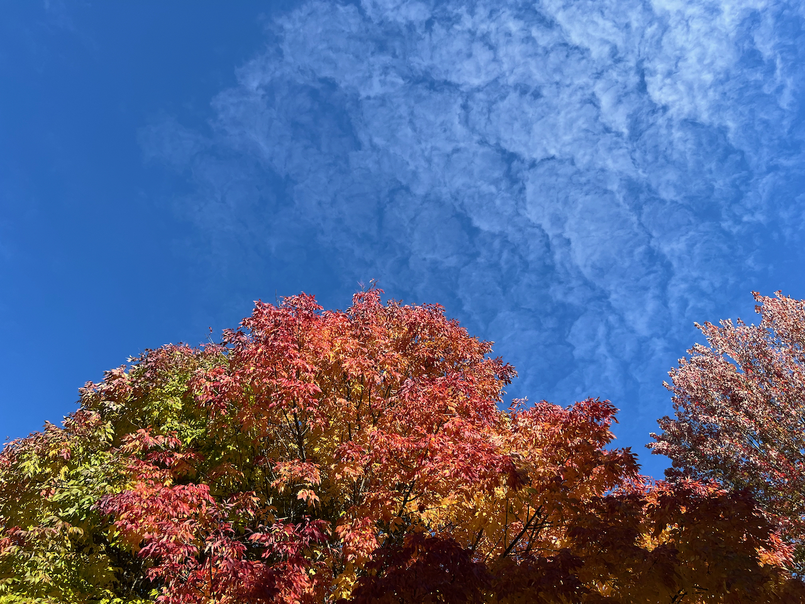

## What is Color Anyways?

I'm gonna start by saying, colors ain't real. It's just a subjective perception of light.

OK, then, what is light?

Well, as we all know, light is just a subset of electromagnetic radiation that can be perceived by the human eye - although broadly speaking, Ultraviolet(UV) and Infrared (IR) should be considered lights as well.

Here's a demo of the perceivable (and invisible) color spectrum of as per wavelengths.


*Source: [lenalighting.com](https://lenalighting.com/company/knowledge-base/1795-the-spectrum-of-visible-light-the-wavelength-of-the-light)*

Sir Newton The Great strikes again, and was credited for initial discovery of this. Back a few centuries ago, in 1665, Newton used a prism to show that sunlight is refracted (bent) into its component colors, such as red, orange, yellow, green, blue, and violet. He demonstrated that clear white light was composed of seven visible colors.

> It still remains for us to exhibit the system of the world from these same principles.

While he famously said these powerful words for explaining the mechanics of the solar systems via the universal laws of motion and gravitation. The laws of lights and colors should also be part of this system of the world.

Let's say how that has been computerized 360 years later.

## Digitalized Colors

Just when I thought I ran out full-stack developer jokes: here's another one:

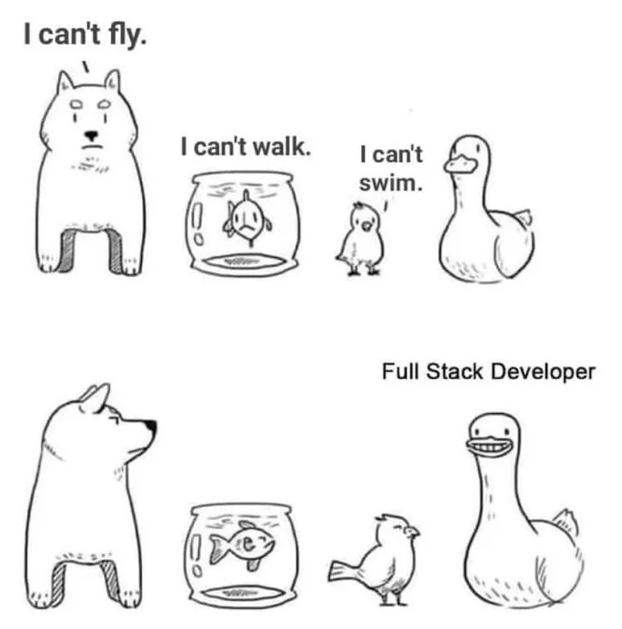
*Credit: [reddit](https://www.reddit.com/r/ProgrammerHumor/comments/ulmb5b/more_work/)*

For the past ~8 years, I've been doing my fair share of jack of trade works at my engineering roles in Canada. I mostly work on backend and infra, but occasionally I need to touch client or frontend or other ad hoc stuff. Whenever I'd have a UI/UX task, I felt compelled to clarify that I just am not very good at manipulating pixels. I kinda know what they are, but it's aesthetically hard for me to be good at it (not everyone is Steve Jobs I guess!). Also just like Zuck, I am a big fan of pure / solid colors in daily life too (although it's reported he's red-green colorblind). So it's fair to say picking colors aint really my forte!

Okay. Enough with the disclaimers. Let's dive into it.

For most computer color models, we just use RGB (red, green, and blue), with a 8-bit representation. For example, RED would be (255, 0, 0) if we use R, G, B as the 3D dimensional space. Or oftentimes, it's being referenced to its hex form: #FF0000 (you can also visual this in a [hex color visualizer](https://lawlesscreation.github.io/hex-color-visualiser/))

RGBs are the primary colors of light, because if you mix them, you can get other colors. But they cannot be the results of mixing of other colors.

Let's visualize it using Python. We'll start with (255, 0, 0), and increase only the red coordinates by 16, so we'd have 256 / 16 = 16 derived colors.

```python
hex_values = list(range(0, 256, 16))  # 0 to 255 with step of 16
print(f"Hex values: {[hex(h) for h in hex_values]}")

# Create RED palette: varying red from 0x00 to 0xFF, green=0, blue=0
# Each color is normalized to 0-1 range for matplotlib
red_palette = [(i / 255.0, 0.0, 0.0) for i in hex_values]
```

With a bit help from our beloved mighty matplotlib, we can see a red palette as we gradually crank up the dosage, until to the full red on the far right of the spectrum.

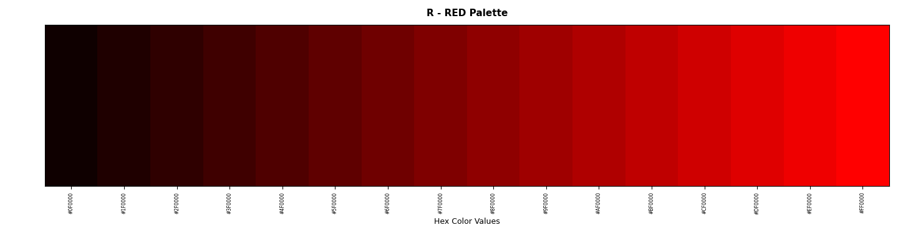

Same for green:

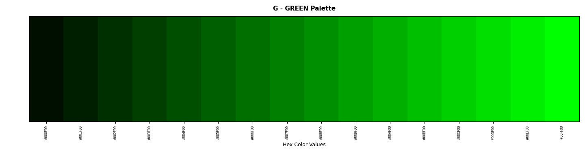

Ditto for Blue:
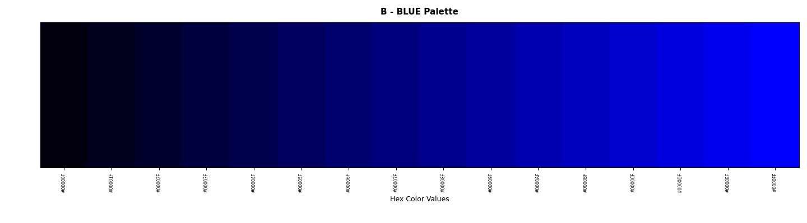

Now let's see what happens if we start mixing any two, Red + Green => Yellow, as we gradually add more reds and greens:
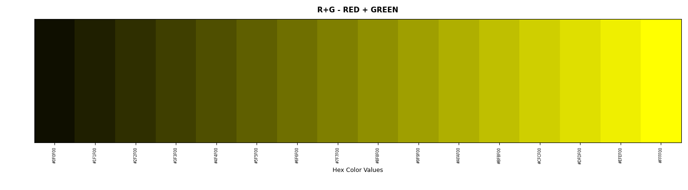

Green + Blue => Cyan:
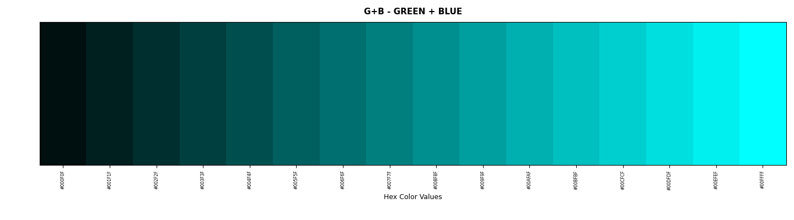

Red + Blue => Magenta:
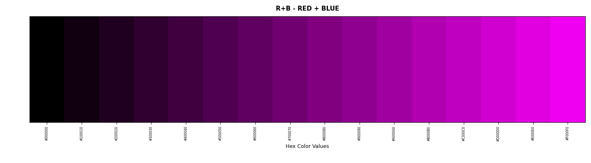

And if we mix all three, i.e. Red + Green + Blue, we should get white if we add more (#FFFFFF would be total white, which isn't shown here):

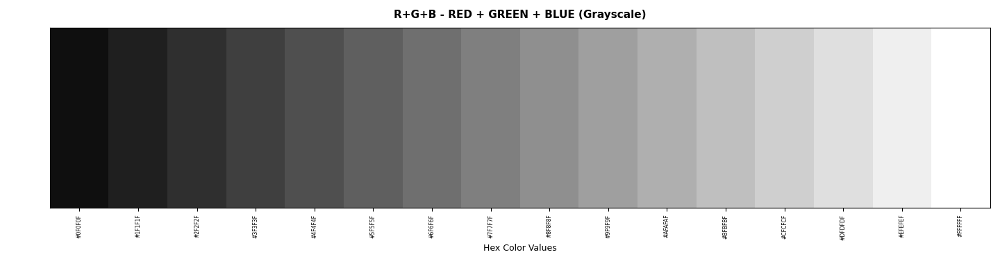

Yup, it's just simple and intuitive as that. Sir Newton sure was absolutely right!

## Additive Mixing vs Subtractive Mixing

The aforementioned RGB process would be considered an additive mixing model. We start with #000000, as no color was added so it was total black. But as we light up (~~let there be light!~~) gradually, after adding all colors, we get a white #FFFFFF, which is total white. This works for light sources, such as monitors, that emit lights.

For the RGB 3D space, represented by the 8-bit hex system, we'd have a total permutation of:

> 256 x 256 x 256 = 16,777,216

i.e. total 16+ million possible colors in the "true color" palette, which is more than enough than bare human eyes can perceive. Some higher-end fancier monitors may offer 10bit that can offer much more colors.

However, for objects that don't emit lights, the colors are created by subtracting or absorbing certain wavelengths of light from white light. That is, an object is seen as blue, just because it absorbed all other wavelengths of light but blue's, so only blue light is being reflected and "seen". Examples would be pigments and inks. If we start mixing different colored pigments, different wavelengths of light get absorbed / reflected, and thus different colors being seen. We call this mixing strategy subtractive color mixing, as the more colors you add, the darker it gets. Picture of yourself in front of a piece of white paper, and if you start by adding all the pigments, it'd turn black at the end.

So in a way, subtractive color mixing is the opposite process of additive color mixing. This is being widely used by artists, publishers, and other paper media etc. But instead of RGB, RYB (Red, Yellow, Blue) or other variations are used as primary colors.

I am unsure how to digitize this subtractive color mixing (yet). It's not gonna be as simple as just flipping the 8-bit representation. Mark it as TODO here. :)

## Trichromacy vs Tetrachromacy

Coincidentally (or is it?), as a biology setup, human eyes have the ability to see colors using three types of cone cells in the eye, which is red, green and blue. This is called Trichromacy.

But not every being is created equal, birds, for example, would have an extra fourth type of cone cell for perceiving colors, which makes them possess the precious Tetrachromacy. Here's a comparison:

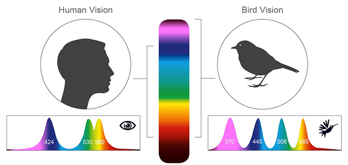
*Credit: [demilked.com](https://www.demilked.com/bird-vs-human-vision/)*

And the colors each sees:


Would it be cool if we also have tetrachromacy? It'd be an artist's dream come true! I think our ancestors may also have this gene eons ago and at one point, it was lost as we started living indoors and this became less essential (for birds, this tetrachromacy capability makes them easier to highlight seeds etc). What a shame though.

## Epilog

I wanted to experiment more, but I'll be honest, Cursor had rate limited me for the day :(. And I'm just too lazy and tired to continue writing and debugging any more Python code.

That's the thing. This is a new era now. And this era was divided by prior- and post- Nov 30, 2022, the day when ChatGPT was released - to think about it, that was just less than 3 years from today. I've been blogging before that, and was fortune enough to work on AI before it became so cool that everyone's talking about it. But I've been trying to make a point that I don't use any AI to write the blog for me, due to some weird old-fashioned pride of craftsmanship. And up till this post, I am pride to say I still don't (and I'll admit, it's probably a much better writer than me..).

But starting last year, I think I've lost the fort on the programming front. I've become a somewhat cautious vibe coder. I'd use AI to write some short snippets by designing the prompts and plans, proof-reading, and fixing by hand if I need to for small things. It's surprisingly good, especially at writing tests (I meant, who needs tests anyways. :D).

I was chatting with our product manager earlier this week, and we agreed that in this vibe coding time and age, it's becoming harder to do any structured learning. Take me for an example, it's been really hard to carve out the time and energy to finish a whole book. And the ROIs on upskilling specific areas are diminishing rapidly - who cares about the latest features of Java releases, or nitty gritty of some archaic syntax? Just ask Claude or Cursor with a prompt, get a cup of coffee and come back. You'll have your answers before you know it!

Also as an interesting trend, different tech roles seem to be quickly converging. Engineers are now expected to have more product sense; PMs are expected to be able to do prototypes with AI assistants like Cursor. But I joked that given PMs own one thing that AI can't yet, which is prioritization by aligning with humans, it's likely that product management as a career will outlast us software engineering people.

So it begins. Any hand-made stuff that's not by AI, including manually typing all the code for programs from scratch, would essentially become luxuries in future.

I think by its very definition, a luxury is something that you don't necessarily need or easily afford to have. It might have 100% quality, but you'd have to pay 10x for it for the exclusivity, brand premium, and social recognition whatnot, which all boils down to so-called Emotional Value. You can easily find cheaper alternatives if you're aiming for functionality only. A Honda Civic is probably just as good as a Ferrari, when it comes what a car was designed to do, which is getting from A to B. But for some reasons, people are still willing to buy Ferraris (I totally would, if I could lol).

For example, I have an Apple watch and Citizen EcoDrive, but I also own a mechanical watch. If anything, Apple watch tells time much more accurately, and there's no need to adjust for day light savings (it also tracks health stats! I've been closing my rings if you know what that means). But I still wear my mechanical watch every now and then (kinda have to alas.. part of the maintenance process to keep the springs in good standing); it sure is heaver too but I'll be darned if it ain't a pretty thing and a great source of pleasure by just watching it (yea yea it tells time too). I guess that's why people dub it Emotional Value. I'm guilty as charged for being a captive of this consumerism rhetorics.

Alright, I'll end my rambling today with my own RYB palette on my home office desk - since they're not light sources, I'm sticking to RYB model (also a green duck would be somewhat strange).

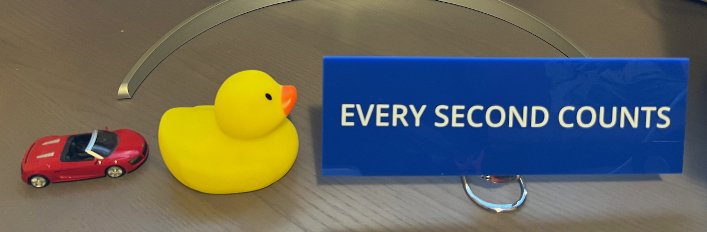
